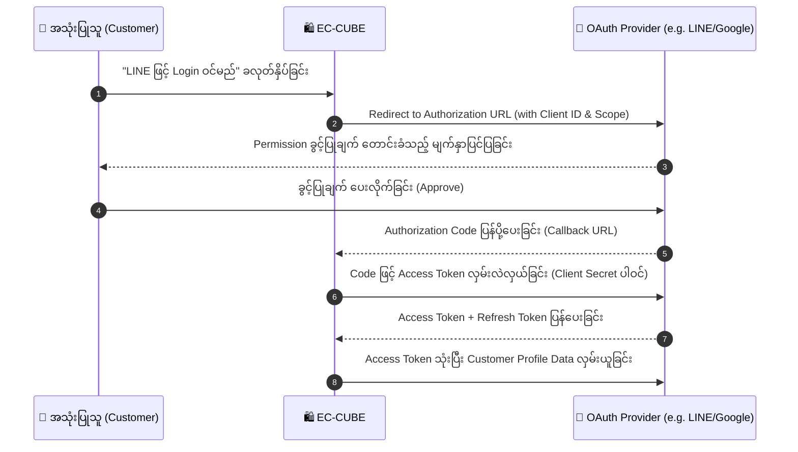

# 01. API Request Pipeline & Security Architecture (မြန်မာဘာသာ)

EC-CUBE မှ ပြင်ပစနစ်များသို့ ဒေတာပေးပို့ခြင်း၊ ရယူခြင်းနှင့် လုံခြုံရေးဆိုင်ရာ Authentication စနစ်များ အလုပ်လုပ်ပုံကို အခြေခံမှစ၍ အသေးစိတ် ရှင်းပြချက် ဖြစ်ပါသည်။

---

## 🔄 The Complete API Lifecycle (အဆင့် ၆ ဆင့် စီးဆင်းမှု အသေးစိတ်)

EC-CUBE နှင့် External API ချိတ်ဆက်ရာတွင် အောက်ပါ Pipeline အဆင့်ဆင့်အတိုင်း စနစ်တကျ လုပ်ဆောင်ရပါသည်:

```
[1. EC-CUBE Entity/Data]
          ↓
[2. HTTP Request (JSON Payload + Auth Header)]
          ↓
[3. External API Endpoint (Stripe, Yamato, freee, etc.)]
          ↓
[4. HTTP Response (Status Code + JSON Body)]
          ↓
[5. Validation & Error Checking (Schema & Status Check)]
          ↓
[6. Database Persistence (EntityManager Transaction Commit)]
```

---

### အဆင့် ၁။ Data Extraction & DTO/Array Conversion (EC-CUBE)
- Database မှ ရယူထားသော Doctrine Entity (ဥပမာ `Order`, `Product`, `Customer`) ကို တိုက်ရိုက် ပြင်ပသို့ မပို့ရပါ။
- External API က တောင်းဆိုသော Format (Array သို့မဟုတ် DTO) သို့ ပြောင်းလဲရွေးထုတ်ပေးရပါသည်:
```php
$payload = [
    'order_number' => $order->getOrderNo(),
    'amount'       => (int) $order->getPaymentTotal(),
    'currency'     => 'JPY',
    'customer'     => [
        'name'  => $order->getName01() . ' ' . $order->getName02(),
        'email' => $order->getEmail(),
        'tel'   => $order->getPhoneNumber(),
    ],
    'items'        => []
];
foreach ($order->getOrderItems() as $item) {
    $payload['items'][] = [
        'product_name' => $item->getProductName(),
        'quantity'     => $item->getQuantity(),
        'price'        => (int) $item->getPriceIncTax(),
    ];
}
```

---

### အဆင့် ၂။ HTTP Request ပို့ဆောင်ခြင်း (Symfony HttpClient)
- EC-CUBE 4.x တွင် Built-in ပါဝင်သော `Symfony\Contracts\HttpClient\HttpClientInterface` ကို အသုံးပြု၍ Request ပို့ဆောင်ရပါသည်:
```php
use Symfony\Contracts\HttpClient\HttpClientInterface;

class ExternalApiService
{
    private HttpClientInterface $httpClient;
    private string $apiKey;

    public function __construct(HttpClientInterface $httpClient, string $apiKey)
    {
        $this->httpClient = $httpClient;
        $this->apiKey = $apiKey;
    }

    public function sendOrder(array $payload): array
    {
        $response = $this->httpClient->request('POST', 'https://api.example.com/v1/orders', [
            'headers' => [
                'Authorization' => 'Bearer ' . $this->apiKey,
                'Content-Type'  => 'application/json',
                'Accept'        => 'application/json',
            ],
            'json'    => $payload,
            'timeout' => 5.0, // အမြင့်ဆုံး ၅ စက္ကန့်သာ စောင့်မည်
        ]);

        return $response->toArray();
    }
}
```

---

### အဆင့် ၃။ External API က လက်ခံဆောင်ရွက်ခြင်း
- ပြင်ပဆာဗာ (Third-party Server) သည် Request ကို စစ်ဆေးပြီး လုပ်ဆောင်ချက် အောင်မြင်မှု ရှိ/မရှိ HTTP Status Code ဖြင့် ပြန်ကြားပေးပါသည်:
  - `200 OK` / `201 Created`: အောင်မြင်ခြင်း။
  - `400 Bad Request`: ပို့လိုက်သော ဒေတာ Format မှားယွင်းနေခြင်း။
  - `401 Unauthorized`: API Key သို့မဟုတ် Token သက်တမ်းကုန်/မှားယွင်းနေခြင်း။
  - `404 Not Found`: API URL သို့မဟုတ် ရှာဖွေသော Resource မရှိခြင်း။
  - `429 Too Many Requests`: Rate limit ကျော်လွန်သွားခြင်း (Request အရမ်းများနေခြင်း)။
  - `500 / 503 Internal Server Error`: ပြင်ပဆာဗာ ပျက်ကျနေခြင်း။

---

### အဆင့် ၄ & ၅။ Response Parsing & Validation (ဒေတာ စစ်ဆေးခြင်း)
- ရရှိလာသော JSON ကို decode လုပ်ပြီး လိုအပ်သော Response key များ ပါမပါ စစ်ဆေးရပါသည်:
```php
$statusCode = $response->getStatusCode();

if ($statusCode !== 200 && $statusCode !== 201) {
    throw new \RuntimeException("External API Error: HTTP Status " . $statusCode);
}

$data = $response->toArray(); // JSON string မှ PHP Array သို့ အလိုအလျောက် ပြောင်းလဲပေးသည်

// Validation: tracking_number ပါဝင်မှု ရှိမရှိ စစ်ဆေးခြင်း
if (!isset($data['tracking_number']) || empty($data['tracking_number'])) {
    throw new \UnexpectedValueException("Missing tracking_number in API response");
}
```

---

### အဆင့် ၆။ Database ထဲသို့ ရေးသွင်းခြင်း (Doctrine Transaction)
- API မှ ရရှိလာသော Tracking Number သို့မဟုတ် External Reference ID ကို Database ထဲတွင် Transaction ဖြင့် သေချာစွာ သိမ်းဆည်းရပါသည်:
```php
$this->entityManager->beginTransaction();
try {
    $order->setTrackingNumber($data['tracking_number']);
    $order->setExternalSyncedAt(new \DateTime());
    
    $this->entityManager->persist($order);
    $this->entityManager->flush();
    $this->entityManager->commit();
} catch (\Exception $e) {
    $this->entityManager->rollback();
    throw $e;
}
```

---

## 🔐 Authentication နည်းလမ်းများ (API လုံခြုံရေး စနစ်များ)

External API များ ချိတ်ဆက်ရာတွင် အသုံးပြုလေ့ရှိသော အဓိက Authentication ပုံစံ ၃ မျိုး ရှိပါသည်:

### ၁။ API Keys (ရိုးရှင်းသော လျှို့ဝှက်ကုဒ်)
- ပြင်ပ Platform (ဥပမာ Stripe, SendGrid) မှ ထုတ်ပေးသော Unique String ဖြစ်သည်။
- HTTP Header မှတစ်ဆင့် ပို့ဆောင်ရပါသည် (`X-API-KEY: your_api_key_here` သို့မဟုတ် `Authorization: Bearer sk_live_xxx`):
```php
'headers' => [
    'X-API-KEY' => $this->apiKey,
]
```
> [!WARNING]
> API Key ကို GET Request ၏ URL Query String ထဲတွင် `https://api.example.com/data?key=secret` ဟု ပို့ဆောင်ခြင်းကို လုံးဝ ရှောင်ကြဉ်ပါ။ Server Access Logs များနှင့် Proxy များထဲတွင် ပေါ်သွားနိုင်ပါသည်။

---

### ၂။ OAuth 2.0 & Access Tokens (ခေတ်မီ အဆင့်မြင့် ချိတ်ဆက်မှု)
- LINE, Google, Amazon, freee စသည့် ကြီးမားသော Platform များတွင် အသုံးပြုသည်။
- User ၏ Password ကို မသိရှိစေဘဲ သတ်မှတ်ထားသော လုပ်ပိုင်ခွင့် (Scope) ကိုသာ ရယူခွင့်ပြုသော စနစ်ဖြစ်သည်။

#### OAuth 2.0 Flow ပုံကြမ်း:


- **Access Token**: အချိန်တို (ဥပမာ ၁ နာရီမှ ၂ နာရီ) သာ သက်တမ်းရှိပြီး API လှမ်းခေါ်ရာတွင် အသုံးပြုသော လက်မှတ်။
- **Refresh Token**: Access Token သက်တမ်းကုန်သွားပါက User ကို ပြန်မမေးဘဲ နောက်ကွယ်မှ အသစ်ပြန်ထုတ်ယူရန် အသုံးပြုသော လက်မှတ် (ရက်ပေါင်း ၃၀ သို့မဟုတ် ထာဝရ သက်တမ်းရှိနိုင်သည်)။

#### Refresh Token ဖြင့် Access Token အသစ် လဲလှယ်ယူပုံ နမူနာ:
```php
public function refreshAccessToken(string $refreshToken): string
{
    $response = $this->httpClient->request('POST', 'https://auth.example.com/oauth2/token', [
        'body' => [
            'grant_type'    => 'refresh_token',
            'refresh_token' => $refreshToken,
            'client_id'     => $this->clientId,
            'client_secret' => $this->clientSecret,
        ],
    ]);

    $data = $response->toArray();
    // $data['access_token'] အသစ်ကို Database သို့မဟုတ် Cache ထဲ အစားထိုးသိမ်းဆည်းရမည်
    return $data['access_token'];
}
```

---

## 🔒 Secret Management (လျှို့ဝှက်ကုဒ်များ စနစ်တကျ သိမ်းဆည်းခြင်း)

API Keys နှင့် Client Secrets များကို PHP Code ထဲတွင် **Hardcode လုံးဝ မရေးရပါ**။

### စနစ်တကျ ပြင်ဆင်ပုံ:

၁။ `.env` ဖိုင်တွင် ထည့်သွင်းသိမ်းဆည်းခြင်း:
```dotenv
###> external_api_config ###
EXTERNAL_SHIPPING_API_KEY=live_sec_abc1234567890
EXTERNAL_SHIPPING_API_URL=https://api.shipping-partner.jp/v1
###< external_api_config ###
```

၂။ `config/packages/eccube.yaml` သို့မဟုတ် `services.yaml` တွင် Parameter ချိတ်ဆက်ခြင်း:
```yaml
parameters:
    env(EXTERNAL_SHIPPING_API_KEY): ''
    env(EXTERNAL_SHIPPING_API_URL): ''
    shipping_api_key: '%env(string:EXTERNAL_SHIPPING_API_KEY)%'
    shipping_api_url: '%env(string:EXTERNAL_SHIPPING_API_URL)%'

services:
    Customize\Service\ShippingApiService:
        arguments:
            $apiKey: '%shipping_api_key%'
            $apiUrl: '%shipping_api_url%'
```

ဤသို့ ပြုလုပ်ခြင်းဖြင့် GitHub/GitLab Repo ထဲသို့ Company ၏ အရေးကြီးသော လျှို့ဝှက် API Key များ မတော်တဆ ပါသွားခြင်းကို ရာနှုန်းပြည့် ကာကွယ်နိုင်ပါသည်။
