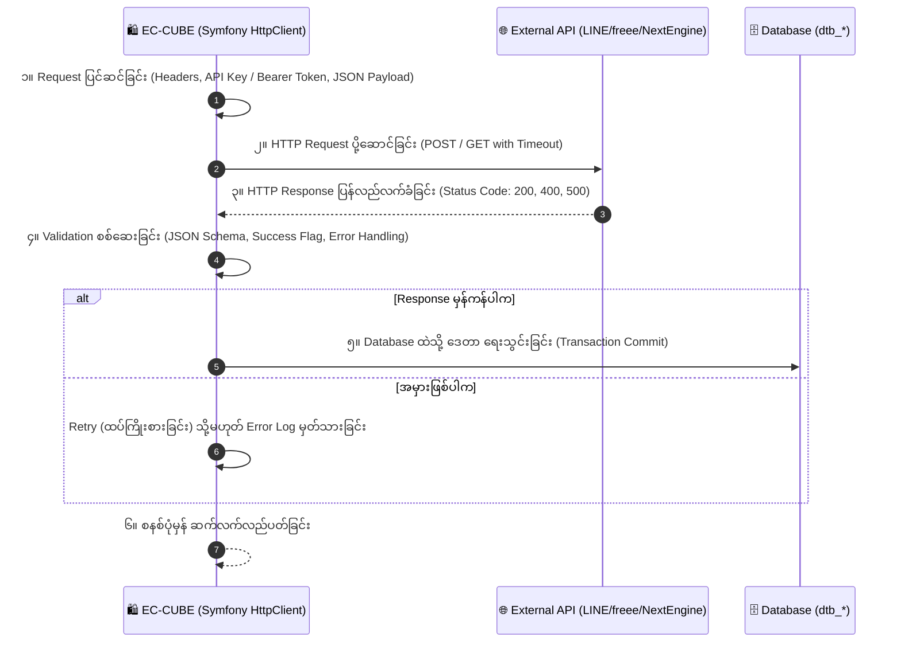

# EC-CUBE Client Requirements: External API Integration (မြန်မာဘာသာ)

EC-CUBE (Version 4.x / 4.2+) ၏ **External API Integration (ပြင်ပ စနစ်များနှင့် API ချိတ်ဆက်ခြင်း)** ဆိုင်ရာ Client Requirements များနှင့် **Robust API Architecture** ကို အခြေခံမှစ၍ အသေးစိတ် ရှင်းလင်းထားသော လေ့လာမှု လမ်းညွှန်ဖြစ်ပါသည်။

ခေတ်မီ E-Commerce လုပ်ငန်းတစ်ခုသည် EC-CUBE တစ်ခုတည်းဖြင့် လည်ပတ်၍ မရဘဲ ငွေချေစနစ်များ (Payment Gateway)၊ ချောပို့စနစ်များ (Yamato/Sagawa)၊ စာရင်းကိုင်စနစ်များ (freee/Money Forward)၊ ဂိုဒေါင်/စတော့စနစ်များ (Next Engine)၊ ဆိုရှယ်မီဒီယာ (LINE/Google)၊ စျေးကွက်ကြီးများ (Amazon/Rakuten) နှင့် ခေတ်သစ် AI APIs (OpenAI/ChatGPT) တို့နှင့် အချိန်နှင့်တပြေးညီ ချိတ်ဆက် အလုပ်လုပ်ရပါသည်။

---

## 🔄 The 6-Step API Integration Pipeline (အဆင့် ၆ ဆင့် စီးဆင်းမှု)

EC-CUBE မှ ပြင်ပ API တစ်ခုဆီသို့ ဒေတာ လှမ်းပို့ပြီး Database ထဲ ပြန်လည် သိမ်းဆည်းသည့် အဆင့် ၆ ဆင့် Pipeline:

---

## 📑 မာတိကာ (Table of Contents)

| No. | ခေါင်းစဉ် | ဖိုင်လမ်းကြောင်း | အဓိက အကြောင်းအရာများ |
|:---:|:---|:---|:---|
| 01 | **API Pipeline & Security Architecture** | [01_api_request_pipeline_and_security.md](./01_api_request_pipeline_and_security.md) | Request ➔ External API ➔ Response ➔ Validation ➔ DB စီးဆင်းမှု၊ API Keys, OAuth 2.0, Access Tokens, Secret Management |
| 02 | **Resilience: Timeout, Retry & Logging** | [02_resilience_timeout_retry_logging.md](./02_resilience_timeout_retry_logging.md) | Timeout (ဆာဗာ Freeze မဖြစ်စေရန်), Exponential Backoff Retry, Error Handling, Monolog ဖြင့် လုံခြုံသော Log မှတ်နည်း |
| 03 | **Major Japanese API Integrations** | [03_major_api_integrations_japan.md](./03_major_api_integrations_japan.md) | Payment, Shipping, Inventory (Next Engine), CRM, Accounting (freee), LINE, Google, Amazon, Rakuten, OpenAI AI API, Webhook |
| 04 | **Top Client Tasks & Troubleshooting (လက်တွေ့ ပြင်ဆင်နည်းများ)** | [04_top_client_tasks_and_troubleshooting.md](./04_top_client_tasks_and_troubleshooting.md) | **Client များ အများဆုံး တောင်းဆိုသော ပြင်ဆင်မှု ၅ ခုနှင့် Fix လုပ်နည်းများ** (Next Engine စတော့ညှိခြင်း၊ LINE Login & Auto Message, freee စာရင်းကိုင် Auto Sync, AI အလိုအလျောက် ပစ္စည်းစာသားရေးခြင်း) |

---

## 🛡️ အရေးကြီးသော လုံခြုံရေးနှင့် ခံနိုင်ရည်ရှိမှု စံနှုန်းများ

1. **Authentication (စိစစ်ခြင်း)**: API Key၊ HTTP Basic Auth သို့မဟုတ် OAuth 2.0 Access Token ဖြင့် စစ်မှန်သော ဆာဗာဖြစ်ကြောင်း အတည်ပြုခြင်း။
2. **Secrets Management**: API Keys များကို Code ထဲတွင် Hardcode လုံးဝ မရေးဘဲ `.env` နှင့် Environment Variables များထဲတွင်သာ လုံခြုံစွာ သိမ်းဆည်းခြင်း။
3. **Timeout Control**: ပြင်ပဆာဗာ ဒေါင်းနေပါက EC-CUBE ပါ လိုက်လံ Freeze မဖြစ်စေရန် `timeout: 5.0` (၅ စက္ကန့်) ကန့်သတ်ထားခြင်း။
4. **Data Masking in Logs**: Error Log များ မှတ်သားရာတွင် Credit Card နံပါတ်များ၊ လျှို့ဝှက် Password များနှင့် Access Token များကို ကြယ်ပွင့် (`****`) ဖြင့် ဖုံးအုပ် (Masking) ပြုလုပ်ရခြင်း။

---

## 🇯🇵 အရေးကြီးသော ဂျပန် ဝေါဟာရများ (External API Terms)

| Japanese (漢字/カタカナ) | Romaji | အဓိပ္ပာယ် |
|:---|:---|:---|
| **外部システム連携** | Gaibu Shisutemu Renkei | External System Integration |
| **在庫連携** | Zaiko Renkei | Multi-channel Inventory Sync (e.g. Next Engine) |
| **自動仕訳連携** | Jidou Shiwake Renkei | Automatic Accounting Journal Entry (freee) |
| **タイムアウト** | Taimuauto | Connection / Request Timeout |
| **再試行 (リトライ)** | Sai-shikou (Ritorai) | Request Retry (Exponential Backoff) |
| **モール連携** | Mooru Renkei | Marketplace Sync (Rakuten, Amazon, Yahoo) |
| **指数バックオフ** | Shisuu Bakkuofu | Exponential Backoff Retry Strategy |

အထက်ပါ မာတိကာဇယားမှ သက်ဆိုင်ရာ လေ့လာမှုဖိုင်များကို ဖွင့်ဖတ်၍ အသေးစိတ် စတင် လေ့လာနိုင်ပါသည်။
