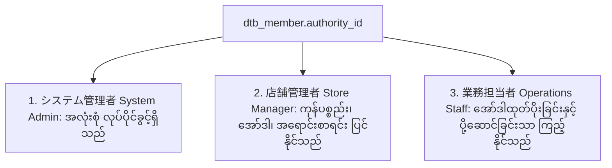

# 03 - Admin Auth, Roles & Permissions (အုပ်ချုပ်သူ အထောက်အထားနှင့် လုပ်ပိုင်ခွင့် အဆင့်ဆင့်)

> **Client Requirements**:
> 1. **Admin authentication (အုပ်ချုပ်သူ Login ဝင်ရောက်ခြင်း)**: ဆိုင်ဝန်ထမ်းများသည် သီးခြား Admin URL (ဥပမာ- `/admin/login`) မှတဆင့် လုံခြုံစွာ Login ဝင်ရောက်နိုင်ရမည်။ အလုပ်ထွက်သွားသော ဝန်ထမ်း၏ Account ကို ချက်ချင်း ပိတ်ပင်နိုင်ရမည် (`work = 0`)။
> 2. **Admin roles & permissions (လုပ်ပိုင်ခွင့် အဆင့်အတန်း သတ်မှတ်ခြင်း)**: ဆိုင်ပိုင်ရှင်၊ စတိုးမန်နေဂျာနှင့် ဂိုဒေါင်ဝန်ထမ်းများကြား လုပ်ပိုင်ခွင့်များကို ခွဲခြားထားနိုင်ရမည် (ဥပမာ- ဂိုဒေါင်ဝန်ထမ်းသည် အော်ဒါနှင့် ပို့ဆောင်ရေးသာ ကြည့်ခွင့်ရှိပြီး၊ ဆိုင်၏ စုစုပေါင်း ရောင်းအားစာရင်းဇယားများကို ကြည့်ခွင့်မရှိစေရ)။

---

## 🗄️ 1. Admin Member Database Architecture (`dtb_member`)

EC-CUBE တွင် ဆိုင်ဝန်ထမ်းများကို `dtb_customer` တွင် မသိမ်းဘဲ သီးခြား **`dtb_member`** ဇယားဖြင့် သိမ်းဆည်းပါသည်:

```sql
CREATE TABLE dtb_member (
    id INT AUTO_INCREMENT PRIMARY KEY,
    work SMALLINT NOT NULL DEFAULT 1,     -- 1: 有効 (Active), 0: 無効 (Account ပိတ်ထားသည်)
    authority_id INT NOT NULL,            -- လုပ်ပိုင်ခွင့် အဆင့် (FK -> mtb_authority)
    name VARCHAR(255) NOT NULL,           -- ဝန်ထမ်းအမည်
    department VARCHAR(255) DEFAULT NULL, -- ဌာန
    login_id VARCHAR(255) NOT NULL UNIQUE,-- Login အမည်
    password VARCHAR(255) NOT NULL,       -- Hashed Password (Bcrypt)
    sort_no INT NOT NULL,
    create_date DATETIME NOT NULL,
    update_date DATETIME NOT NULL
);
```

### အကောင့် ချက်ချင်း ပိတ်ပင်ခြင်း (`work` Flag):
ဝန်ထမ်းတစ်ဦး အလုပ်ထွက်သွားပါက ၎င်း၏ အကောင့်ကို Database မှ မဖျက်ဘဲ `work = 0 (無効)` သို့ ပြောင်းလိုက်ရုံဖြင့် ထိုသူသည် Admin သို့ ချက်ချင်း Login ဝင်ခွင့် မရှိတော့ပါ။

---

## 👑 2. Admin Authority Master (လုပ်ပိုင်ခွင့် အဆင့် ၃ ဆင့်)

EC-CUBE Standard တွင် `mtb_authority` Master ဖြင့် အောက်ပါ အဆင့် ၃ ဆင့် ပါဝင်ပါသည်:



| Authority ID | ဂျပန်အမည် | မြန်မာ အဓိပ္ပာယ် | လုပ်ပိုင်ခွင့် အတိုင်းအတာ |
|:---:|:---|:---|:---|
| **1** | **システム管理者** | System Administrator | ဆိုင်စနစ်တစ်ခုလုံး၊ Plugin များ၊ လုံခြုံရေးနှင့် ဝန်ထမ်းအကောင့်များ ပြင်ဆင်ခွင့်ရှိသည် (Full Access) |
| **2** | **店舗管理者** | Store Manager | ကုန်ပစ္စည်းတင်ခြင်း၊ အော်ဒါစစ်ဆေးခြင်း၊ ရောင်းအားကြည့်ခြင်းများ လုပ်နိုင်သော်လည်း System Settings ပြင်ခွင့်မရှိပါ |
| **3** | **業務担当者** | Operations / Warehouse | ပါဆယ်ထုတ်ပိုးခြင်း၊ Tracking နံပါတ်ထည့်ခြင်းသာ လုပ်နိုင်ပြီး ရောင်းအားစာရင်းဇယားများ မမြင်ရပါ |

---

## 💻 3. Role-Based Access Control (RBAC) Implementation

Admin Controller များတွင် လုပ်ပိုင်ခွင့် စစ်ဆေးပုံ:

```php
namespace Eccube\Controller\Admin\Setting\System;

use Sensio\Bundle\FrameworkExtraBundle\Configuration\IsGranted;
use Symfony\Component\Routing\Annotation\Route;

class SecurityController extends AbstractController
{
    /**
     * စနစ် လုံခြုံရေး စာမျက်နှာ (System Admin သာ ဝင်ခွင့်ပြုခြင်း)
     */
    #[Route('/%eccube_admin_route%/setting/system/security', name: 'admin_setting_system_security')]
    public function index()
    {
        // လက်ရှိ Login ဝင်ထားသော ဝန်ထမ်းကို ယူခြင်း
        $Member = $this->getUser();

        // အကယ်၍ System Administrator (Authority ID: 1) မဟုတ်ပါက ပိတ်ပင်ခြင်း
        if ($Member->getAuthority()->getId() !== 1) {
            throw new AccessDeniedHttpException('このページへのアクセス権限がありません (ဝင်ရောက်ခွင့် မရှိပါ)');
        }

        return [];
    }
}
```

---

## 🎨 Twig Sidebar Menu တွင် လုပ်ပိုင်ခွင့်အလိုက် Menu ဖျောက်ထားခြင်း

လုပ်ပိုင်ခွင့် မရှိသော ဝန်ထမ်းများအတွက် Sidebar Menu တွင် ထိုခလုတ်များကို လုံးဝ မပြသဘဲ ဖျောက်ထားပါသည်:

```twig
{# Resource/template/admin/nav.twig #}

{# ၁။ ကုန်ပစ္စည်းနှင့် အော်ဒါ Menu (ဝန်ထမ်းတိုင်း မြင်တွေ့နိုင်သည်) #}
<li><a href="{{ url('admin_order') }}"><i class="fa fa-shopping-cart"></i> 受注管理</a></li>
<li><a href="{{ url('admin_product') }}"><i class="fa fa-box"></i> 商品管理</a></li>

{# ၂။ ရောင်းအားစာရင်း (ဂိုဒေါင်ဝန်ထမ်းများ မမြင်စေရန် ပိတ်ခြင်း) #}

    <li><a href="{{ url('admin_order_sales') }}"><i class="fa fa-chart-line"></i> 売上集計</a></li>


{# ၃။ System Setting Menu (System Administrator သာ မြင်ရမည်) #}

    <li><a href="{{ url('admin_setting_system') }}"><i class="fa fa-cogs"></i> システム設定</a></li>

```

---

## 🇯🇵 သက်ဆိုင်ရာ ဂျပန် ဝေါဟာရများ

- **管理者認証 (Kanrisha Ninshou)**: Admin Authentication
- **権限 (Kengen)**: Authority / Permission
- **システム管理者 (Shisutemu Kanrisha)**: System Administrator (Super User)
- **店舗管理者 (Tenpo Kanrisha)**: Store Manager
- **業務担当者 (Gyoumu Tantousha)**: Operational / Warehouse Staff
- **権限エラー / アクセス拒否 (Kengen Eraa / Akusesu Kyohi)**: 403 Access Denied
