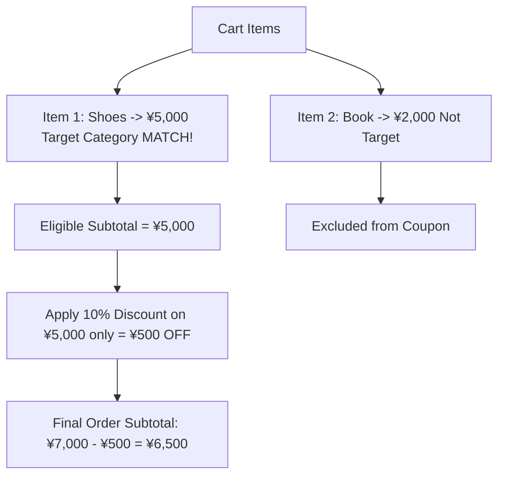

# 02 - Coupon Rules & Types (ကူပွန် အမျိုးအစားများနှင့် စည်းမျဉ်းများ)

> **Client Requirements**:
> 1. **Coupon creation (ကူပွန် တည်ဆောက်ခြင်း)**: Admin Dashboard မှ ကူပွန်အမည်၊ ကူပွန်ကုဒ် (ဥပမာ- `WELCOME2026`) နှင့် အသုံးပြုနိုင်သည့် အကြိမ်ရေတို့ကို လွယ်ကူစွာ သတ်မှတ်နိုင်ရမည်။
> 2. **Expiration (သက်တမ်း သတ်မှတ်ခြင်း)**: စတင်မည့် နေ့ရက်/အချိန် နှင့် ကုန်ဆုံးမည့် နေ့ရက်/အချိန် (Start & End Datetime) သတ်မှတ်နိုင်ရမည်။
> 3. **Percentage discount (ရာခိုင်နှုန်း လျှော့စျေး)**: 10% OFF သို့မဟုတ် 20% OFF ကူပွန်များ ထုတ်ပေးနိုင်ရမည်။
> 4. **Fixed discount (ငွေပမာဏ အတိအကျ လျှော့စျေး)**: ¥500 OFF သို့မဟုတ် ¥1,000 OFF ကူပွန်များ ထုတ်ပေးနိုင်ရမည်။
> 5. **Member-only coupon (အသင်းဝင် သီးသန့်)**: အသင်းဝင် စာရင်းသွင်းပြီး Login ဝင်ထားသူများသာ သုံးခွင့်ရမည့် ကူပွန်။
> 6. **Product/Category-specific coupon (သတ်မှတ် ပစ္စည်း/Category သီးသန့်)**: ဆိုင်ရှိ ပစ္စည်းအားလုံး မဟုတ်ဘဲ သတ်မှတ်ထားသော အင်္ကျီ သို့မဟုတ် Fashion Category ထဲရှိ ပစ္စည်းများ ဝယ်မှသာ သုံးခွင့်ရမည့် ကူပွန်။
> 7. **Minimum purchase amount (အနည်းဆုံး ဝယ်ယူငွေ ကန့်သတ်ချက်)**: "အနည်းဆုံး ¥3,000 ဖိုး ဝယ်ယူမှသာ သုံးနိုင်သည်" ဟူသော စည်းမျဉ်း။

---

## 🎟️ ကူပွန် အမျိုးအစား ၂ မျိုး တွက်ချက်ပုံ

### ၁။ 定額割引 (Fixed Amount Discount)
- **ဥပမာ**: `¥1,000 OFF Coupon`
- **ပုံသေနည်း**: `Discount Amount = 1,000 円`
- **သတိပြုရန်**: ဝယ်ယူငွေသည် ¥800 သာ ရှိပါက Discount သည် ¥1,000 မဖြစ်နိုင်ပါ (ငွေစာရင်း အနုတ် မဖြစ်စေရန် `min(1000, 800) = 800 円` အဖြစ် ကန့်သတ်ရပါသည်)။

### ၂။ 定率割引 (Percentage Discount)
- **ဥပမာ**: `15% OFF Coupon`
- **ပုံသေနည်း**: `Discount Amount = floor(Subtotal * 0.15)`
- **ဂျပန် စံနှုန်း အကြွင်းဖြတ်တောက်မှု (端数処理)**:  
  အကယ်၍ ၁၅% လျှော့စျေး တွက်ချက်မှုအရ `¥375.8` ဟု အကြွင်းထွက်လာပါက ဂျပန် E-Commerce များတွင် အောက်သို့ ဖြတ်ချသည့် **`floor()`** (切り捨て) ကို စံနှုန်းအဖြစ် အသုံးပြုကြပါသည် (Customer အား ¥375 လျှော့ပေးသည်)။

---

## 🏷️ သတ်မှတ် ပစ္စည်း / Category သီးသန့် ကူပွန် တွက်ချက်ပုံ

ကူပွန်တစ်ခုသည် ဆိုင်ရှိ ပစ္စည်းအားလုံးအတွက် မဟုတ်ဘဲ "ဖိနပ် (Shoes) Category" အတွက်သာ သီးသန့် လျှော့ပေးလိုသည့်အခါ:



### Code Implementation (Target Item Filtering):
```php
// သတ်မှတ်ထားသော Target ပစ္စည်းများ၏ တန်ဖိုးကိုသာ သီးခြား စုစည်းခြင်း
$eligibleSubtotal = 0;

foreach ($Order->getProductOrderItems() as $orderItem) {
    $Product = $orderItem->getProductClass()->getProduct();

    // ကုန်ပစ္စည်း သို့မဟုတ် Category ကိုက်ညီမှု ရှိမရှိ စစ်ဆေးခြင်း
    if ($Coupon->isTargetProduct($Product)) {
        $eligibleSubtotal += ($orderItem->getPriceIncTax() * $orderItem->getQuantity());
    }
}

if ($eligibleSubtotal > 0) {
    // Target ပစ္စည်းများ၏ တန်ဖိုးအပေါ်တွင်သာ ရာခိုင်နှုန်း လျှော့ချခြင်း
    $discount = floor($eligibleSubtotal * ($Coupon->getDiscountRate() / 100));
}
```

---

## ⏰ သက်တမ်း စစ်ဆေးခြင်း (Timezone & Datetime Comparison)

ဂျပန်နိုင်ငံ စံတော်ချိန် (JST / Asia/Tokyo) အရ Start Time နှင့် End Time ကို တိကျစွာ စစ်ဆေးရပါမည်:

```php
// ဥပမာ- 2026-09-01 00:00:00 မှ 2026-09-30 23:59:59 အထိ
$now = new \DateTime('now', new \DateTimeZone('Asia/Tokyo'));

if ($now < $Coupon->getStartDate()) {
    throw new PurchaseFlowException('このクーポンはまだ開始されていません (ကူပွန် မစတင်သေးပါ)');
}

if ($now > $Coupon->getEndDate()) {
    throw new PurchaseFlowException('このクーポンの有効期限は終了しました (ကူပွန် သက်တမ်းကုန်သွားပါပြီ)');
}
```

---

## 👤 အသင်းဝင် သီးသန့် ကူပွန် (会員限定)

ဧည့်သည် (Guest User) များအား အသင်းဝင် စာရင်းသွင်းရန် ဆွဲဆောင်သည့် အနေဖြင့် "အသင်းဝင်များသာ သုံးခွင့်ရှိသော ကူပွန်" များကို အသုံးပြုကြပါသည်:

```php
if ($Coupon->isMemberOnly() && !$Order->getCustomer()) {
    throw new PurchaseFlowException('会員登録・ログイン後にご利用いただけます (Login အရင်ဝင်ပေးပါ)');
}
```

---

## 🇯🇵 သက်ဆိုင်ရာ ဂျပန် ဝေါဟာရများ

- **定額割引 (Teigaku Waribiki)**: Fixed Amount Discount (e.g. ¥500 OFF)
- **定率割引 (Teiritsu Waribiki)**: Percentage Discount (e.g. 10% OFF)
- **対象商品限定 (Taishou Shouhin Gentei)**: Target Product Specific
- **対象カテゴリ限定 (Taishou Kategori Gentei)**: Target Category Specific
- **端数処理 / 切り捨て (Hasuu Shorii / Kirisute)**: Rounding Down (floor)
- **最低利用可能金額 (Saitei Riyou Kanou Kingaku)**: Minimum Required Cart Amount
