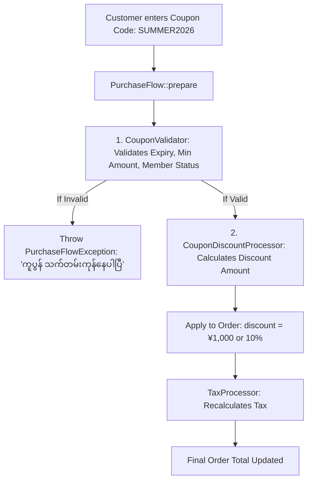
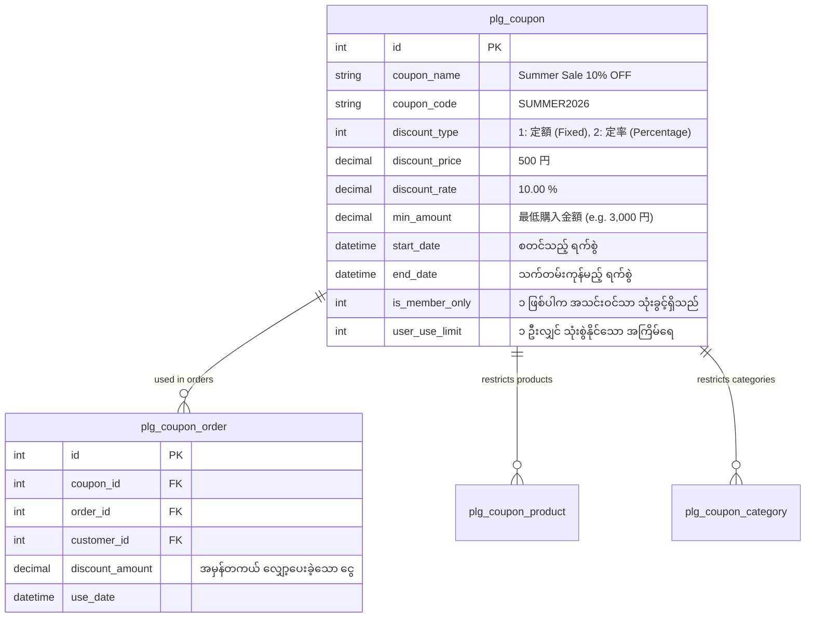

# EC-CUBE Client Requirements: Campaign & Coupon (မြန်မာဘာသာ)

EC-CUBE (Version 4.x / 4.2+) ၏ **Campaign & Coupon (ပရိုမိုးရှင်း ကမ်ပိန်း၊ ကူပွန်စနစ်နှင့် လျှော့စျေး စီမံခန့်ခွဲမှု)** ဆိုင်ရာ Client Requirements များနှင့် **Business Logic တည်ရှိရာ ဗိသုကာ** ကို အခြေခံမှစ၍ အသေးစိတ် ရှင်းလင်းထားသော လေ့လာမှု လမ်းညွှန်ဖြစ်ပါသည်။

အွန်လိုင်းစတိုးများတွင် ရောင်းအားမြှင့်တင်ရန်အတွက် ရာခိုင်နှုန်းလျှော့စျေး (Percentage Discount)၊ ငွေပမာဏအတိအကျလျှော့စျေး (Fixed Discount)၊ အသင်းဝင်သီးသန့်ကူပွန်၊ သတ်မှတ်ကုန်ပစ္စည်းကူပွန်နှင့် သက်တမ်းအလိုက် အလိုအလျောက် ပေါ်/ပျောက် ပြုလုပ်နိုင်သော Campaign Banner စနစ်များသည် မရှိမဖြစ် လိုအပ်ပါသည်။

---

## 🏛️ Where Business Logic Should Live? (အရေးကြီးဆုံး ဗိသုကာ မေးခွန်း)

Junior Developer များ အများဆုံး မှားယွင်းတတ်သော မေးခွန်း:  
> *"ကူပွန် သက်တမ်းကုန်/မကုန် စစ်ဆေးခြင်း၊ လျှော့စျေး တွက်ချက်ခြင်း စသည့် Business Logic များကို **Controller** ထဲတွင် ရေးသားသင့်ပါသလား?"*

### ❌ အဖြေ: Controller ထဲတွင် လုံးဝ မရေးရပါ!
အကယ်၍ Controller ထဲတွင် ရေးသားပါက:
1. Customer က Cart ထဲမှ ပစ္စည်း အရေအတွက် ပြောင်းလိုက်သည့်အခါ သို့မဟုတ် Checkout အဆင့်များ ပြန်ဆုတ်သည့်အခါ စျေးနှုန်းများ လွဲချော်သွားမည်။
2. Admin ဘက်ခြမ်းမှ အော်ဒါပြင်ဆင်သည့်အခါ ထို Logic များ အလုပ်မလုပ်တော့ဘဲ ချို့ယွင်းသွားမည်။

### ✅ မှန်ကန်သော တည်နေရာ: `PurchaseFlow` Architecture!
EC-CUBE တွင် ကူပွန်နှင့် လျှော့စျေး Business Logic အားလုံးကို အောက်ပါ နေရာ ၂ ခုတွင်သာ ထားရှိရပါသည်:
1. **`ItemHolderValidator` (စစ်ဆေးရေးအပိုင်း)**: ကူပွန် ကုဒ်မှန်မမှန်၊ သက်တမ်း ကုန်/မကုန်၊ အနည်းဆုံး ဝယ်ယူငွေ ပြည့်/မပြည့်၊ အသင်းဝင် ဟုတ်/မဟုတ် စစ်ဆေးသည်။
2. **`DiscountProcessor` (တွက်ချက်ရေးအပိုင်း)**: လျှော့စျေး ပမာဏကို တိကျစွာ တွက်ချက်ပြီး `dtb_order.discount` ထဲသို့ ထည့်သွင်းပေးသည်။

---

## 📑 မာတိကာ (Table of Contents)

| No. | ခေါင်းစဉ် | ဖိုင်လမ်းကြောင်း | အဓိက အကြောင်းအရာများ |
|:---:|:---|:---|:---|
| 01 | **Coupon Architecture & Where Logic Lives** | [01_coupon_architecture_and_business_logic.md](./01_coupon_architecture_and_business_logic.md) | Controller vs PurchaseFlow, `CouponValidator`, `DiscountProcessor`, Database Schema |
| 02 | **Coupon Rules & Types** | [02_coupon_rules_and_types.md](./02_coupon_rules_and_types.md) | ရာခိုင်နှုန်း (定率 10% OFF) vs ငွေပမာဏ (定額 ¥500 OFF)၊ သက်တမ်း (有効期限)၊ အနည်းဆုံးဝယ်ယူငွေ၊ အသင်းဝင်သီးသန့်၊ သီးသန့်ပစ္စည်း/Category ကူပွန် |
| 03 | **Campaign Banners & Marketing** | [03_campaign_banners_and_marketing.md](./03_campaign_banners_and_marketing.md) | Top Page Campaign Banner၊ သက်တမ်းအလိုက် အလိုအလျောက် ပေါ်/ဖျောက် ပြုလုပ်ပုံ (Auto-expiry Banner)၊ ကလစ်နှိပ်ရုံဖြင့် ကူပွန်ကူးယူခြင်း |
| 04 | **Top Client Tasks & Troubleshooting (လက်တွေ့ ပြင်ဆင်နည်းများ)** | [04_top_client_tasks_and_troubleshooting.md](./04_top_client_tasks_and_troubleshooting.md) | **Client များ အများဆုံး တောင်းဆိုသော ပြင်ဆင်မှု ၅ ခုနှင့် Fix လုပ်နည်းများ** (၁ ဦး ၁ ကြိမ်သာ သုံးခွင့်၊ ကူပွန်ငွေက ပစ္စည်းတန်ဖိုးထက် ကြီး၍ အနုတ်မဖြစ်စေရန် ကာကွယ်နည်း၊ ၈% နှင့် ၁၀% အခွန်ခွဲခြမ်းမှု) |

---

## 🗄️ Database Schema: Coupon System Tables

EC-CUBE တွင် Coupon Plugin များသည် အောက်ပါ ဇယားများဖြင့် ဖွဲ့စည်းထားပါသည်:

---

## 🇯🇵 အရေးကြီးသော ဂျပန် ဝေါဟာရများ (Coupon & Campaign Terms)

| Japanese (漢字/カタカナ) | Romaji | အဓိပ္ပာယ် |
|:---|:---|:---|
| **クーポン** | Kuupon | Coupon / Promo Code |
| **定額割引** | Teigaku Waribiki | Fixed Amount Discount (ဥပမာ- ¥500 OFF, ¥1,000 OFF) |
| **定率割引** | Teiritsu Waribiki | Percentage Discount (ဥပမာ- 10% OFF, 20% OFF) |
| **有効期限** | Yuukou Kigen | Expiration Date / Validity Period |
| **最低購入金額** | Saitei Kounyuu Kingaku | Minimum Purchase Amount Required |
| **会員限定クーポン** | Kaiin Gentei Kuupon | Member-Only Exclusive Coupon |
| **対象商品限定** | Taishou Shouhin Gentei | Specific Target Products Only |
| **併用不可** | Heiyou Fuka | Cannot be combined with other coupons |
| **1人1回限り** | Hitori Ikkai Kagiri | One-time usage per customer only |

အထက်ပါ မာတိကာဇယားမှ သက်ဆိုင်ရာ လေ့လာမှုဖိုင်များကို ဖွင့်ဖတ်၍ အသေးစိတ် စတင် လေ့လာနိုင်ပါသည်။
