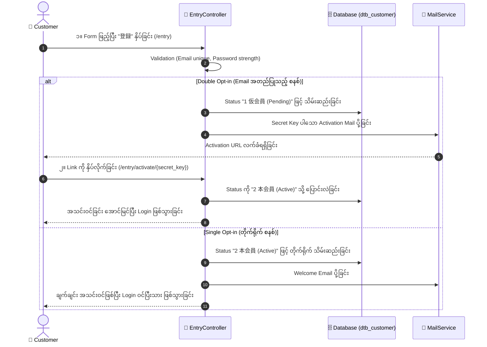

# 02 - Customer Registration (ဖောက်သည် အသင်းဝင် စာရင်းသွင်းခြင်း)

> **Client Requirements**:
> 1. **Customer Registration (ဝဘ်ဆိုက်မှ အသင်းဝင် စာရင်းသွင်းခြင်း)**: ဝယ်ယူသူများ အမည်၊ အီးမေးလ်၊ လိပ်စာ၊ ဖုန်းနံပါတ် ဖြည့်သွင်းပြီး အသင်းဝင်အဖြစ် အလွယ်တကူ စာရင်းသွင်းနိုင်ရမည်။ စာတိုက်သင်္ကေတ ရိုက်လိုက်သည်နှင့် လိပ်စာ အလိုအလျောက် ပေါ်လာရမည် (Zipcode Auto-fill)။
> 2. **Double Opt-in စနစ် (Email အတည်ပြုခြင်း)**: အီးမေးလ်အတုများ မဖြစ်စေရန်အတွက် အသင်းဝင် စာရင်းသွင်းပြီးသည်နှင့် ချက်ချင်း အသင်းဝင် မဖြစ်သေးဘဲ **仮会員 (Temporary Member)** အဖြစ် ထားရှိပြီး၊ Email ထဲသို့ ရောက်လာသော Activation Link ကို နှိပ်ပြီးမှသာ **本会員 (Active Member)** အဖြစ် တရားဝင် သတ်မှတ်ရမည်။
> 3. **Single Opt-in (တိုက်ရိုက် အသင်းဝင်ဖြစ်ခြင်း)**: အချို့သော Client များအတွက် Email သွားစစ်နေရန် မလိုဘဲ စာရင်းသွင်းပြီးသည်နှင့် ချက်ချင်း ဝယ်ယူနိုင်သော စနစ်လည်း ရွေးချယ်နိုင်ရမည်။

---

## 🔄 EC-CUBE Registration Flow: Double Opt-in vs Single Opt-in



---

## 🏛️ Implementation Architecture & Controllers

### သက်ဆိုင်ရာ အဓိက ဖိုင်များ:
- **Front Controller**: `src/Eccube/Controller/EntryController.php`
- **Form Type**: `src/Eccube/Form/Type/Front/EntryType.php`
- **Mail Service**: `src/Eccube/Service/MailService.php`
- **Twig Template**: `src/Eccube/Resource/template/default/Entry/index.twig`

---

## 📝 အဆင့်ဆင့် အလုပ်လုပ်ပုံ (Step-by-Step Flow)

### အဆင့် ၁: Form ဖြည့်သွင်းခြင်းနှင့် ဂျပန် စံနှုန်း Validation
ဂျပန်နိုင်ငံ E-Commerce ဝဘ်ဆိုက်များတွင် အမည်ကို **漢字 (Kanji)** အပြင် အသံထွက် ဖတ်ရှုနိုင်ရန် **フリガナ (Katakana)** ကို မဖြစ်မနေ ထည့်သွင်းရပါသည်:

```php
// EntryType.php
$builder
    // မျိုးရိုးအမည် နှင့် အမည် (Kanji)
    ->add('name', NameType::class, [
        'required' => true,
    ])
    // ခတခဏ အမည် (Furigana - Kana)
    ->add('kana', KanaType::class, [
        'required' => true,
    ])
    // စာတိုက်သင်္ကေတ (Postal Code)
    ->add('postal_code', PostalType::class, [
        'required' => true,
    ])
    // စီရင်စု (Prefecture)
    ->add('pref', PrefType::class, [
        'required' => true,
    ])
    // အီးမေးလ် (ထပ်တူကျခြင်း မရှိစေရန် စစ်ဆေးသည်)
    ->add('email', RepeatedEmailType::class, [
        'required' => true,
    ])
    // Password
    ->add('password', RepeatedPasswordType::class, [
        'required' => true,
    ]);
```

### အဆင့် ၂: Postal Code Auto-fill JavaScript (郵便番号自動入力)
Customer များ စာတိုက်သင်္ကေတ (ဥပမာ- `100-0001`) ရိုက်ထည့်လိုက်သည်နှင့် Tokyo စီရင်စု၊ Chiyoda မြို့နယ် အလိုအလျောက် ပေါ်လာစေရန် `yubinbango.js` ကို အသုံးပြုပါသည်:

```html
<!-- Entry/index.twig -->
<script src="https://yubinbango.github.io/yubinbango/yubinbango.js" charset="UTF-8"></script>

<form class="h-adr" method="post">
    <span class="p-country-name" style="display:none;">Japan</span>
    <!-- Postal Code -->
    <input type="text" class="p-postal-code" name="entry[postal_code]">
    <!-- Prefecture Auto-fills -->
    <select class="p-region-id" name="entry[pref]"></select>
    <!-- City/Address Auto-fills -->
    <input type="text" class="p-locality p-street-address" name="entry[addr01]">
</form>
```

### အဆင့် ၃: Activation Key ထုတ်ပေးခြင်းနှင့် Email ပေးပို့ခြင်း
Controller တွင် Double Opt-in စနစ်အတွက် အောက်ပါအတိုင်း ရေးသားထားပါသည်:

```php
// EntryController.php
if ($form->isSubmitted() && $form->isValid()) {
    $Customer = $form->getData();

    // Random Secret Key ထုတ်ပေးခြင်း (ဥပမာ- activation token)
    $Customer->setSecretKey($this->tokenGenerator->generateToken());

    if ($this->eccubeConfig['eccube_customer_entry_type'] === 'double_opt_in') {
        // Status: 1 (仮会員)
        $Customer->setStatus($this->customerStatusRepository->find(CustomerStatus::NONACTIVE));
        $this->entityManager->persist($Customer);
        $this->entityManager->flush();

        // Activation Link ပါသော Email ပို့ခြင်း
        $this->mailService->sendCustomerConfirmMail($Customer);

        return $this->redirectToRoute('entry_complete');
    } else {
        // Status: 2 (本会員 - Single Opt-in)
        $Customer->setStatus($this->customerStatusRepository->find(CustomerStatus::ACTIVE));
        $this->entityManager->persist($Customer);
        $this->entityManager->flush();

        // အလိုအလျောက် Login ဝင်ပေးခြင်း
        return $this->userAuthenticator->authenticateUser($Customer, $this->authenticator, $request);
    }
}
```

### အဆင့် ၄: Customer က Link ကို နှိပ်၍ အတည်ပြုခြင်း (`/entry/activate/{secret_key}`)
Customer ဆီသို့ `https://example.com/entry/activate/abc123token` ပုံစံ Link ရောက်ရှိသွားပြီး ထို Link ကို နှိပ်လိုက်သည့်အခါ:

```php
// EntryController::activate()
public function activate(Request $request, $secret_key)
{
    $Customer = $this->customerRepository->findOneBy(['secret_key' => $secret_key]);

    if (!$Customer) {
        throw new NotFoundHttpException();
    }

    // Status ကို 本会員 (Active - ID: 2) သို့ ပြောင်းလဲခြင်း
    $Customer->setStatus($this->customerStatusRepository->find(CustomerStatus::ACTIVE));
    $Customer->setSecretKey(null); // Key ကို ဖျက်ထုတ်ခြင်း
    $this->entityManager->flush();

    $this->addSuccess('front.entry.activate_complete');
    return $this->redirectToRoute('entry_activate_complete');
}
```

---

## 👨‍💼 Admin မှ Customer အသစ် လက်ဖြင့် ထည့်သွင်းခြင်း (Manual Registration)

ဖုန်းဖြင့် အော်ဒါမှာယူသော ဖောက်သည်များအတွက် Admin က **会員管理 ➔ 会員登録** မှတဆင့် တိုက်ရိုက် စာရင်းသွင်းပေးနိုင်ပါသည်:
- **Admin Controller**: `src/Eccube/Controller/Admin/Customer/CustomerEditController.php`
- Admin မှ ထည့်သွင်းပေးသော Customer များသည် Email အတည်ပြုရန် မလိုဘဲ တိုက်ရိုက် **本会員 (Active)** အဖြစ် စာရင်းဝင်သွားပါသည်။

---

## 🇯🇵 သက်ဆိုင်ရာ ဂျပန် ဝေါဟာရများ

- **会員登録 (Kaiin Touroku)**: Customer Registration
- **仮会員 (Kari Kaiin)**: Temporary Member (Pending Email Verification)
- **本会員 (Hon Kaiin)**: Verified / Active Member
- **フリガナ (Furigana)**: Phonetic Reading in Katakana
- **郵便番号自動入力 (Yuubin Bangou Jidou Nyuuryoku)**: Zipcode Address Auto-fill
- **本登録案内メール (Hon Touroku Annai Meeru)**: Account Activation Verification Email
