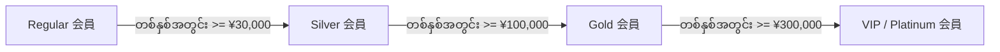

# 04 - Customer Purchase History & Groups (ဝယ်ယူမှု ရာဇဝင်နှင့် အသင်းဝင် အဆင့်အတန်းများ)

> **Client Requirements**:
> 1. **Customer purchase history (ဝယ်ယူမှု ရာဇဝင် ကြည့်ရှုခြင်း)**: Customer က မိမိ ယခင်က ဝယ်ယူခဲ့ဖူးသော အော်ဒါများကို MyPage တွင် ကြည့်ရှုနိုင်ရမည်ဖြစ်ပြီး၊ ထိုပစ္စည်းများကို တစ်ချက်နှိပ်ရုံဖြင့် တစ်ဖန် ပြန်လည်မှာယူနိုင်ရမည် (One-click Re-order)။ Admin ဘက်တွင်လည်း Customer Detail ၌ ထိုသူ၏ ဝယ်ယူမှုမှတ်တမ်းအားလုံးကို ကြည့်ရှုနိုင်ရမည်။
> 2. **Customer groups / Membership ranks (အသင်းဝင် အဆင့်အတန်း စနစ်)**: နှစ်စဉ် ဝယ်ယူမှု ပမာဏအပေါ် မူတည်၍ Customer များကို အဆင့်များ (Regular, Silver, Gold, VIP) ခွဲခြား သတ်မှတ်ပြီး၊ Gold/VIP အသင်းဝင်များအတွက် Point ပိုမိုပေးခြင်း သို့မဟုတ် အထူးလျှော့စျေးများ ပေးလိုခြင်း။

---

## 📜 1. Customer Purchase History (ဝယ်ယူမှု ရာဇဝင် Architecture)

ဝယ်ယူမှု ရာဇဝင်ကို Front-End နှင့် Back-End နှစ်ဖက်စလုံးတွင် အောက်ပါအတိုင်း ချိတ်ဆက်ထားပါသည်:

```
[dtb_customer (id: 15)]
           │
           ▼ (One-to-Many Relationship: Customer -> Orders)
     [dtb_order]
     ├── Order #101 ── 2026-08-10 ── ¥5,400 ── 発送済み (Shipped)
     ├── Order #145 ── 2026-09-01 ── ¥12,000 ── 発送済み (Shipped)
     └── Order #190 ── 2026-09-20 ── ¥3,500 ── 対応中 (In Progress)
```

### ၁။ Front MyPage Purchase History (`MypageController::index`)
Customer က MyPage သို့ ဝင်ရောက်သည့်အခါ `OrderRepository` က Login User ၏ Order များကိုသာ ဆွဲထုတ်ပေးပါသည်:

```php
// MypageController.php
public function index()
{
    /** @var Customer $Customer */
    $Customer = $this->getUser();

    // အဆိုပါ Customer ၏ အော်ဒါများကို နောက်ဆုံးရက်စွဲအလိုက် ဆွဲထုတ်ခြင်း
    $Orders = $this->orderRepository->findBy(
        ['Customer' => $Customer],
        ['order_date' => 'DESC'],
        5 // နောက်ဆုံး ၅ ခု
    );

    return ['Orders' => $Orders];
}
```

### ၂။ Re-Order Feature (ယခင်ပစ္စည်းများ ပြန်လည် ဝယ်ယူခြင်း)
Customer က ယခင်ဝယ်ဖူးသော Order Detail ထဲမှ "もう一度購入する (Re-order)" ခလုတ်ကို နှိပ်လိုက်ပါက ထိုအော်ဒါထဲရှိ ပစ္စည်းများကို လက်ရှိ Cart ထဲသို့ အလိုအလျောက် ပြန်လည် ထည့်သွင်းပေးနိုင်ပါသည်:

```php
// Re-order Action
public function reorder(Order $Order)
{
    foreach ($Order->getOrderItems() as $item) {
        if ($item->isProduct()) {
            // Cart ထဲသို့ အသစ် ပြန်ထည့်ခြင်း
            $this->cartService->addProduct($item->getProductClass(), $item->getQuantity());
        }
    }
    return $this->redirectToRoute('cart');
}
```

---

## 🏆 2. Customer Groups / Membership Ranks (会員ランク စနစ်)

ဂျပန် E-Commerce များတွင် သစ္စာရှိ ဝယ်ယူသူများ (Loyal Customers) ကို ဆွဲဆောင်ရန်အတွက် **会員ランク (Membership Ranks)** စနစ်ကို အသုံးပြုကြပါသည်:



### အဆင့်အတန်းအလိုက် ရရှိသော အခွင့်အရေးများ ဥပမာ:
- **Regular**: Point ရရှိမှုနှုန်း `1%`
- **Silver**: Point ရရှိမှုနှုန်း `2%` + မွေးနေ့လတွင် ¥500 Coupon
- **Gold**: Point ရရှိမှုနှုန်း `3%` + အမြဲတမ်း 5% လျှော့စျေး
- **VIP / Platinum**: Point ရရှိမှုနှုန်း `5%` + ပို့ခ အခမဲ့ (Free Shipping)

---

## 💻 Technical Architecture: Rank System Plugin

EC-CUBE Standard တွင် ရိုးရိုး Customer Entity သာ ပါဝင်ပြီး Rank စနစ် မပါရှိသေးသဖြင့် **Customer Rank Plugin** ဖြင့် ချိတ်ဆက်လေ့ရှိပါသည်:

### ၁။ Database Entity Extension:
```sql
CREATE TABLE plg_customer_rank (
    id INT AUTO_INCREMENT PRIMARY KEY,
    name VARCHAR(255) NOT NULL,            -- Regular, Silver, Gold, VIP
    point_rate DECIMAL(5,2) NOT NULL,      -- 1.00, 2.00, 3.00, 5.00
    discount_rate DECIMAL(5,2) NOT NULL,   -- 0%, 5%, 10%
    target_amount INT NOT NULL             -- သတ်မှတ်ထားသော ဝယ်ယူငွေပမာဏ
);

ALTER TABLE dtb_customer ADD customer_rank_id INT DEFAULT 1;
```

### ၂။ PurchaseFlow တွင် Rank-based Point နှင့် Discount တွက်ချက်ခြင်း:
`PurchaseFlow` ၏ `PointProcessor` နှင့် `DiscountProcessor` တွင် Login ဝင်ထားသော Customer ၏ Rank ကို စစ်ဆေးပြီး အကျိုးခံစားခွင့်များ တွက်ပေးပါသည်:

```php
// Plugin Custom PointProcessor
public function process(ItemInterface $item, PurchaseContext $context)
{
    $Order = $context->getOrder();
    $Customer = $Order->getCustomer();

    if ($Customer && $Customer->getCustomerRank()) {
        $multiplier = $Customer->getCustomerRank()->getPointRate(); // e.g. 5%
        // ပုံမှန် Point ထက် ၅ ဆ တိုးမြှင့် တွက်ချက်ပေးခြင်း
    }
}
```

### ၃။ ညစဉ် Rank အလိုအလျောက် သတ်မှတ်ပေးသော Cron Command:
Cron Task ဖြင့် ညသန်းခေါင်တိုင်း Customer တစ်ဦးချင်းစီ၏ လွန်ခဲ့သော ၁၂ လအတွင်း စုစုပေါင်း ဝယ်ယူငွေကို တွက်ချက်ပြီး Rank အသစ်သို့ အလိုအလျောက် တိုးမြှင့် (Promote) သို့မဟုတ် လျှော့ချ (Demote) ပေးပါသည်:

```bash
# Terminal Cron Command နမူနာ
bin/console eccube:customer-rank:update-daily
```

---

## 🇯🇵 သက်ဆိုင်ရာ ဂျပန် ဝေါဟာရများ

- **購入履歴 (Kounyuu Rireki)**: Purchase / Order History
- **再注文 (Sai-chuumon)**: Re-order / Buy Again
- **会員ランク (Kaiin Ranku)**: Customer Rank / Membership Tier
- **ポイント付与率 (Point Fuyo-ritsu)**: Point Granting Rate
- **年間購入金額 (Nenkan Kounyuu Kingaku)**: Annual Purchase Amount
- **ランクアップ (Ranku Appu)**: Rank Up / Promotion
- **優遇特典 (Yuuguu Tokuten)**: Special VIP Privileges / Benefits
