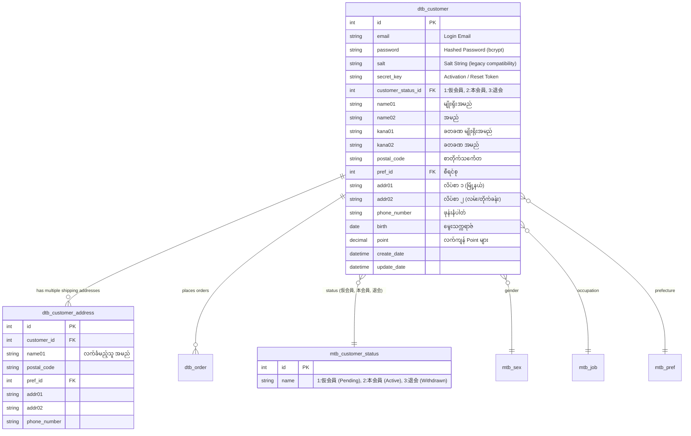

# EC-CUBE Client Requirements: Customer Management (မြန်မာဘာသာ)

EC-CUBE (Version 4.x / 4.2+) ၏ **Customer Management (ဖောက်သည် / အသင်းဝင် စီမံခန့်ခွဲမှုစနစ်)** ဆိုင်ရာ Client Requirements များနှင့် **Customer Authentication & Authorization** ဗိသုကာကို အခြေခံမှစ၍ အသေးစိတ် ရှင်းလင်းထားသော လေ့လာမှု လမ်းညွှန်ဖြစ်ပါသည်။

EC-CUBE တွင် Customer (会員) စနစ်သည် Symfony Security Component အပေါ်တွင် တည်ဆောက်ထားပြီး၊ အသင်းဝင် စာရင်းသွင်းခြင်း (Registration)၊ Double Opt-in အတည်ပြုခြင်း၊ MyPage စီမံခြင်း၊ ဝယ်ယူမှု ရာဇဝင်၊ အသင်းဝင် အဆင့်အတန်း (Membership Tiers) နှင့် လျှို့ဝှက်လုံခြုံရေး စနစ်များနှင့် ဆက်စပ်နေပါသည်။

---

## 🔐 Customer Authentication & Authorization Architecture Overview

EC-CUBE တွင် User စနစ်ကို **Customer (Front Store ဝယ်ယူသူ)** နှင့် **Member (Admin Backend ဝန်ထမ်း)** ဟူ၍ Firewall ၂ ခု သီးခြား ခွဲခြား ထိန်းချုပ်ထားပါသည်:

```mermaid
graph TD
    A[Incoming HTTP Request] --> B{Firewall Matcher in security.yaml}
    B -->|URL: ^/%eccube_admin_route%/| C[Admin Firewall]
    B -->|URL: ^/ (Front Store)| D[Customer Firewall]

    C --> E[UserProvider: MemberProvider]
    E --> F[Entity: dtb_member]
    F --> G[Role: ROLE_ADMIN]

    D --> H[UserProvider: CustomerProvider]
    H --> I[Entity: dtb_customer]
    I --> J[Role: ROLE_USER]
```

### အဓိက သဘောတရားများ:
1. **Customer Firewall (`customer`)**:
   - Storefront ဘက်ခြမ်းတွင် Customer များ Login ဝင်ရောက်ခြင်း၊ Cart နှင့် Checkout ပြုလုပ်ခြင်းတို့ကို ထိန်းချုပ်သည်။
2. **Entity (`dtb_customer`)**:
   - Symfony ၏ `UserInterface` နှင့် `PasswordAuthenticatedUserInterface` ကို Implement လုပ်ထားသဖြင့် လုံခြုံစိတ်ချရသော Session နှင့် Password Hashing စနစ် ပါဝင်သည်။
3. **Roles & Permissions**:
   - အသင်းဝင်အဖြစ် Login ဝင်ထားသူများအားလုံးသည် `ROLE_USER` ရရှိပြီး၊ Login မဝင်ရသေးသော ဧည့်သည်များသည် Guest User အဖြစ်သာ ရှိနေမည် ဖြစ်သည်။

---

## 📑 မာတိကာ (Table of Contents)

အောက်ပါ သင်ခန်းစာဖိုင်များတွင် Customer Management Requirement တစ်ခုချင်းစီကို အသေးစိတ် ခွဲခြမ်း လေ့လာနိုင်ပါသည်:

| No. | Requirement ခေါင်းစဉ် | ဖိုင်လမ်းကြောင်း | လေ့လာရမည့် အဓိက အကြောင်းအရာများ |
|:---:|:---|:---|:---|
| 01 | **Customer Authentication & Authorization** | [01_authentication_and_authorization.md](./01_authentication_and_authorization.md) | Symfony Security Architecture, `security.yaml`, Password Hashing (bcrypt/sodium), Remember-me, Brute-force protection |
| 02 | **Customer Registration (会員登録)** | [02_customer_registration.md](./02_customer_registration.md) | Double Opt-in စနစ် (仮会員 ➔ Activation Mail ➔ 本会員), Single Opt-in setting, Admin manual customer creation |
| 03 | **Customer Info Editing & Customer Search** | [03_customer_info_and_search.md](./03_customer_info_and_search.md) | MyPage အချက်အလက် ပြင်ဆင်ခြင်း၊ လိပ်စာခွဲများ (`dtb_customer_address`)၊ Admin Customer Search Query & Filters |
| 04 | **Purchase History & Customer Groups (Ranks)** | [04_customer_purchase_history_and_groups.md](./04_customer_purchase_history_and_groups.md) | MyPage နှင့် Admin မှ ဝယ်ယူမှု ရာဇဝင် စစ်ဆေးခြင်း၊ အသင်းဝင် အဆင့်အတန်း (VIP/Gold/Silver 会員ランク) သတ်မှတ်ခြင်း |
| 05 | **CSV Import/Export & Account Deletion (退会)** | [05_csv_import_export_and_deletion.md](./05_csv_import_export_and_deletion.md) | Customer CSV Import/Export, အသင်းဝင်မှ နုတ်ထွက်ခြင်း (退会 - Soft Delete & Anonymization), Order Data မပျက်စီးစေရန် ကာကွယ်မှု |
| 06 | **Member-Only Products & Member Prices** | [06_member_only_products_and_prices.md](./06_member_only_products_and_prices.md) | အသင်းဝင် သီးသန့် ဝယ်ယူနိုင်သော ပစ္စည်းများ (会員限定商品)၊ အသင်းဝင် အထူးသက်သာစျေး (会員限定価格 / 卸価格 B2B) |

---

## 🗄️ EC-CUBE Customer Core Database Architecture (ERD)



---

## 🇯🇵 အရေးကြီးသော ဂျပန် ဝေါဟာရများ (Customer Management Terms)

| Japanese (漢字/カタカナ) | Romaji | အဓိပ္ပာယ် |
|:---|:---|:---|
| **顧客管理 / 会員管理** | Kokyaku Kanri / Kaiin Kanri | Customer / Member Management |
| **会員登録** | Kaiin Touroku | Customer Registration |
| **仮会員** | Kari Kaiin | Temporary / Pending Member (Email မစစ်ဆေးရသေး) |
| **本会員** | Hon Kaiin | Active / Fully Verified Member |
| **マイページ** | Mai Peeji | MyPage (Customer Dashboard) |
| **退会手続き** | Taikai Tetsuzuki | Account Deletion / Membership Withdrawal |
| **会員ランク** | Kaiin Ranku | Membership Tier (Silver, Gold, VIP) |
| **会員限定商品** | Kaiin Gentei Shouhin | Member-Only Products |
| **お届け先追加** | Otodokesaki Tsuika | Add Additional Shipping Address |
| **購入履歴** | Kounyuu Rireki | Purchase History |

အထက်ပါ မာတိကာဇယားမှ သက်ဆိုင်ရာ လေ့လာမှုဖိုင်များကို ဖွင့်ဖတ်၍ အသေးစိတ် စတင် လေ့လာနိုင်ပါသည်။
