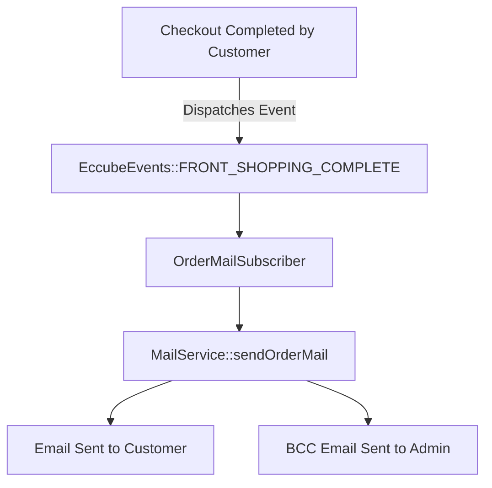

# 03 - Automatic Emails & Admin Notifications (အလိုအလျောက် ပေးပို့ခြင်းနှင့် Admin သတိပေးချက်များ)

> **Client Requirements**:
> 1. **Automatic emails (အလိုအလျောက် အီးမေးလ် ပေးပို့ခြင်း)**: Customer က အော်ဒါတင်လိုက်ချိန် သို့မဟုတ် Admin က Status ပြောင်းလိုက်သည်နှင့် လူက Manual ပို့စရာမလိုဘဲ စနစ်မှ သက်ဆိုင်ရာ Email များကို အလိုအလျောက် (Event-driven) ပေးပို့ပေးရမည်။
> 2. **Admin notifications (ဆိုင်ဝန်ထမ်းများထံ BCC မိတ္တူ ပေးပို့ခြင်း)**: Customer ထံ အော်ဒါအတည်ပြုမေးလ် ပို့တိုင်း ဆိုင်မန်နေဂျာထံသို့ BCC ဖြင့် မိတ္တူ အလိုအလျောက် ရောက်ရှိရမည်။
> 3. **Department routing (ဌာနအလိုက် အီးမေးလ် ခွဲပို့ခြင်း)**: အော်ဒါအသစ် ရောက်လာပါက ဂိုဒေါင်ဌာန (`warehouse@example.com`) သို့ ပစ္စည်းထုတ်ရန် အီးမေးလ် ပို့ပေးပြီး၊ ဘဏ်ငွေလွှဲဖြစ်ပါက စာရင်းကိုင်ဌာန (`finance@example.com`) သို့ သီးခြား သတိပေးချက် ပို့ပေးရမည်။

---

## ⚙️ 1. Automatic Emails Architecture (Event-Driven Flow)

EC-CUBE တွင် အလိုအလျောက် အီးမေးလ် ပေးပို့ခြင်းကို **Event Subscriber** ဖြင့် အောက်ပါအတိုင်း ချိတ်ဆက်ထားပါသည်:



### Event Subscriber Code နမူနာ:
```php
namespace Plugin\AutoEmail\EventSubscriber;

use Eccube\Event\EccubeEvents;
use Eccube\Event\EventArgs;
use Eccube\Service\MailService;
use Symfony\Component\EventDispatcher\EventSubscriberInterface;

class OrderMailSubscriber implements EventSubscriberInterface
{
    public function __construct(private readonly MailService $mailService) {}

    public static function getSubscribedEvents(): array
    {
        return [
            // အော်ဒါ အောင်မြင်စွာ တင်ပြီးချိန် Event
            EccubeEvents::FRONT_SHOPPING_COMPLETE => 'onOrderComplete',
            // Admin က Status ပြောင်းလဲပြီးချိန် Event
            EccubeEvents::ADMIN_ORDER_EDIT_STATUS_COMPLETE => 'onStatusChange',
        ];
    }

    public function onOrderComplete(EventArgs $event): void
    {
        $Order = $event->getArgument('Order');
        // အော်ဒါ အတည်ပြုမေးလ် အလိုအလျောက် ပေးပို့ခြင်း
        $this->mailService->sendOrderMail($Order);
    }
}
```

---

## 👨‍💼 2. Admin Notifications & BCC Configuration

Customer ထံ အီးမေးလ် ပို့တိုင်း ဆိုင်ရှင်ထံသို့ အသိပေးချက် ရောက်ရှိစေရန် EC-CUBE သည် **BCC (Blind Carbon Copy)** ကို အသုံးပြုပါသည်:

```php
// MailService.php
$message = (new Email())
    ->from($BaseInfo->getEmail01())
    ->to($Order->getEmail())
    ->bcc($BaseInfo->getEmail01()); // ဆိုင်၏ Email01 သို့ BCC အလိုအလျောက် ပေးပို့ခြင်း
```

---

## 🏢 3. Department Routing (ဌာနအလိုက် အီးမေးလ် ခွဲပို့ခြင်း Customization)

Client များ အလွန်တောင်းဆိုလေ့ရှိသော Customization:
> *"အော်ဒါသစ် ရောက်လာရင် ဂိုဒေါင်ကို ရောက်စေချင်တယ်၊ ဘဏ်ငွေလွှဲဆိုရင် စာရင်းကိုင်ဆီ သီးသန့် ရောက်စေချင်တယ်"*

### Custom Mail Routing Listener ဖြင့် ဖြေရှင်းပုံ:
```php
public function onOrderCompleteRouteDepartments(EventArgs $event): void
{
    $Order = $event->getArgument('Order');

    // ၁။ ဂိုဒေါင်ဌာနသို့ ပစ္စည်းထုတ်ပိုးရန် အသိပေးမေးလ် ပို့ခြင်း
    $warehouseEmail = 'warehouse@mystore.com';
    $this->sendInternalNotice($warehouseEmail, '【新規出荷依頼】Order #' . $Order->getOrderNo(), $Order);

    // ၂။ ငွေချေနည်းလမ်းသည် ဘဏ်လွှဲ (銀行振込) ဖြစ်ပါက စာရင်းကိုင်ဌာနသို့ ပို့ခြင်း
    if ($Order->getPayment()->getId() === 1) { // Bank Transfer
        $financeEmail = 'finance@mystore.com';
        $this->sendInternalNotice($financeEmail, '【未入金通知】振込確認のお願い Order #' . $Order->getOrderNo(), $Order);
    }
}
```

---

## 🇯🇵 သက်ဆိုင်ရာ ဂျပန် ဝေါဟာရများ

- **自動返信メール (Jidou Henshin Meeru)**: Auto-reply / Transactional Email
- **管理者宛通知メール (Kanrisha-ate Tsuuchi Meeru)**: Admin Notification Email
- **BCC送信 (Bii-shii-shii Soushin)**: Blind Carbon Copy to Shop Admin
- **出荷指示 (Shukka Shiji)**: Shipping / Picking Order to Warehouse
