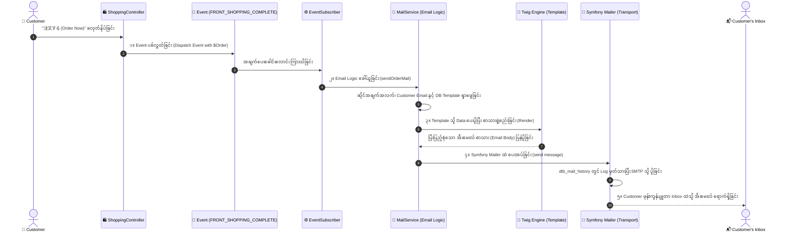

# 05 - Email Event Pipeline (အီးမေးလ် ထွက်ရှိသွားပုံ အဆင့် ၅ ဆင့်)

> **Core Flow**:  
> **Event ➔ Email Logic ➔ Template ➔ Mailer ➔ Customer**  
> (အဖြစ်အပျက်တစ်ခု စတင်ချိန်မှစ၍ Customer ၏ Inbox ထဲသို့ အီးမေးလ် ရောက်ရှိသွားသည်အထိ EC-CUBE ၏ အတွင်းပိုင်း အလုပ်လုပ်ပုံ အဆင့် ၅ ဆင့်)

---

## 🔄 အဆင့် ၅ ဆင့် Pipeline မြင်ကွင်း (Sequence Diagram)



---

## 🔍 အဆင့်တစ်ခုချင်းစီ၏ အသေးစိတ် အလုပ်လုပ်ပုံ

### အဆင့် ၁: Event (အစပျိုး အချက်ပေးခေါင်းလောင်း)
- **ဘာလုပ်တာလဲ**: Customer က အော်ဒါတင်လိုက်ချိန် သို့မဟုတ် Admin က Status ပြောင်းလိုက်ချိန်တွင် စနစ်က `EventDispatcher` မှတဆင့် Event အချက်ပေးသံတစ်ခု ပစ်လွှတ်လိုက်သည်။
- **တာဝန်ခံ Code**:
  ```php
  // ShoppingController.php
  $event = new EventArgs(['Order' => $Order], $request);
  $this->eventDispatcher->dispatch($event, EccubeEvents::FRONT_SHOPPING_COMPLETE);
  ```
- **အကျိုးကျေးဇူး**: Controller ထဲတွင် Email ပို့သော Code များကို ရောမထွေးစေဘဲ သီးခြားစီ ခွဲထုတ်ထားနိုင်ခြင်း (Decoupling)။

---

### အဆင့် ၂: Email Logic (အီးမေးလ် ဆင်ခြင်တုံတရားနှင့် ပြင်ဆင်မှု)
- **ဘာလုပ်တာလဲ**: `OrderMailSubscriber` က Event ကို ဖမ်းယူပြီး **`MailService::sendOrderMail($Order)`** ကို လှမ်းခေါ်သည်။
- **အချက်အလက် စုစည်းခြင်း**:
  1. မည်သူ့ထံ ပို့မည်နည်း? ➔ `$Order->getEmail()`
  2. မည်သူက ပို့မည်နည်း? ➔ ဆိုင်လိပ်စာ `$BaseInfo->getEmail01()`
  3. အီးမေးလ် ခေါင်းစဉ်နှင့် Template ဖိုင်အမည် ရယူခြင်း ➔ `dtb_mail_template` မှ `order.twig` ကို ရှာဖွေခြင်း။
  4. ဆိုင်ရှင်ထံ မိတ္တူ (BCC) ပို့ရန် စီစဉ်ခြင်း။

---

### အဆင့် ၃: Template (စာသား ဒီဇိုင်း ပုံစံခွက် - Twig)
- **ဘာလုပ်တာလဲ**: `MailService` မှ ပေးပို့လိုက်သော `$Order` နှင့် `$BaseInfo` Data များကို **Twig Engine** က `Mail/order.twig` ပုံစံခွက်နှင့် ပေါင်းစပ်ပြီး အမှန်တကယ် ဖတ်ရှုရမည့် စာသားအဖြစ် ဖန်တီးပေးသည်။
- **တာဝန်ခံ Code**:
  ```php
  // Twig Render ပြုလုပ်ခြင်း
  $body = $this->twig->render('Mail/order.twig', [
      'Order' => $Order,
      'BaseInfo' => $BaseInfo,
  ]);
  ```
- **ရလဒ်**: `{{ Order.name01 }}` နေရာတွင် "ဦးကျော်"၊ `{{ Order.payment_total }}` နေရာတွင် "¥5,400" စသည်ဖြင့် တကယ့် Data များ ဝင်ရောက်သွားသည်။

---

### အဆင့် ၄: Mailer (အီးမေးလ် သယ်ယူပို့ဆောင်ရေး စက်ယန္တရား)
- **ဘာလုပ်တာလဲ**: Symfony Mailer သည် အီးမေးလ် ခေါင်းစဉ်၊ ပေးပို့သူ၊ လက်ခံသူနှင့် Body စာသားများကို သယ်ဆောင်ပြီး အင်တာနက်ပေါ်မှတဆင့် SMTP ဆာဗာ (SendGrid, SES သို့မဟုတ် Gmail SMTP) သို့ ပေးပို့သည်။
- **တာဝန်ခံ Code**:
  ```php
  $message = (new Email())
      ->from($from)
      ->to($to)
      ->subject($subject)
      ->text($body);

  $this->mailer->send($message);
  ```
- **လုံခြုံရေး စစ်ဆေးမှု**: SMTP ဆာဗာသည် SPF, DKIM လက်မှတ်များကို ပူးတွဲ တံဆိပ်ခတ်ပေးပြီး Customer ၏ Mail Server (ဥပမာ Google Mail Server) ဆီသို့ ကွန်ရက်ချိတ်ဆက် ပို့ဆောင်ပေးသည်။
- **History Log**: ပေးပို့ပြီးသော စာသားကို `dtb_mail_history` တွင် သိမ်းဆည်းသည်။

---

### အဆင့် ၅: Customer (ဖောက်သည် လက်ခံရရှိခြင်း)
- **ဘာလုပ်တာလဲ**: Customer ၏ Gmail သို့မဟုတ် Yahoo Mail ဆာဗာက လက်မှတ်များကို စစ်ဆေး အတည်ပြုပြီးနောက် Spam မဟုတ်ကြောင်း သေချာပါက **Inbox** ထဲသို့ ထည့်သွင်းပေးသည်။
- **နောက်ဆုံးရလဒ်**: Customer ၏ စမတ်ဖုန်းတွင် Notification တက်လာပြီး၊ အော်ဒါအသေးစိတ်နှင့် ကျသင့်ငွေစာရင်းကို ချက်ချင်း ဖတ်ရှုနိုင်သွားပါသည်။
