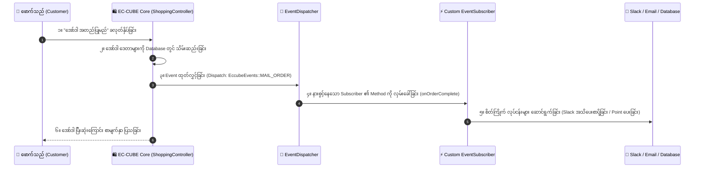

# EC-CUBE Client Requirements: Event & EventSubscriber (မြန်မာဘာသာ)

EC-CUBE (Version 4.x / 4.2+) တွင် မူရင်း Core ဖိုင်များကို **လုံးဝ ပြင်ဆင်စရာမလိုဘဲ (No Core Modification)** စတိုးဆိုင်၏ လုပ်ဆောင်ချက်များနှင့် မျက်နှာပြင်များကို စိတ်ကြိုက် တိုးချဲ့ပြောင်းလဲနိုင်သော အရေးအကြီးဆုံး နည်းပညာဖြစ်သည့် **Event & EventSubscriber (イベントサブスクライバー)** အကြောင်း အခြေခံမှစ၍ အသေးစိတ် ရှင်းလင်းချက် ဖြစ်ပါသည်။

---

## 💡 EventSubscriber ဆိုတာ အဘယ်နည်း? အဘယ်ကြောင့် မဖြစ်မနေ သုံးရသနည်း?

EC-CUBE သည် Symfony Framework ၏ **EventDispatcher Architecture** ပေါ်တွင် တည်ဆောက်ထားသည်။

### မူရင်း Core Code ကို ပြင်ဆင်ခြင်း၏ ဆိုးကျိုး:
အကယ်၍ သင်သည် "အော်ဒါပြီးဆုံးချိန်တွင် Slack ထံသို့ စာပို့ချင်သည်" ဟုဆိုကာ EC-CUBE ၏ မူရင်း `ShoppingController.php` သို့မဟုတ် Core ဖိုင်ထဲတွင် ကုဒ်သွားရောက် ရေးသားလိုက်ပါက:
1. နောင်တစ်ချိန်တွင် EC-CUBE Version အသစ် (ဥပမာ 4.2 ➔ 4.3) သို့ Update တင်လိုက်သည့်အခါ သင်ရေးထားသော ကုဒ်များအားလုံး **အစအနမကျန် ပျက်စီး ပျောက်ကွယ်သွားမည် (Overwrite ခံရမည်)**။
2. အခြား Plugin များနှင့် ချိတ်ဆက်အလုပ်လုပ်ရာတွင် Conflict (ကုဒ်တိုက်ခိုက်မှု) ဖြစ်ပွားနိုင်သည်။

### EventSubscriber ကို အသုံးပြုခြင်း၏ အားသာချက်:
EventSubscriber သည် EC-CUBE စနစ်ထဲတွင် အဖြစ်အပျက်တစ်ခုခု (Event) ဖြစ်ပွားသည်နှင့် အလိုအလျောက် သတိပေးလှမ်းခေါ်ပေးသော **"ကြားဖြတ်သတင်းထောက် (Hook Listener)"** ကဲ့သို့ လုပ်ဆောင်ပေးပါသည်။
- Core ဖိုင်များကို လုံးဝ မထိခိုက်ပါ။
- ကုဒ်အားလုံးသည် `app/Customize/EventSubscriber/` ထဲတွင် သီးခြား လုံခြုံစွာ တည်ရှိသည်။
- EC-CUBE Version Update မည်မျှပင် ပြုလုပ်စေကာမူ သင်၏ စိတ်ကြိုက် ကုဒ်များသည် အမြဲတမ်း ပုံမှန် အလုပ်လုပ်နေမည် ဖြစ်ပါသည်။

---

## 🔄 Event-Driven Flow ပုံကြမ်း

---

## 📑 မာတိကာ (Table of Contents)

| No. | ခေါင်းစဉ် | ဖိုင်လမ်းကြောင်း | အဓိက အကြောင်းအရာများ |
|:---:|:---|:---|:---|
| 01 | **Event Architecture & Basics** | [01_event_architecture_and_basics.md](./01_event_architecture_and_basics.md) | EventDispatcher သဘောတရား၊ အဓိက Event အမျိုးအစား ၄ မျိုး (Core, Template, Kernel, Form)၊ EventSubscriber ဖိုင်ဖွဲ့စည်းပုံ |
| 02 | **When to Use & Required Features** | [02_when_to_use_and_required_tasks.md](./02_when_to_use_and_required_tasks.md) | မည်သည့် Task များတွင် မဖြစ်မနေ သုံးရသနည်း? ရေးသားရာတွင် လိုအပ်သော Interface, Method, Arguments နှင့် Priority စည်းမျဉ်းများ |
| 03 | **Template Events & UI Hooking** | [03_template_events_and_ui_hooking.md](./03_template_events_and_ui_hooking.md) | Twig ဖိုင်များကို မထိခိုက်ဘဲ HTML အပိုင်းအစများ ကြားညှပ်ထည့်သွင်းခြင်း (`addSnippet`)၊ Parameter ပေးပို့ခြင်း |
| 04 | **Form Events & Request Interception** | [04_form_events_and_request_interception.md](./04_form_events_and_request_interception.md) | Form များတွင် Field အသစ်များ အလိုအလျောက် ထည့်သွင်းခြင်း၊ Request များကို ကြားဖြတ်စစ်ဆေးခြင်း၊ ရပ်တန့်စေခြင်း (`stopPropagation`) |
| 05 | **Top Client Tasks & Troubleshooting** | [05_top_client_tasks_and_troubleshooting.md](./05_top_client_tasks_and_troubleshooting.md) | **Client များ အများဆုံး တောင်းဆိုသော EventSubscriber လုပ်ငန်းတာဝန် ၅ ခုနှင့် လက်တွေ့ ကုဒ်ပြင်ဆင်နည်းများ** |

---

## 🇯🇵 အရေးကြီးသော ဂျပန် ဝေါဟာရများ (Event Terms)

| Japanese (漢字/カタカナ) | Romaji | အဓိပ္ပာယ် |
|:---|:---|:---|
| **イベント** | Ibento | Event (စနစ်အတွင်း ဖြစ်ပျက်သော အခြေအနေ) |
| **イベントサブスクライバー** | Ibento Sabusukuraibaa | EventSubscriber (Event များကို နားစွင့်ပြီး တုန့်ပြန်ဆောင်ရွက်သည့် Class) |
| **フック (Hook)** | Hukku | Hook (မူရင်း စီးဆင်းမှုကြားထဲသို့ ကြားဖြတ် ဝင်ရောက်လုပ်ဆောင်ခြင်း) |
| **スニペット挿入** | Sunipetto Sounyuu | Snippet Injection (Template ထဲသို့ HTML အပိုင်းအစ လှမ်းထည့်ခြင်း) |
| **優先度 (プライオリティ)** | Yuusendo (Puraioriti) | Priority (Subscriber များ အလုပ်လုပ်ရမည့် အစဉ်လိုက် ဦးစားပေးအဆင့်) |
| **伝播停止** | Denpa Teishi | Stop Propagation (Event ကို ဆက်လက် မစီးဆင်းစေဘဲ ချက်ချင်း ရပ်တန့်ပစ်ခြင်း) |

အထက်ပါ မာတိကာဇယားမှ သက်ဆိုင်ရာ လေ့လာမှုဖိုင်များကို ဖွင့်ဖတ်၍ အသေးစိတ် စတင် လေ့လာနိုင်ပါသည်။
