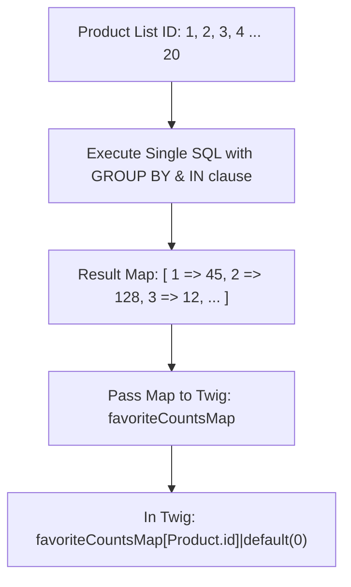

# 03 - Favorite Counts & Solving N+1 Queries (အရေအတွက် ပြသခြင်းနှင့် N+1 ပြဿနာ ဖြေရှင်းနည်း)

> **Client Requirements**:
> 1. **Favorite count (အကြိုက်ဆုံး အရေအတွက်)**: ဝဘ်ဆိုက် Header တွင် Customer မှတ်ထားသော အရေအတွက် Badge (ဥပမာ- `❤️ 5`) ပြသပေးရမည်။
> 2. **Other users' favorite count (အခြားသူများ အကြိုက်ဆုံး အရေအတွက်)**: ကုန်ပစ္စည်း တစ်ခုချင်းစီတွင် အခြားသူပေါင်း မည်မျှက Favorite လုပ်ထားကြောင်း လူကြိုက်များမှု သက်သေအဖြစ် (ဥပမာ- `❤️ 128人がお気に入りに登録中`) ဟု ပြသပေးရမည်။
> 3. **Critical Performance Requirement (N+1 Query ကာကွယ်ခြင်း)**: ကုန်ပစ္စည်း အခု ၅၀ ပြသထားသော List စာမျက်နှာတွင် Database Query အခေါက် ၅၀ မဖြစ်စေဘဲ စက္ကန့်ပိုင်းအတွင်း လျင်မြန်စွာ ပွင့်စေရမည်။

---

## 🛑 N+1 Query Problem ဆိုသည်မှာ အဘယ်နည်း?

Doctrine ORM ကို အသုံးပြုရာတွင် Beginner Developer များ အဖြစ်အများဆုံး အမှားကြီးတစ်ခု ဖြစ်ပါသည်။

### ❌ နှေးကွေးစေသော ရေးသားနည်း (The Anti-Pattern):
ကုန်ပစ္စည်း စာရင်းကို Controller မှ ဆွဲထုတ်ပြီးနောက် Twig Template ထဲတွင် အောက်ပါအတိုင်း ရေးသားမိပါက:

```twig
{# ❌ အလွန်နှေးကွေးသော နည်းလမ်း (N+1 Queries ဖြစ်စေသည်) #}

    <div class="product-item">
        <h6>{{ Product.name }}</h6>
        {# Twig က Loop ပတ်တိုင်း DB သို့ Query အသစ် ထပ်ထုတ်စေသည် #}
        <span>❤️ {{ Product.CustomerFavoriteProducts|length }} 人が登録中</span>
    </div>

```

### Database တွင် ဖြစ်ပေါ်သွားသော Query များ:
```sql
1. SELECT * FROM dtb_product LIMIT 20;                         -- ကုန်ပစ္စည်း ၂၀ ခုကို ဆွဲယူခြင်း (1st Query)
2. SELECT COUNT(*) FROM dtb_customer_favorite_product WHERE product_id = 1;  -- Prod 1 အတွက် Query
3. SELECT COUNT(*) FROM dtb_customer_favorite_product WHERE product_id = 2;  -- Prod 2 အတွက် Query
...
21. SELECT COUNT(*) FROM dtb_customer_favorite_product WHERE product_id = 20; -- Prod 20 အတွက် Query
```
👉 **ရလဒ်**: ကုန်ပစ္စည်း ၂၀ အတွက် Database သို့ Query **၂၁ ကြိမ် (1 + N)** သွားရောက် မေးမြန်းရသဖြင့် User များလာပါက Database Server လဲကျသွားနိုင်ပါသည်။

---

## ✅ N+1 Query ကို ဖြေရှင်းသည့် အကောင်းဆုံး နည်းလမ်း (Batch Lookup Map)

N+1 မဖြစ်စေရန်အတွက် လက်ရှိ စာမျက်နှာတွင် ပါဝင်သော ကုန်ပစ္စည်း ID အားလုံး၏ Favorite အရေအတွက်ကို **Query ၁ ကြိမ်တည်း (Single Query)** ဖြင့် `GROUP BY` တွက်ချက်ကာ PHP Array (Map) အဖြစ် ဆွဲထုတ်ပေးရပါမည်:



---

## 💻 Repository Code: Batch Favorite Counts Query

`src/Eccube/Repository/CustomerFavoriteProductRepository.php`
```php
namespace Eccube\Repository;

use Doctrine\ORM\EntityRepository;

class CustomerFavoriteProductRepository extends AbstractRepository
{
    /**
     * ကုန်ပစ္စည်း ID များစွာအတွက် Favorite Count များကို Query တစ်ကြိမ်တည်းဖြင့် ရယူခြင်း
     * 
     * @param int[] $productIds
     * @return array [ productId => count ] (e.g. [1 => 128, 2 => 45])
     */
    public function getFavoriteCountsByProductIds(array $productIds): array
    {
        if (empty($productIds)) {
            return [];
        }

        // Single Query ဖြင့် GROUP BY ပြုလုပ်ခြင်း
        $qb = $this->createQueryBuilder('cfp')
            ->select('IDENTITY(cfp.Product) AS product_id, COUNT(cfp.Customer) AS fav_count')
            ->where('cfp.Product IN (:productIds)')
            ->setParameter('productIds', $productIds)
            ->groupBy('cfp.Product');

        $results = $qb->getQuery()->getResult();

        // Key-Value Array အဖြစ် ပြောင်းလဲခြင်း [ 1 => 128, 2 => 45 ]
        $countsMap = [];
        foreach ($results as $row) {
            $countsMap[$row['product_id']] = (int) $row['fav_count'];
        }

        return $countsMap;
    }
}
```

---

## 🎮 Controller မှ Twig သို့ ချိတ်ဆက်ပေးပုံ (`ProductController.php`)

```php
#[Route('/products/list', name: 'product_list')]
public function index(Request $request)
{
    $pagination = $this->paginator->paginate($queryBuilder, $pageNo, 20);

    // စာမျက်နှာတွင် ပါဝင်သော ကုန်ပစ္စည်း ID များကို ယူခြင်း
    $productIds = [];
    foreach ($pagination as $Product) {
        $productIds[] = $Product->getId();
    }

    // Single Query ဖြင့် Favorite Counts Map ကို ရယူခြင်း (NO N+1!)
    $favoriteCountsMap = $this->customerFavoriteProductRepository
        ->getFavoriteCountsByProductIds($productIds);

    return [
        'pagination' => $pagination,
        'favoriteCountsMap' => $favoriteCountsMap, // [1 => 128, 2 => 45]
    ];
}
```

---

## 🎨 Twig Template တွင် အလွန် လျင်မြန်စွာ ပြသပုံ

Twig တွင် Database သို့ လုံးဝ မသွားတော့ဘဲ Memory ထဲရှိ Array မှ တိုက်ရိုက် ဆွဲထုတ်ပြသပါသည်:

```twig
{# Resource/template/default/Product/list.twig #}


    <div class="product-item">
        <a href="{{ url('product_detail', {id: Product.id}) }}">
            
            <h6>{{ Product.name }}</h6>
        </a>

        {# Batch Map ထဲမှ တိုက်ရိုက် ထုတ်ပြခြင်း (N+1 Query ကင်းစင်သည်) #}
        
        
            <div class="favorite-user-count text-muted small mt-1">
                <i class="fa fa-heart text-danger"></i> {{ favCount }} 人がお気に入りに登録中
            </div>
        
    </div>

```

---

## 📊 Benchmark နှိုင်းယှဉ်ချက် (Performance Comparison)

| စံနှုန်း | N+1 ချဉ်းကပ်နည်း (Bad) | Batch Map ချဉ်းကပ်နည်း (Optimized) |
|:---|:---:|:---:|
| **Database Queries** | **၂၁ ကြိမ် မှ ၁၀၁ ကြိမ်** | **၂ ကြိမ်သာ (Products + Favorite Map)** |
| **Memory Usage** | မြင့်မားသည် (Entity အများအပြား Load လုပ်ရသည်) | အလွန် နည်းပါးသည် (Scalar Data သာဖြစ်သည်) |
| **Page Response Time** | 1,200 ms ~ 2,500 ms (နှေးကွေးသည်) | **150 ms ~ 250 ms (အလွန် လျင်မြန်သည်)** |

---

## 🇯🇵 သက်ဆိုင်ရာ ဂျပန် ဝေါဟာရများ

- **N+1問題 (Enu Purasu Ichi Mondai)**: N+1 Query Performance Problem
- **まとめ取得 / 一括取得 (Matome Shutoku / Ikkatsu Shutoku)**: Batch Fetching
- **集計クエリ (Shuukei Kueri)**: Aggregation Query (`COUNT()`, `GROUP BY`)
- **〇〇人がお気に入り (Maru-maru-nin ga Okiniiri)**: XX people added to favorites
