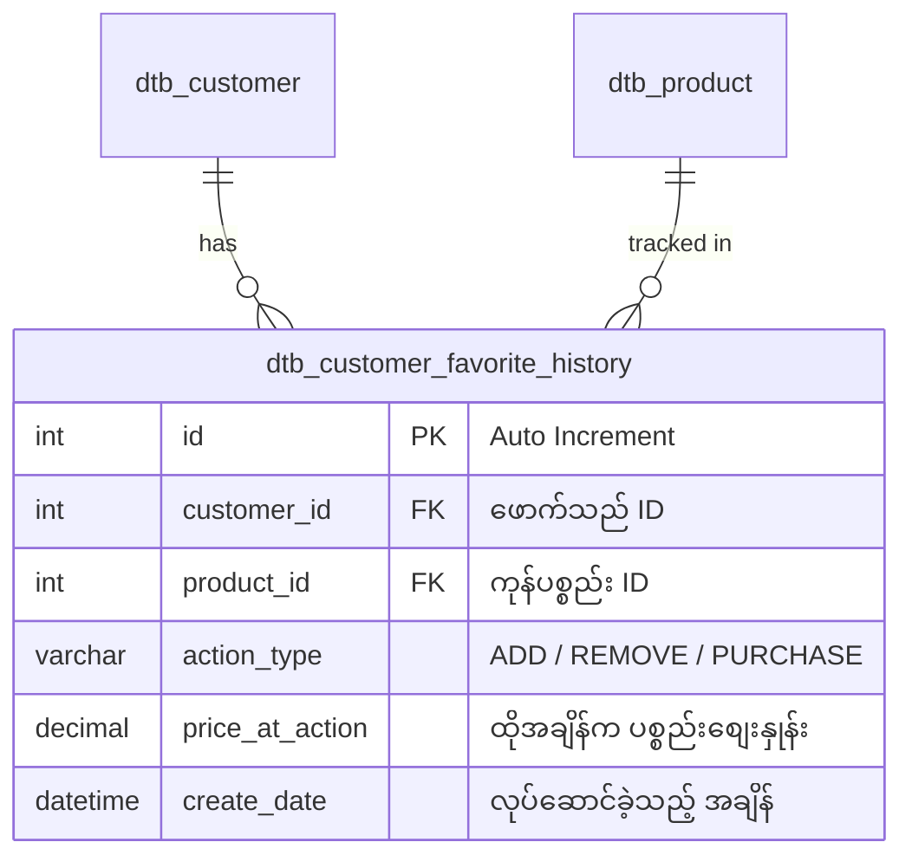

# 06. Favorite History Tracking (お気に入り履歴管理・行動ログ)

ဖောက်သည်များ မည်သည့်နေ့ရက်တွင် မည်သည့်ပစ္စည်းကို Favorite လုပ်ခဲ့သည်၊ မည်သည့်အချိန်တွင် ပြန်လည်ဖျက်ပစ်ခဲ့သည်၊ ထို့နောက် အမှန်တကယ် ဝယ်ယူသွားသလား စသည့် အချက်အလက်များကို မှတ်တမ်းတင်ပေးသော **Favorite History (お気に入り履歴)** စနစ် တည်ဆောက်ပုံ ဖြစ်ပါသည်။

---

## 🎯 အဘယ်ကြောင့် Favorite History ကို သီးခြား တည်ဆောက်ရသနည်း?

EC-CUBE ၏ မူရင်း `dtb_customer_favorite_product` ဇယားသည် **လက်ရှိ အခြေအနေ (Current State)** ကိုသာ သိမ်းဆည်းပေးပါသည်။
- Customer က အသည်းပုံ ပြန်ဖြုတ်လိုက်ပါက Database ထဲမှ ထို Record သည် အပြီးအပိုင် Delete ဖြစ်သွားသည်။
- ထို့ကြောင့် "မည်သည့် ပစ္စည်းကို လူကြိုက်များပြီးနောက် အဘယ်ကြောင့် ပြန်ဖြုတ်သွားသနည်း" သို့မဟုတ် "Favorite လုပ်ပြီး ရက်မည်မျှအကြာတွင် ဝယ်ယူသွားသနည်း" စသည့် **Marketing Analytics (ဝယ်ယူသူ စိတ်ပညာနှင့် အပြုအမူ မှတ်တမ်း)** ကို လေ့လာရန် မဖြစ်နိုင်ပါ။

### Client Requirement (တောင်းဆိုချက်):
> 「顧客がお気に入り登録・解除した履歴や、お気に入り登録後に実際に購入したかを追跡できる『お気に入り履歴テーブル』を作成し、マイページおよび管理画面で確認できるようにしたい。」
> (ဖောက်သည် Favorite လုပ်ခြင်း/ဖြုတ်ခြင်း မှတ်တမ်းနှင့် Favorite လုပ်ပြီးနောက် အမှန်တကယ် ဝယ်ယူသွားခြင်း ရှိ/မရှိကို ခြေရာခံနိုင်မည့် Favorite History Table ဖန်တီးပြီး Mypage နှင့် Admin တွင် ကြည့်ရှုနိုင်အောင် လုပ်ဆောင်ပေးပါ။)

---

## 🗄️ ၁။ Database Schema (`dtb_customer_favorite_history`)

Favorite ပြုလုပ်မှု Action တိုင်းကို အမြဲတမ်း Log အဖြစ် သိမ်းဆည်းရန် ဇယားအသစ်တစ်ခု ဖန်တီးပါသည်:



### Doctrine Migration ကုဒ်:
```php
namespace DoctrineMigrations;

use Doctrine\DBAL\Schema\Schema;
use Doctrine\Migrations\AbstractMigration;

class Version20260921FavoriteHistory extends AbstractMigration
{
    public function up(Schema $schema): void
    {
        $this->addSql('
            CREATE TABLE dtb_customer_favorite_history (
                id INT AUTO_INCREMENT NOT NULL,
                customer_id INT NOT NULL,
                product_id INT NOT NULL,
                action_type VARCHAR(20) NOT NULL COMMENT "ADD, REMOVE, PURCHASE",
                price_at_action NUMERIC(12, 2) NOT NULL,
                create_date DATETIME NOT NULL,
                INDEX idx_fav_hist_customer (customer_id),
                INDEX idx_fav_hist_product (product_id),
                INDEX idx_fav_hist_date (create_date),
                PRIMARY KEY(id),
                CONSTRAINT FK_FAV_HIST_CUST FOREIGN KEY (customer_id) REFERENCES dtb_customer (id) ON DELETE CASCADE,
                CONSTRAINT FK_FAV_HIST_PROD FOREIGN KEY (product_id) REFERENCES dtb_product (id) ON DELETE CASCADE
            ) ENGINE = InnoDB
        ');
    }

    public function down(Schema $schema): void
    {
        $this->addSql('DROP TABLE dtb_customer_favorite_history');
    }
}
```

---

## 🏛️ ၂။ FavoriteHistory Entity တည်ဆောက်ခြင်း

`app/Customize/Entity/CustomerFavoriteHistory.php`:

```php
namespace Customize\Entity;

use Doctrine\ORM\Mapping as ORM;
use Eccube\Entity\Customer;
use Eccube\Entity\Product;

/**
 * @ORM\Table(name="dtb_customer_favorite_history")
 * @ORM\Entity(repositoryClass="Customize\Repository\CustomerFavoriteHistoryRepository")
 */
class CustomerFavoriteHistory
{
    public const ACTION_ADD = 'ADD';
    public const ACTION_REMOVE = 'REMOVE';
    public const ACTION_PURCHASE = 'PURCHASE';

    /**
     * @ORM\Id
     * @ORM\GeneratedValue
     * @ORM\Column(type="integer")
     */
    private ?int $id = null;

    /**
     * @ORM\ManyToOne(targetEntity="Eccube\Entity\Customer")
     * @ORM\JoinColumn(name="customer_id", referencedColumnName="id", nullable=false, onDelete="CASCADE")
     */
    private Customer $Customer;

    /**
     * @ORM\ManyToOne(targetEntity="Eccube\Entity\Product")
     * @ORM\JoinColumn(name="product_id", referencedColumnName="id", nullable=false, onDelete="CASCADE")
     */
    private Product $Product;

    /**
     * @ORM\Column(type="string", length=20)
     */
    private string $action_type;

    /**
     * @ORM\Column(type="decimal", precision=12, scale=2)
     */
    private string $price_at_action;

    /**
     * @ORM\Column(type="datetime")
     */
    private \DateTimeInterface $create_date;

    public function __construct()
    {
        $this->create_date = new \DateTime();
    }

    // Getters and Setters...
    public function getId(): ?int { return $this->id; }
    public function getCustomer(): Customer { return $this->Customer; }
    public function setCustomer(Customer $Customer): self { $this->Customer = $Customer; return $this; }
    public function getProduct(): Product { return $this->Product; }
    public function setProduct(Product $Product): self { $this->Product = $Product; return $this; }
    public function getActionType(): string { return $this->action_type; }
    public function setActionType(string $action_type): self { $this->action_type = $action_type; return $this; }
    public function getPriceAtAction(): string { return $this->price_at_action; }
    public function setPriceAtAction(string $price_at_action): self { $this->price_at_action = $price_at_action; return $this; }
    public function getCreateDate(): \DateTimeInterface { return $this->create_date; }
    public function setCreateDate(\DateTimeInterface $create_date): self { $this->create_date = $create_date; return $this; }
}
```

---

## ⚡ ၃။ History Logging Service တည်ဆောက်ခြင်း

`app/Customize/Service/FavoriteHistoryService.php`:

```php
namespace Customize\Service;

use Customize\Entity\CustomerFavoriteHistory;
use Doctrine\ORM\EntityManagerInterface;
use Eccube\Entity\Customer;
use Eccube\Entity\Product;

class FavoriteHistoryService
{
    private EntityManagerInterface $entityManager;

    public function __construct(EntityManagerInterface $entityManager)
    {
        $this->entityManager = $entityManager;
    }

    /**
     * Favorite အသစ် ထည့်သွင်းချိန်တွင် မှတ်တမ်းတင်ခြင်း
     */
    public function logAdd(Customer $customer, Product $product): void
    {
        $this->record($customer, $product, CustomerFavoriteHistory::ACTION_ADD);
    }

    /**
     * Favorite ဖျက်ပစ်ချိန်တွင် မှတ်တမ်းတင်ခြင်း
     */
    public function logRemove(Customer $customer, Product $product): void
    {
        $this->record($customer, $product, CustomerFavoriteHistory::ACTION_REMOVE);
    }

    /**
     * Favorite ပြုလုပ်ထားသော ပစ္စည်းကို အမှန်တကယ် ဝယ်ယူသွားချိန်တွင် မှတ်တမ်းတင်ခြင်း
     */
    public function logPurchase(Customer $customer, Product $product): void
    {
        $this->record($customer, $product, CustomerFavoriteHistory::ACTION_PURCHASE);
    }

    private function record(Customer $customer, Product $product, string $action): void
    {
        $price = $product->getPrice02IncTaxMin(); // လက်ရှိ စျေးနှုန်း

        $history = new CustomerFavoriteHistory();
        $history->setCustomer($customer);
        $history->setProduct($product);
        $history->setActionType($action);
        $history->setPriceAtAction((string) $price);
        $history->setCreateDate(new \DateTime());

        $this->entityManager->persist($history);
        $this->entityManager->flush();
    }
}
```

---

## 🛒 ၄။ အော်ဒါတက်ချိန်တွင် EventSubscriber ဖြင့် Purchase Conversion ဖမ်းယူခြင်း

Customer က Favorite မှတ်ထားသော ပစ္စည်းကို ဝယ်ယူသွားပါက `ACTION_PURCHASE` ဟု History ထဲသို့ အလိုအလျောက် ရေးသွင်းပေးသော EventSubscriber ဖြစ်ပါသည်:

```php
namespace Customize\EventSubscriber;

use Customize\Service\FavoriteHistoryService;
use Eccube\Event\EccubeEvents;
use Eccube\Event\EventArgs;
use Eccube\Repository\CustomerFavoriteProductRepository;
use Symfony\Component\EventDispatcher\EventSubscriberInterface;

class FavoritePurchaseHistorySubscriber implements EventSubscriberInterface
{
    private FavoriteHistoryService $historyService;
    private CustomerFavoriteProductRepository $favRepo;

    public function __construct(FavoriteHistoryService $historyService, CustomerFavoriteProductRepository $favRepo)
    {
        $this->historyService = $historyService;
        $this->favRepo = $favRepo;
    }

    public static function getSubscribedEvents(): array
    {
        return [
            EccubeEvents::MAIL_ORDER => 'onOrderComplete',
        ];
    }

    public function onOrderComplete(EventArgs $event): void
    {
        $order = $event->getArgument('Order');
        $customer = $order->getCustomer();

        if (!$customer) {
            return;
        }

        foreach ($order->getOrderItems() as $item) {
            $product = $item->getProduct();
            if (!$product) {
                continue;
            }

            // Customer ၏ Favorite ထဲတွင် ဤပစ္စည်း ရှိမရှိ စစ်ဆေးခြင်း
            $isFavorited = $this->favRepo->isFavorite($customer, $product);
            if ($isFavorited) {
                // Favorite History ထဲတွင် ဝယ်ယူသွားကြောင်း မှတ်တမ်းတင်ခြင်း
                $this->historyService->logPurchase($customer, $product);
            }
        }
    }
}
```

---

## 🖥️ ၅။ Mypage တွင် ဖောက်သည်အား မိမိ၏ Favorite History ပြသခြင်း

`app/template/default/Mypage/favorite_history.twig`:

```twig
<table class="table table-bordered">
    <thead>
        <tr>
            <th>ရက်စွဲ (日時)</th>
            <th>ကုန်ပစ္စည်း (商品名)</th>
            <th>စျေးနှုန်း (金額)</th>
            <th>လုပ်ဆောင်ချက် (アクション)</th>
        </tr>
    </thead>
    <tbody>
        
            <tr>
                <td>{{ history.create_date|date('Y-m-d H:i') }}</td>
                <td>
                    <a href="{{ url('product_detail', {id: history.product.id}) }}">
                        {{ history.product.name }}
                    </a>
                </td>
                <td>¥{{ history.price_at_action|number_format }}</td>
                <td>
                    
                        <span class="badge badge-success">❤️ お気に入り追加</span>
                    
                        <span class="badge badge-secondary">🤍 解除</span>
                    
                        <span class="badge badge-primary">🛍️ 購入完了 (CVR達成)</span>
                    
                </td>
            </tr>
        
    </tbody>
</table>
```

ဤစနစ်ဖြင့် ဆိုင်ရှင်များသည် မည်သည့် ပစ္စည်းများသည် လူကြိုက်များသော်လည်း ဈေးကြီးသဖြင့် မဝယ်ဘဲ ပြန်ဖျက်သွားကြသည်ကို တိကျစွာ ခွဲခြမ်းစိတ်ဖြာနိုင်မည် ဖြစ်ပါသည်။
