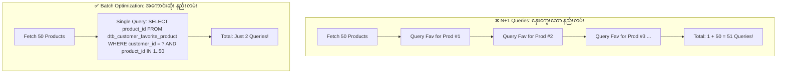
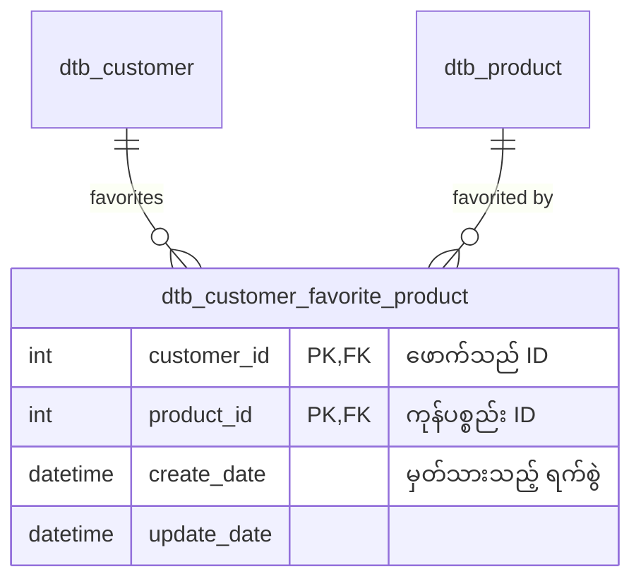

# EC-CUBE Client Requirements: Favorite / Wishlist (မြန်မာဘာသာ)

EC-CUBE (Version 4.x / 4.2+) ၏ **Favorite / Wishlist (အကြိုက်ဆုံး ကုန်ပစ္စည်းများ စာရင်း / お気に入り機能)** ဆိုင်ရာ Client Requirements များနှင့် လက်တွေ့ အသုံးများဆုံး Requirement ဖြစ်သော **「お気に入り登録されている商品に印を表示する (Favorite မှတ်ထားသော ကုန်ပစ္စည်းများပေါ်တွင် အမှတ်အသား အသည်းပုံ ပြသခြင်း)」** ၏ End-to-End ဗိသုကာကို အခြေခံမှစ၍ အသေးစိတ် ရှင်းလင်းထားသော လေ့လာမှု လမ်းညွှန်ဖြစ်ပါသည်။

---

## 🎯 Practical Core Example:「お気に入り登録されている商品に印を表示する」

Client က အများဆုံး တောင်းဆိုလေ့ရှိသော အဓိက Feature ဖြစ်ပြီး အောက်ပါ **Full Technical Pipeline (အဆင့် ၇ ဆင့်)** အတိုင်း အလုပ်လုပ်ပါသည်:

```
[1. Requirement (တောင်းဆိုချက်)]
       │ Customer က မိမိ အကြိုက်ဆုံး မှတ်ထားပြီးသော ပစ္စည်းများတွင် အနီရောင် အသည်းပုံ (❤️) ပေါ်စေချင်သည်
       ▼
[2. Database Table] ── dtb_customer_favorite_product (customer_id, product_id)
       │
       ▼
[3. Entity Layer] ── CustomerFavoriteProduct, Product, Customer
       │
       ▼
[4. Repository Layer] ── CustomerFavoriteProductRepository
       │
       ▼
[5. QueryBuilder Layer] ── Batch query ဖြင့် Favorite Product ID များကို ဆွဲထုတ်ခြင်း (Avoid N+1)
       │
       ▼
[6. Controller Layer] ── ProductController::index() မှ Twig သို့ favoriteProductIds ပေးပို့ခြင်း
       │
       ▼
[7. Twig View Layer] ──  ❤️  🤍 
```

---

## ⚡ Performance Alert: N+1 Query Problem မဖြစ်စေရန် ဖြေရှင်းပုံ

ကုန်ပစ္စည်း အခု ၅၀ ပြသထားသော List စာမျက်နှာတွင် ကုန်ပစ္စည်းတစ်ခုချင်းစီအတွက် Favorite ရှိမရှိ Database သို့ Query တစ်ကြောင်းချင်း သွားစစ်ပါက Database သို့ Query အကြိမ် ၅၀ ထပ်ခါတလဲလဲ သွားရောက်မေးမြန်းသဖြင့် ဝဘ်ဆိုက် နှေးကွေးသွားစေပါသည် (**N+1 Query Problem**):



အသေးစိတ် ကုဒ်ရေးနည်းများကို [03_favorite_counts_and_n_plus_one.md](./03_favorite_counts_and_n_plus_one.md) တွင် ရှင်းပြထားပါသည်။

---

## 📑 မာတိကာ (Table of Contents)

| No. | Requirement ခေါင်းစဉ် | ဖိုင်လမ်းကြောင်း | အဓိက အကြောင်းအရာများ |
|:---:|:---|:---|:---|
| 01 | **Favorite Core Architecture (End-to-End Pipeline)** | [01_favorite_core_architecture.md](./01_favorite_core_architecture.md) | Requirement မှ Twig အထိ အဆင့် ၇ ဆင့် စလုံးကို Code အပြည့်အစုံဖြင့် လက်တွေ့ တည်ဆောက်ပြခြင်း |
| 02 | **Add, Remove & Favorite List** | [02_add_remove_and_list.md](./02_add_remove_and_list.md) | AJAX ဖြင့် Favorite ထည့်ခြင်း/ဖျက်ခြင်း၊ MyPage Favorite List (`Mypage/favorite.twig`), Guest User ကိုင်တွယ်ပုံ |
| 03 | **Favorite Counts & Solving N+1 Queries** | [03_favorite_counts_and_n_plus_one.md](./03_favorite_counts_and_n_plus_one.md) | Header Favorite Badge, အခြားသူများ၏ Favorite အရေအတွက် ("❤️ ၁၂၈ ယောက် မှတ်ထားသည်"), N+1 Query ကာကွယ်နည်း |
| 04 | **Favorite Ranking & History Marketing** | [04_favorite_ranking_and_history.md](./04_favorite_ranking_and_history.md) | အကြိုက်ဆုံး အများဆုံး ပစ္စည်းများ Ranking (お気に入りランキング), စျေးလျှော့သည့်အခါ Auto Email ပို့သော Marketing Logic |
| 05 | **Favorite Admin Screen & Analytics** | [05_favorite_admin_screen.md](./05_favorite_admin_screen.md) | Admin ဘက်ခြမ်းမှ မည်သည့် Customer က မည်သည့်ပစ္စည်းကို Favorite လုပ်ထားကြောင်း စစ်ဆေးနိုင်သော Screen ဖန်တီးနည်း |

---

## 🗄️ Database Schema (`dtb_customer_favorite_product`)

EC-CUBE Standard တွင် Favorite စနစ်အတွက် Join Table တစ်ခု ပါဝင်ပြီးသား ဖြစ်ပါသည်:



```sql
CREATE TABLE dtb_customer_favorite_product (
    customer_id INT NOT NULL,
    product_id INT NOT NULL,
    create_date DATETIME NOT NULL,
    update_date DATETIME NOT NULL,
    discriminator_type VARCHAR(255) NOT NULL,
    PRIMARY KEY (customer_id, product_id),
    CONSTRAINT FK_FAVORITE_CUSTOMER FOREIGN KEY (customer_id) REFERENCES dtb_customer (id) ON DELETE CASCADE,
    CONSTRAINT FK_FAVORITE_PRODUCT FOREIGN KEY (product_id) REFERENCES dtb_product (id) ON DELETE CASCADE
);
```

---

## 🇯🇵 အရေးကြီးသော ဂျပန် ဝေါဟာရများ (Favorite Management Terms)

| Japanese (漢字/カタカナ) | Romaji | အဓိပ္ပာယ် |
|:---|:---|:---|
| **お気に入り** | Okiniiri | Favorite / Wishlist |
| **お気に入り登録** | Okiniiri Touroku | Add to Favorites |
| **お気に入り解除** | Okiniiri Kaijo | Remove from Favorites |
| **お気に入り一覧** | Okiniiri Ichiran | Favorite Products List |
| **お気に入り数** | Okiniiri Suu | Favorite Count |
| **お気に入りランキング** | Okiniiri Rankingu | Favorite Ranking (အကြိုက်ဆုံး အများဆုံး ပစ္စည်းများ) |
| **N+1問題** | Enu Purasu Ichi Mondai | N+1 Query Performance Problem |
| **非同期登録 (AJAX)** | Hidouki Touroku | Asynchronous (AJAX) Favorite Toggle |

အထက်ပါ မာတိကာဇယားမှ သက်ဆိုင်ရာ လေ့လာမှုဖိုင်များကို ဖွင့်ဖတ်၍ အသေးစိတ် စတင် လေ့လာနိုင်ပါသည်။
