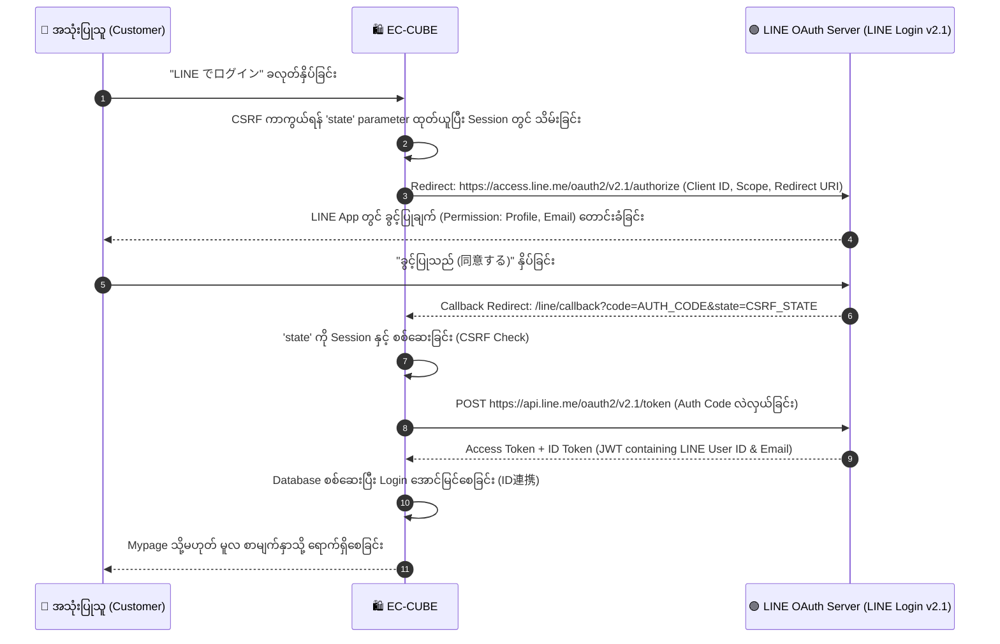

# 01. LINE Login & Account Linking (LINEログイン・ID連携)

EC-CUBE သို့ ဈေးဝယ်သူများ အလွယ်တကူ ၁ ချက်နှိပ်ရုံဖြင့် Login ဝင်ရောက်နိုင်စေရန်နှင့် အကောင့်ချိတ်ဆက်နိုင်စေရန် **LINE Login v2.1 (OAuth 2.0)** စနစ် ထည့်သွင်းတည်ဆောက်ပုံ ဖြစ်ပါသည်။

---

## 🔑 LINE Login v2.1 စီးဆင်းမှု (The OAuth 2.0 Flow)



---

## 🗄️ ၁။ Database Entity ပြင်ဆင်ခြင်း (Entity Extension)

EC-CUBE ၏ `dtb_customer` ဇယားတွင် LINE User ID (ဥပမာ: `U4af4980629...`) ကို သိမ်းဆည်းနိုင်ရန် Entity Trait ရေးသားရပါသည်:

```php
namespace Customize\Entity;

use Doctrine\ORM\Mapping as ORM;
use Eccube\Annotation\EntityExtension;

/**
 * @EntityExtension("Eccube\Entity\Customer")
 */
trait CustomerTrait
{
    /**
     * @var string|null
     * @ORM\Column(name="line_user_id", type="string", length=255, nullable=true, unique=true)
     */
    private $line_user_id;

    public function getLineUserId(): ?string
    {
        return $this->line_user_id;
    }

    public function setLineUserId(?string $line_user_id): self
    {
        $this->line_user_id = $line_user_id;
        return $this;
    }
}
```

---

## ⚙️ ၂။ LINE Login Service တည်ဆောက်ခြင်း

Symfony HttpClient ကို အသုံးပြု၍ LINE OAuth Server နှင့် ဆက်သွယ်သော Service တစ်ခု ရေးသားပါသည်:

```php
namespace Customize\Service;

use Symfony\Contracts\HttpClient\HttpClientInterface;
use Symfony\Component\HttpFoundation\Session\SessionInterface;

class LineLoginService
{
    private HttpClientInterface $httpClient;
    private SessionInterface $session;
    private string $channelId;
    private string $channelSecret;
    private string $callbackUrl;

    public function __construct(
        HttpClientInterface $httpClient,
        SessionInterface $session,
        string $channelId,
        string $channelSecret,
        string $callbackUrl
    ) {
        $this->httpClient = $httpClient;
        $this->session = $session;
        $this->channelId = $channelId;
        $this->channelSecret = $channelSecret;
        $this->callbackUrl = $callbackUrl;
    }

    /**
     * LINE Login ပေးပို့မည့် Auth URL ကို ထုတ်ပေးခြင်း
     */
    public function getAuthorizationUrl(): string
    {
        $state = bin2hex(random_bytes(16));
        $this->session->set('line_oauth_state', $state);

        $params = [
            'response_type' => 'code',
            'client_id'     => $this->channelId,
            'redirect_uri'  => $this->callbackUrl,
            'state'         => $state,
            'scope'         => 'profile openid email',
        ];

        return 'https://access.line.me/oauth2/v2.1/authorize?' . http_build_query($params);
    }

    /**
     * Authorization Code ဖြင့် Access Token နှင့် Profile အချက်အလက် ရယူခြင်း
     */
    public function getLineProfile(string $code): array
    {
        $response = $this->httpClient->request('POST', 'https://api.line.me/oauth2/v2.1/token', [
            'body' => [
                'grant_type'    => 'authorization_code',
                'code'          => $code,
                'redirect_uri'  => $this->callbackUrl,
                'client_id'     => $this->channelId,
                'client_secret' => $this->channelSecret,
            ],
            'timeout' => 5.0,
        ]);

        $tokenData = $response->toArray();
        $accessToken = $tokenData['access_token'];

        // LINE Profile Data (userId, displayName) ကို လှမ်းယူခြင်း
        $profileResponse = $this->httpClient->request('GET', 'https://api.line.me/v2/profile', [
            'headers' => [
                'Authorization' => 'Bearer ' . $accessToken,
            ],
            'timeout' => 5.0,
        ]);

        return $profileResponse->toArray();
    }
}
```

---

## 🎮 ၃။ LINE Callback Controller တည်ဆောက်ခြင်း

အသုံးပြုသူ LINE မှ ပြန်ရောက်လာချိန်တွင် `line_user_id` ကို စစ်ဆေးပြီး Login အောင်မြင်အောင် လုပ်ဆောင်ပေးသော Controller ဖြစ်ပါသည်:

```php
namespace Customize\Controller;

use Customize\Service\LineLoginService;
use Eccube\Repository\CustomerRepository;
use Symfony\Component\HttpFoundation\Request;
use Symfony\Component\HttpFoundation\Response;
use Symfony\Component\Routing\Annotation\Route;
use Symfony\Component\Security\Core\Authentication\Token\UsernamePasswordToken;
use Symfony\Component\Security\Core\Authentication\Token\Storage\TokenStorageInterface;
use Doctrine\ORM\EntityManagerInterface;

class LineLoginController
{
    private LineLoginService $lineLoginService;
    private CustomerRepository $customerRepository;
    private TokenStorageInterface $tokenStorage;
    private EntityManagerInterface $entityManager;

    public function __construct(
        LineLoginService $lineLoginService,
        CustomerRepository $customerRepository,
        TokenStorageInterface $tokenStorage,
        EntityManagerInterface $entityManager
    ) {
        $this->lineLoginService = $lineLoginService;
        $this->customerRepository = $customerRepository;
        $this->tokenStorage = $tokenStorage;
        $this->entityManager = $entityManager;
    }

    /**
     * @Route("/line/login", name="line_login_redirect")
     */
    public function redirectToLine(): Response
    {
        $url = $this->lineLoginService->getAuthorizationUrl();
        return new \Symfony\Component\HttpFoundation\RedirectResponse($url);
    }

    /**
     * @Route("/line/callback", name="line_login_callback")
     */
    public function callback(Request $request): Response
    {
        $session = $request->getSession();
        $state = $request->query->get('state');
        $code = $request->query->get('code');

        // CSRF Check
        if (!$state || $state !== $session->get('line_oauth_state')) {
            throw new \RuntimeException('Invalid OAuth State (CSRF Protection Failed)');
        }
        $session->remove('line_oauth_state');

        // LINE Profile ရယူခြင်း
        $profile = $this->lineLoginService->getLineProfile($code);
        $lineUserId = $profile['userId'];

        // Case 1: ဤ LINE ID ဖြင့် ချိတ်ဆက်ထားသော ဖောက်သည် ရှိမရှိ ရှာဖွေခြင်း
        $customer = $this->customerRepository->findOneBy(['line_user_id' => $lineUserId]);

        if ($customer) {
            // အကောင့်ရှိပြီးသားဖြစ်ပါက Symfony Security Session ဖြင့် Login ချက်ချင်းပေးဝင်ခြင်း
            $token = new UsernamePasswordToken($customer, null, 'customer', $customer->getRoles());
            $this->tokenStorage->setToken($token);
            $session->set('_security_customer', serialize($token));

            return new \Symfony\Component\HttpFoundation\RedirectResponse('/mypage');
        }

        // Case 2: အကောင့်မရှိသေးပါက LINE ID ကို Session တွင် ခေတ္တသိမ်းပြီး အကောင့်အသစ်ဖွင့်ခိုင်းခြင်း
        $session->set('pending_line_user_id', $lineUserId);
        $session->set('pending_line_display_name', $profile['displayName'] ?? '');

        return new \Symfony\Component\HttpFoundation\RedirectResponse('/entry');
    }
}
```

---

## 🎨 ၄။ Twig တွင် LINE Login ခလုတ် ထည့်သွင်းခြင်း

`template/default/Mypage/login.twig` သို့မဟုတ် `template/default/Entry/index.twig` တွင် ထည့်သွင်းအသုံးပြုပုံ:

```twig
{# LINE Official Green Theme Button #}
<div class="ec-line-login-wrapper" style="margin: 20px 0; text-align: center;">
    <a href="{{ url('line_login_redirect') }}" class="ec-line-btn" style="
        display: inline-flex;
        align-items: center;
        justify-content: center;
        background-color: #06C755;
        color: #FFFFFF;
        font-weight: bold;
        padding: 12px 24px;
        border-radius: 6px;
        text-decoration: none;
        width: 100%;
        max-width: 340px;
        box-shadow: 0 2px 4px rgba(0,0,0,0.1);
    ">
        <svg width="24" height="24" viewBox="0 0 24 24" fill="#FFFFFF" style="margin-right: 10px;">
            <path d="M12 2C6.48 2 2 5.92 2 10.76c0 3.04 1.77 5.72 4.48 7.23-.2.72-.71 2.61-.81 3.01-.13.51.19.5.39.37.16-.1 2.21-1.5 3.12-2.12.92.17 1.86.26 2.82.26 5.52 0 10-3.92 10-8.75S17.52 2 12 2z"/>
        </svg>
        <span>LINE でログイン / 新規登録</span>
    </a>
</div>
```

ဤသို့ဖြင့် အသုံးပြုသူများသည် ခက်ခဲရှည်လျားသော Password များကို မှတ်စရာမလိုဘဲ မိမိတို့၏ LINE အကောင့်ဖြင့် လွယ်ကူစွာ Login ဝင်ရောက်နိုင်မည် ဖြစ်ပါသည်။
