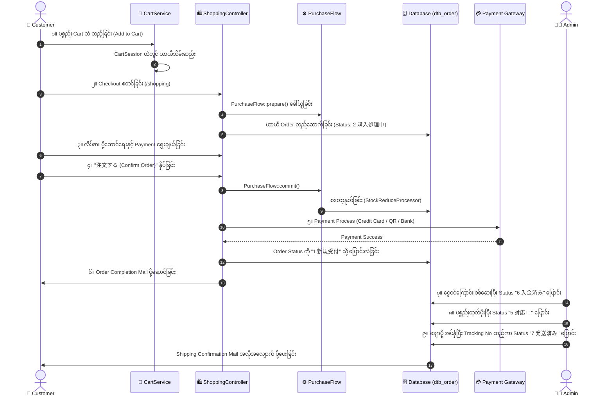

# 01 - Order Lifecycle & Status Architecture (အော်ဒါ သံသရာနှင့် Status စနစ်)

> **Client Requirement & Technical Overview**:
> "Customer က ပစ္စည်းကို Cart ထဲ ထည့်လိုက်ချိန်မှစ၍ Checkout ပြုလုပ်ခြင်း၊ အော်ဒါကျသွားခြင်း၊ ငွေပေးချေခြင်း၊ ပို့ဆောင်ခြင်းနှင့် အပြီးသတ်သည်အထိ အဆင့်တိုင်းတွင် Status မည်သို့ ပြောင်းလဲသွားသနည်း။ ထို Logic များသည် EC-CUBE ၏ မည်သည့် Code / Service ဖိုင်များတွင် အမှန်တကယ် တည်ရှိနေသနည်း?"

---

## 🔄 အသေးစိတ် Order Lifecycle (Customer ➔ Completed)



---

## 🏛️ အဆင့်တစ်ခုချင်းစီ၏ Logic များ တည်ရှိရာ နေရာများ (Where the Logic Exists)

EC-CUBE 4.x တွင် Order နှင့် ပတ်သက်သော Business Logic များကို အောက်ပါ Classes များတွင် ခွဲဝေ ထိန်းချုပ်ထားပါသည်:

### ၁။ Cart အဆင့် (ပစ္စည်း စုစည်းမှု)
- **တာဝန်ခံ Class**: `src/Eccube/Service/CartService.php`
- **တာဝန်ခံ Controller**: `src/Eccube/Controller/CartController.php`
- **အလုပ်လုပ်ပုံ**: Customer ၏ Cart ထဲသို့ ပစ္စည်းထည့်ခြင်း၊ အရေအတွက် ပြင်ဆင်ခြင်း၊ စတော့ လက်ကျန် ရှိမရှိ အကြိုစစ်ဆေးခြင်းများကို PHP Session (`CartSession`) ထဲတွင် သိမ်းဆည်းထားသည်။

### ၂။ Checkout / PurchaseFlow အဆင့် (စျေးနှုန်းနှင့် အခွန် တွက်ချက်ခြင်း)
- **တာဝန်ခံ Class**: `src/Eccube/Service/PurchaseFlow/PurchaseFlow.php`
- **တာဝန်ခံ Controller**: `src/Eccube/Controller/ShoppingController.php`
- **အလုပ်လုပ်ပုံ**: 
  - Cart ထဲရှိ ပစ္စည်းများကို `PurchaseFlow` မှတဆင့် ဖြတ်သန်းစေပြီး ပို့ဆောင်ခ (`DeliveryFeeProcessor`)၊ လျှော့စျေး (`DiscountProcessor`)၊ အခွန် (`TaxProcessor`) များကို တွက်ချက်သည်။
  - Database ထဲတွင် အော်ဒါအတွက် ယာယီ Row တစ်ခုကို `dtb_order` ထဲ၌ `order_status_id = 2 (購入処理中)` ဖြင့် စတင် ဆောက်တည်သည်။

### ၃။ Order Creation အဆင့် (အော်ဒါ အတည်ပြုခြင်း)
- **တာဝန်ခံ Class**: `src/Eccube/Service/OrderHelper.php`
- **Method**: `OrderHelper::createPurchaseData()`
- **အလုပ်လုပ်ပုံ**: Customer က "注文する (Complete Order)" ခလုတ်ကို နှိပ်လိုက်သည့်အခါ:
  1. `PurchaseFlow::commit()` ကို ခေါ်ယူသည်။
  2. `StockReduceProcessor` က `dtb_product_stock` မှ စတော့ကို တရားဝင် နှုတ်ယူသည်။
  3. `Order` ထဲသို့ `order_no` (ဥပမာ- 20260921-0001) ထုတ်ပေးသည်။
  4. Status ကို `1 (新規受付)` သို့ ပြောင်းလဲသည်။

### ၄။ Payment အဆင့် (ငွေပေးချေမှု)
- **တာဝန်ခံ Class**: `src/Eccube/Service/Payment/PaymentMethodInterface.php` သို့မဟုတ် သက်ဆိုင်ရာ Payment Plugin (GMO, Stripe, SBPS)
- **အလုပ်လုပ်ပုံ**:
  - **Credit Card / Online Pay**: Payment Gateway မှ Webhook (Callback) ပြန်လာသည့်အခါ ငွေချေမှု အောင်မြင်ပါက Status ကို `1 (新規受付)` သို့မဟုတ် `6 (入金済み)` သို့ ပြောင်းသည်။
  - **Bank Transfer (銀行振込)**: Status ကို `4 (入金待ち)` အဖြစ် သတ်မှတ်ပြီး ဘဏ်ငွေလွှဲ အချက်အလက်များပါသော Email ပေးပို့သည်။

### ၅။ Shipping အဆင့် (ပစ္စည်း ပို့ဆောင်ခြင်း)
- **တာဝန်ခံ Controller**: `src/Eccube/Controller/Admin/Order/ShippingController.php`
- **အလုပ်လုပ်ပုံ**: Admin က ချောပို့ Tracking Number (`送り状番号`) ရိုက်ထည့်ပြီး "発送完了" နှိပ်လိုက်သောအခါ Status သည် `7 (発送済み)` သို့ ပြောင်းလဲသွားပြီး Customer ဆီသို့ Tracking URL ပါသော Email အလိုအလျောက် ရောက်ရှိသွားသည်။

---

## 🗄️ Status တစ်ခုချင်းစီကို Database တွင် ကိုယ်စားပြုပုံ (Status Representation)

Database ထဲရှိ `dtb_order` ဇယားတွင် အော်ဒါတစ်ခု၏ လက်ရှိ အခြေအနေကို **`order_status_id`** Column ဖြင့် မှတ်သားပါသည်:

```sql
-- လက်ရှိ အော်ဒါ၏ Status ကို စစ်ဆေးခြင်း
SELECT id, order_no, order_status_id, payment_total, create_date 
FROM dtb_order 
WHERE id = 101;
```

### Entity အတွင်း အသုံးပြုပုံ (`Order.php`):
```php
// Order Entity
$order = $orderRepository->find(101);

// Status ID ရယူခြင်း
$statusId = $order->getOrderStatus()->getId();

// Status စစ်ဆေးခြင်း
if ($order->getOrderStatus()->getId() === OrderStatus::ORDER_NEW) {
    // 新規受付 အခြေအနေ ဖြစ်ပါက
}
```

---

## ⚙️ PurchaseFlow Architecture ၏ အဓိက Processors များ

EC-CUBE တွင် အော်ဒါတင်စဉ် စျေးနှုန်းနှင့် စတော့ တွက်ချက်မှုများကို Plugin များမှ အလွယ်တကူ ဝင်ရောက် Customize လုပ်နိုင်ရန် **Chain of Responsibility Pattern** ဖြင့် ဖွဲ့စည်းထားပါသည်:

```
[PurchaseFlow]
   │
   ├── 1. ItemHolderValidator (စတော့ရှိမရှိ၊ ပစ္စည်းရောင်းချခွင့်ရှိမရှိ စစ်ခြင်း)
   ├── 2. DeliveryFeePreprocessor (ပို့ခ တွက်ခြင်း)
   ├── 3. TaxProcessor (軽減税率 8% သို့မဟုတ် 10% အခွန် တွက်ခြင်း)
   ├── 4. DiscountProcessor (ကူပွန် သို့မဟုတ် Point လျှော့စျေး တွက်ခြင်း)
   ├── 5. PaymentTotalProcessor (စုစုပေါင်း ပေးချေရမည့်ငွေ တွက်ခြင်း)
   └── 6. StockReduceProcessor (အော်ဒါ အောင်မြင်ပါက စတော့ အမှန်တကယ် နှုတ်ခြင်း)
```

---

## 🇯🇵 သက်ဆိုင်ရာ ဂျပန် ဝေါဟာရများ

- **購入処理中 (Kounyuu Shorichuu)**: Order In Progress (Status: 2)
- **新規受付 (Shinki Uketsuke)**: New Order Received (Status: 1)
- **入金待ち (Nyuukin Machi)**: Waiting for Payment (Status: 4)
- **入金済み (Nyuukinzumi)**: Payment Confirmed (Status: 6)
- **対応中 (Taiouchuu)**: Order Being Processed / Packing (Status: 5)
- **発送済み (Hassouzumi)**: Shipped / Completed (Status: 7)
- **注文取消し (Chuumon Torikeshi)**: Order Cancelled (Status: 3)
