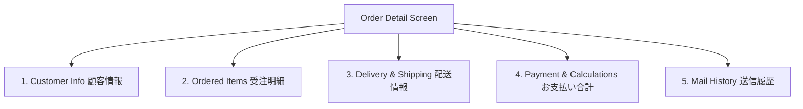

# 02 - Order List & Order Detail (အော်ဒါ စာရင်းနှင့် အသေးစိတ် အချက်အလက်)

> **Client Requirements**:
> 1. **Order list (အော်ဒါ စာရင်း ရှာဖွေကြည့်ရှုခြင်း)**: Admin Dashboard မှ ဝင်ရောက်လာသော အော်ဒါများကို အော်ဒါနံပါတ်၊ ဝယ်ယူသူအမည်၊ ရက်စွဲ၊ Status၊ ငွေချေနည်းလမ်း စသည်တို့ဖြင့် စစ်ထုတ်ရှာဖွေနိုင်ရမည်။
> 2. **Order detail (အော်ဒါ အသေးစိတ် ကြည့်ရှုခြင်း)**: အော်ဒါတစ်ခုချင်းစီ၏ ဝယ်ယူထားသော ပစ္စည်းများ၊ ပို့ဆောင်ရမည့် လိပ်စာ၊ စုစုပေါင်း ကုန်ကျငွေ၊ အခွန်၊ Tracking နံပါတ်နှင့် ပေးပို့ခဲ့သော အီးမေးလ် ရာဇဝင် (Mail History) များကို စုံလင်စွာ ကြည့်ရှုစစ်ဆေးနိုင်ရမည်။

---

## 📋 1. Order List (အော်ဒါ စာရင်း ရှာဖွေခြင်း Architecture)

Admin သည် **受注管理 ➔ 受注一覧 (Order List)** သို့ သွားရောက်သည့်အခါ အောက်ပါ Architecture အတိုင်း အလုပ်လုပ်ပါသည်:

```
[Admin Search Form (SearchOrderType)]
               │
               ▼ (HTTP GET / POST /%eccube_admin_route%/order)
     [OrderController::index()]
               │
               ▼
[OrderRepository::getQueryBuilderBySearchDataForAdmin($searchData)]
               │
               ├── Order Status Filter (WHERE o.OrderStatus IN (:statuses))
               ├── Date Range Filter (WHERE o.order_date BETWEEN :start AND :end)
               ├── Keyword Filter (Customer Name, Email, Phone, Order No)
               ├── Payment Method Filter (WHERE o.Payment = :payment)
               └── Shipping Date Filter
               │
               ▼
     [KnpPaginator (Pagination)] ── Page 1, 2, 3 ခွဲခြမ်းပြသခြင်း
               │
               ▼
     [admin/Order/index.twig] ── Table ဖြင့် List ပြသခြင်း
```

### သက်ဆိုင်ရာ အဓိက ဖိုင်များ:
- **Admin Controller**: `src/Eccube/Controller/Admin/Order/OrderController.php`
- **Search Form Type**: `src/Eccube/Form/Type/Admin/SearchOrderType.php`
- **Repository**: `src/Eccube/Repository/OrderRepository.php`
- **Twig Template**: `src/Eccube/Resource/template/admin/Order/index.twig`

### Search Query Logic နမူနာ (`OrderRepository.php`):
```php
public function getQueryBuilderBySearchDataForAdmin($searchData)
{
    $qb = $this->createQueryBuilder('o')
        ->addSelect(['c', 's', 'p'])
        ->leftJoin('o.Customer', 'c')
        ->leftJoin('o.OrderStatus', 's')
        ->leftJoin('o.Payment', 'p');

    // Status အလိုက် Filter ပြုလုပ်ခြင်း
    if (!empty($searchData['status'])) {
        $qb->andWhere($qb->expr()->in('o.OrderStatus', ':statuses'))
           ->setParameter('statuses', $searchData['status']);
    }

    // ဝယ်ယူသူ အမည် / ဖုန်းနံပါတ် / အီးမေးလ် ဖြင့် ရှာဖွေခြင်း
    if (!empty($searchData['multi'])) {
        $qb->andWhere($qb->expr()->orX(
            $qb->expr()->like('o.order_no', ':multi'),
            $qb->expr()->like('o.name01', ':multi'),
            $qb->expr()->like('o.name02', ':multi'),
            $qb->expr()->like('o.email', ':multi'),
            $qb->expr()->like('o.phone_number', ':multi')
        ))->setParameter('multi', '%'.$searchData['multi'].'%');
    }

    // နောက်ဆုံး အော်ဒါများကို အပေါ်ဆုံးမှ ပြသခြင်း
    $qb->orderBy('o.order_date', 'DESC');

    return $qb;
}
```

---

## 🔍 2. Order Detail (အော်ဒါ အသေးစိတ် ကြည့်ရှုစစ်ဆေးခြင်း)

အော်ဒါတစ်ခု၏ အသေးစိတ်ကို ကြည့်ရှု/ပြင်ဆင်ရန်အတွက် `OrderEditController::edit` ကို ခေါ်ယူပါသည်:
- **Route**: `/%eccube_admin_route%/order/{id}/edit`
- **Template**: `src/Eccube/Resource/template/admin/Order/edit.twig`

### အော်ဒါ အသေးစိတ်တွင် ပါဝင်သော အဓိက အစိတ်အပိုင်း ၅ ခု:



### ၁။ ဝယ်ယူသူ အချက်အလက် (Customer Info Snapshot)
- ဝယ်ယူသူ၏ အမည်၊ ဖုန်းနံပါတ်၊ အီးမေးလ်၊ စာတိုက်သင်္ကေတ။
- 💡 **သတိပြုရန်**: ဝယ်ယူသူသည် နောင်တစ်ချိန်တွင် ၎င်း၏ Account Profile လိပ်စာကို ပြောင်းလိုက်စေကာမူ `dtb_order` တွင် မူလဝယ်ယူစဉ်က အချက်အလက်များ မပြောင်းလဲဘဲ Snapshot အဖြစ် ကျန်ရှိနေပါသည်။

### ၂။ မှာယူထားသော ပစ္စည်းများ (Ordered Items - `dtb_order_item`)
```twig
{# edit.twig ထဲတွင် ပစ္စည်းစာရင်း ပြသပုံ နမူနာ #}
<table class="table">
    <thead>
        <tr>
            <th>商品名 (Product Name)</th>
            <th>単価 (Unit Price)</th>
            <th>数量 (Qty)</th>
            <th>小計 (Subtotal)</th>
        </tr>
    </thead>
    <tbody>
        
            
                <tr>
                    <td>{{ OrderItem.product_name }} ({{ OrderItem.product_code }})</td>
                    <td>{{ OrderItem.priceIncTax|number_format }} 円</td>
                    <td>{{ OrderItem.quantity }}</td>
                    <td>{{ (OrderItem.priceIncTax * OrderItem.quantity)|number_format }} 円</td>
                </tr>
            
        
    </tbody>
</table>
```

### ၃။ ပို့ဆောင်ရေး အချက်အလက် (Delivery & Shipping)
- လက်ခံမည့်သူ၏ လိပ်စာ၊ ချောပို့ကုမ္ပဏီ (ヤマト運輸, 佐川急便 စသည်)၊ ပို့ဆောင်ပေးရမည့် ရက်စွဲနှင့် အချိန် (配達指定日時)။
- အမြန်ချောပို့ စာပို့နံပါတ် (**送り状番号 / Tracking Number**).

### ၄။ ငွေပေးချေမှုနှင့် ကုန်ကျငွေ တွက်ချက်မှု (Payment Summary)
- ကုန်ပစ္စည်း စုစုပေါင်း (Subtotal): `order.subtotal`
- လျှော့စျေး (Discount): `order.discount`
- ပို့ဆောင်ခ (Delivery Fee): `order.delivery_fee_total`
- ငွေလွှဲခ/ကြေး (Charge): `order.charge`
- ကျသင့်အခွန် (Tax 10% / 8%): `order.tax`
- **စုစုပေါင်း ပေးချေငွေ (Payment Total)**: `order.payment_total`

### ၅။ အီးမေးလ် ပေးပို့မှု မှတ်တမ်း (Mail History - `dtb_mail_history`)
အဆိုပါ အော်ဒါနှင့် ပတ်သက်၍ Customer ဆီသို့ အော်ဒါအတည်ပြုမေးလ်၊ ငွေလက်ခံရရှိမေးလ်၊ ပစ္စည်းပို့ဆောင်ပြီးမေးလ် စသည့် အီးမေးလ်များ မည်သည့်နေ့ရက်၊ မည်သည့်အချိန်တွင် ပေးပို့ခဲ့သည်ကို စစ်ဆေးနိုင်သည့် ရာဇဝင်ဇယား ဖြစ်ပါသည်။

---

## 🇯🇵 သက်ဆိုင်ရာ ဂျပန် ဝေါဟာရများ

- **受注一覧 (Juchuu Ichiran)**: Order List
- **受注詳細 / 受注編集 (Juchuu Shousai / Juchuu Henshuu)**: Order Detail / Order Edit
- **お買い上げ明細 (Okaieage Meisai)**: Order Items Statement
- **顧客情報 (Kokyaku Jouhou)**: Customer Information
- **メール送信履歴 (Meeru Soushin Rireki)**: Mail Sending History
- **小計 (Shoukei)**: Subtotal
- **手数料 (Tesuryou)**: Commission / Service Charge
