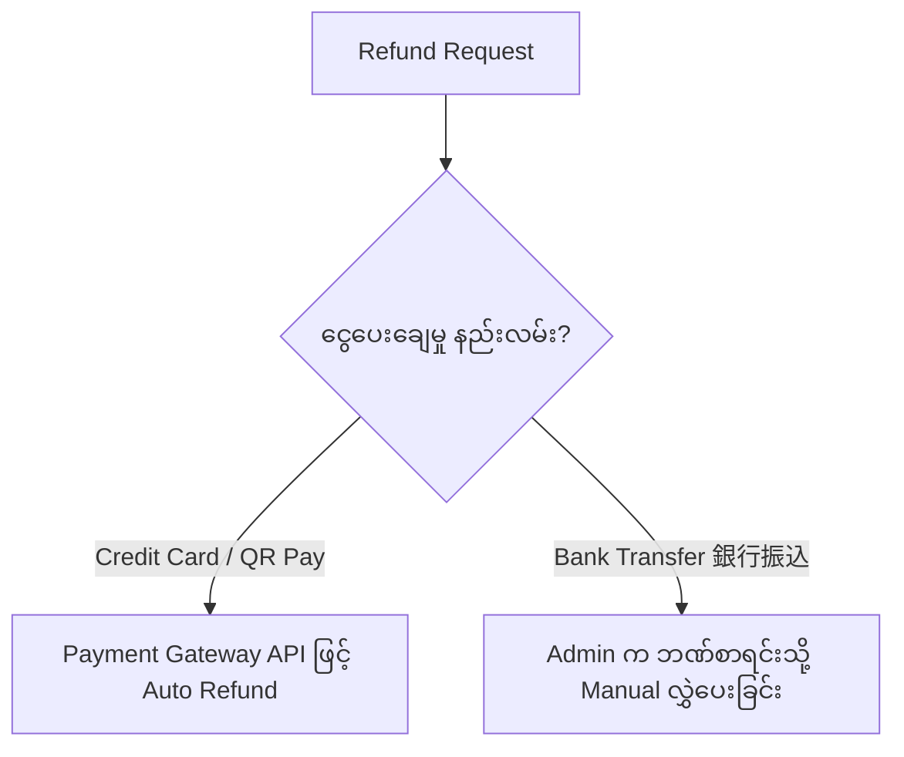

# 04 - Cancel Order & Refund Handling (အော်ဒါ ဖျက်သိမ်းခြင်းနှင့် ငွေပြန်အမ်းခြင်း)

> **Client Requirements**:
> 1. **Cancel order (အော်ဒါ ဖျက်သိမ်းခြင်း)**: ဝယ်ယူသူက အော်ဒါ ဖျက်သိမ်းလိုသည့်အခါ (သို့မဟုတ် စတော့မလောက်၍ ပယ်ဖျက်ရသည့်အခါ) Status ကို "注文取消し" သို့ ပြောင်းနိုင်ရမည်ဖြစ်ပြီး၊ **နှုတ်ယူထားသော ကုန်ပစ္စည်း စတော့များကို Database တွင် အလိုအလျောက် ပြန်လည်ပေါင်းထည့် (Stock Restore) ပေးရမည်**။
> 2. **Refund handling (ငွေပြန်အမ်းခြင်း / ပစ္စည်းပြန်အပ်ခြင်း)**: ပစ္စည်းရောက်ပြီးမှ ပျက်စီးနေ၍ ပြန်ပို့လာပါက (返品) ငွေပေးချေထားသော Credit Card သို့မဟုတ် ဘဏ်စာရင်းထဲသို့ ငွေပြန်လည် လွှဲပေးနိုင်ရမည် (Refund API Integration)။

---

## 🛑 1. Cancel Order (အော်ဒါ ဖျက်သိမ်းခြင်း Architecture)

အော်ဒါ ဖျက်သိမ်းခြင်းတွင် အရေးအကြီးဆုံး နည်းပညာဆိုင်ရာ အချက်မှာ **"在庫戻し (Stock Restoration)"** ဖြစ်ပါသည်။

```
[Admin / Customer initiates Cancel]
                  │
                  ▼
   [Order Status changed to "3 注文取消し"]
                  │
                  ├── 1. 在庫戻し (Stock Restoration)
                  │      dtb_order_item ရှိ ပစ္စည်း အရေအတွက်များကို
                  │      dtb_product_stock ထဲသို့ ပြန်ပေါင်းထည့်ခြင်း (+)
                  │
                  ├── 2. ポイント返還 (Point / Coupon Restoration)
                  │      ဝယ်ယူစဉ်က သုံးထားသော Point များကို Customer Account သို့ ပြန်ထည့်ခြင်း
                  │
                  ├── 3. 決済取消 (Payment Void / Cancel)
                  │      Credit Card ငွေညှစ်ယူမှု မပြုလုပ်မီ ပယ်ဖျက်ခြင်း
                  │
                  └── 4. キャンセルメール (Send Cancellation Mail)
```

---

## 🗄️ Stock Restoration Logic (စတော့ ပြန်ပေါင်းထည့်ပုံ ကုဒ်)

EC-CUBE တွင် အော်ဒါ Status ကို `ORDER_CANCEL (ID: 3)` သို့ ပြောင်းလဲလိုက်ချိန်တွင် `PurchaseFlow` သို့မဟုတ် State Transition Listener မှ စတော့ကို ပြန်တိုးပေးပါသည်:

```php
// စတော့ ပြန်လည်ပေါင်းထည့်ခြင်း Service Logic နမူနာ
public function restoreStock(Order $Order): void
{
    foreach ($Order->getOrderItems() as $OrderItem) {
        // ကုန်ပစ္စည်း Item ဖြစ်ပါက စတော့ ပြန်တိုးပေးရန်
        if ($OrderItem->isProduct()) {
            $ProductClass = $OrderItem->getProductClass();

            // အကန့်အသတ်ရှိသော စတော့ဖြစ်ပါက
            if (!$ProductClass->isStockUnlimited()) {
                $ProductStock = $ProductClass->getProductStock();
                $currentStock = $ProductStock->getStock();
                $restoreQty = $OrderItem->getQuantity();

                // မူလစတော့ထဲသို့ ပြန်လည်ပေါင်းထည့်ခြင်း
                $ProductStock->setStock($currentStock + $restoreQty);
            }
        }
    }

    $this->entityManager->flush();
}
```

> ⚠️ **သတိပြုရမည့် အချက်**:  
> အကယ်၍ စတော့ကို မူလအတိုင်း ပြန်မတိုးပေးပါက Database ထဲရှိ ကုန်ပစ္စည်း စာရင်းသည် အမှန်တကယ် ဂိုဒေါင်တွင် ရှိနေသော အရေအတွက်နှင့် လွဲချော်သွားမည် ဖြစ်ပါသည်။

---

## 💳 2. Refund Handling (ငွေပြန်အမ်းခြင်း လုပ်ငန်းစဉ်)

ငွေပြန်အမ်းခြင်းတွင် အခြေအနေ ၂ မျိုး ရှိပါသည်:



### Credit Card ငွေပြန်အမ်းမှုဆိုင်ရာ ဂျပန် စံနှုန်း အခေါ်အဝေါ်များ:
1. **仮売上 / 承認 (Auth / Authorization)**: Customer ၏ ကတ်ထဲမှ ငွေမဖြတ်သေးဘဲ အော်ဒါပမာဏကို ခေတ္တ ထိန်းချုပ်ထားခြင်း (Hold)။ ဤအခြေအနေတွင် ဖျက်သိမ်းပါက **与信取消 (Void)** API ကို ခေါ်ရုံဖြင့် ပြီးပြတ်ပါသည်။
2. **売上確定 (Capture)**: Customer ၏ ကတ်ထဲမှ ငွေကို အမှန်တကယ် ဖြတ်ယူပြီးစီးသွားသော အခြေအနေ။ ဤအခြေအနေတွင် ငွေပြန်အမ်းရန်အတွက် **売上取消 / 返金 (Refund)** API ကို Payment Gateway (GMO, Stripe, Softbank) သို့ ပေးပို့ရပါသည်။

### Stripe / Gateway Refund API ချိတ်ဆက်မှု နမူနာ:
```php
// Payment Gateway Refund API Call
public function processRefund(Order $Order, int $refundAmount): bool
{
    $chargeId = $Order->getPaymentTransactionId(); // Payment Gateway Transaction ID

    try {
        // Payment Gateway SDK (e.g. Stripe or GMO)
        $refund = \Stripe\Refund::create([
            'charge' => $chargeId,
            'amount' => $refundAmount, // ပြန်အမ်းမည့် ငွေပမာဏ
            'reason' => 'requested_by_customer',
        ]);

        if ($refund->status === 'succeeded') {
            // Status ကို "9 返品 (Returned)" သို့ ပြောင်းခြင်း
            $ReturnedStatus = $this->orderStatusRepository->find(OrderStatus::ORDER_RETURNED);
            $Order->setOrderStatus($ReturnedStatus);
            $this->entityManager->flush();

            return true;
        }
    } catch (\Exception $e) {
        // Log Error & Notify Admin
        $this->logger->error('Refund Failed: '.$e->getMessage());
    }

    return false;
}
```

---

## ⚡ Client Requirement: တစ်စိတ်တစ်ပိုင်း ငွေပြန်အမ်းခြင်း (Partial Refund)

Client တချို့သည် ပစ္စည်း ၃ မျိုး ဝယ်ယူထားသည့်အနက် ပစ္စည်း ၁ မျိုးတည်းအတွက်သာ ငွေပြန်အမ်းလိုကြသည် (**一部返金**):
- ဤကဲ့သို့သော အခြေအနေတွင် Order Total ငွေပမာဏကို `dtb_order.payment_total` တွင် ပြင်ဆင်ပြီး၊ ကွာခြားသွားသော ပမာဏကိုသာ Payment Gateway ၏ Partial Refund API သို့ Amount သတ်မှတ်၍ ပေးပို့ရပါသည်။

---

## 🇯🇵 သက်ဆိုင်ရာ ဂျပန် ဝေါဟာရများ

- **注文取消し / キャンセル (Chuumon Torikeshi / Kyanseru)**: Order Cancellation
- **返品 (Henpin)**: Product Return
- **返金 (Henkin)**: Money Refund
- **在庫戻し (Zaiko Modoshi)**: Stock Restoration (စတော့ ပြန်တိုးခြင်း)
- **仮売上 (Kari Uriage)**: Authorization / Auth (ငွေခေတ္တ ထိန်းထားခြင်း)
- **売上確定 (Uriage Kakutei)**: Capture (ငွေအပြီးသတ် ဖြတ်ယူခြင်း)
- **売上取消 / 返金処理 (Uriage Torikeshi / Henkin Shorii)**: Refund Processing
- **一部返金 (Ichibu Henkin)**: Partial Refund
- **全額返金 (Zengaku Henkin)**: Full Refund
