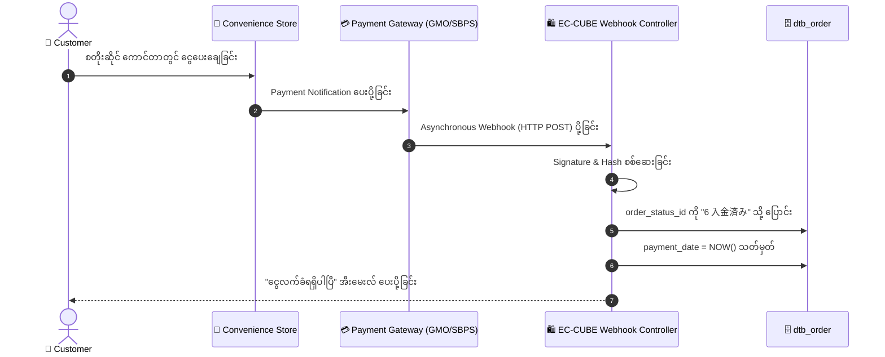

# 06 - Payment Status & Changing Ordered Products (ငွေပေးချေမှု အခြေအနေနှင့် မှာယူထားသော ပစ္စည်းများ ပြင်ဆင်ခြင်း)

> **Client Requirements**:
> 1. **Payment status (ငွေပေးချေမှု အခြေအနေ စီမံခြင်း)**: ဘဏ်လွှဲ (Bank Transfer)၊ ကွန်ဗီးနီးယားစတိုး (Convenience Store)၊ Credit Card သို့မဟုတ် ပစ္စည်းရောက်မှ ငွေချေ (COD) စသည့် မတူညီသော ငွေချေစနစ်များ၏ အခြေအနေ (ငွေဝင်/မဝင်) ကို စနစ်တကျ ခွဲခြားသိရှိနိုင်ရမည်။
> 2. **Change ordered products (မှာယူထားသော ပစ္စည်းများ ပြင်ဆင်ခြင်း)**: Customer က အော်ဒါတင်ပြီးမှ ပစ္စည်းအရေအတွက် တိုးခြင်း၊ လျှော့ခြင်း၊ ပစ္စည်းအသစ် ထပ်ထည့်ခြင်း သို့မဟုတ် ဖယ်ထုတ်ခြင်း ပြုလုပ်လိုပါက Admin က ပြင်ဆင်ပေးနိုင်ရမည်ဖြစ်ပြီး၊ **စတော့နှင့် စုစုပေါင်း စျေးနှုန်းကို အလိုအလျောက် ပြန်လည်တွက်ချက်ပေးရမည်**။

---

## 💳 1. Payment Status (ငွေပေးချေမှု ပုံစံ ၃ မျိုးနှင့် Status Flow)

ဂျပန်နိုင်ငံ E-Commerce တွင် ငွေပေးချေမှုပုံစံကို အဓိက ၃ မျိုး ခွဲခြားထားပါသည်:

| ငွေချေစနစ် အမျိုးအစား | ဂျပန်အမည် | သာဓကများ | စတင်သည့် Status | ငွေဝင်ပြီး Status |
|:---|:---|:---|:---:|:---:|
| **၁။ 前払い (Pre-payment)** | ကြိုတင်ငွေလွှဲ | 銀行振込 (ဘဏ်လွှဲ), コンビニ決済 (7-Eleven, Lawson) | **入金待ち (4)** | **入金済み (6)** |
| **၂။ 即時決済 (Immediate)** | ချက်ချင်းငွေချေ | クレジットカード (Credit Card), PayPay, Amazon Pay | **決済処理中 (8)** | **新規受付 (1)** |
| **၃။ 後払い (Post-payment)** | ပစ္စည်းရောက်မှချေ | 代金引換 (COD), NP後払い, Paidy | **新規受付 (1)** | ပို့ဆောင်ပြီးမှ အတည်ပြု |

---

## 🌐 Convenience Store / Webhook Asynchronous Notification

Customer က ကွန်ဗီးနီးယားစတိုး (ဥပမာ 7-Eleven သို့မဟုတ် FamilyMart) တွင် ငွေသွားရောက် ပေးချေလိုက်သောအခါ:



---

## 🛒 2. Change Ordered Products (မှာယူထားသော ပစ္စည်းများ ပြင်ဆင်ခြင်း)

Admin သည် Order Detail စာမျက်နှာတွင် မှာယူထားသော ပစ္စည်းများကို အောက်ပါအတိုင်း ပြင်ဆင်နိုင်ပါသည်:

### ၁။ ပစ္စည်း အသစ် ထပ်ပေါင်းထည့်ခြင်း (Add Item)
Customer က ဖုန်းဆက်ပြီး *"အင်္ကျီ ၁ ထည် ထပ်ဖြည့်ပေးပါ"* ဟု ပြောလာပါက:
- Admin က Product Search Modal မှ ကုန်ပစ္စည်းကို ရွေးချယ်ပြီး အော်ဒါထဲ ထည့်သွင်းသည်။
- `dtb_order_item` ဇယားထဲတွင် Row အသစ် တည်ဆောက်သည်။
- `PurchaseFlow` က ထိုပစ္စည်းအတွက် စတော့ကို ထပ်မံ နှုတ်ယူသည် (`dtb_product_stock` - 1)။

### ၂။ ပစ္စည်း အရေအတွက် ပြောင်းခြင်း / ဖယ်ထုတ်ခြင်း (Quantity Change / Remove Item)
- အရေအတွက် လျှော့လိုက်ပါက သို့မဟုတ် ပစ္စည်း ဖျက်လိုက်ပါက ကွာခြားသွားသော အရေအတွက်ကို `dtb_product_stock` ထဲသို့ ပြန်ပေါင်းထည့်ပေးသည် (Stock Restoration)။

### ၃။ စျေးနှုန်း၊ ပို့ခနှင့် အခွန် ပြန်လည်တွက်ချက်ခြင်း (Recalculate Totals)
ပစ္စည်းများ ပြင်ဆင်ပြီးပါက Controller က `PurchaseFlow::prepare()` နှင့် `PurchaseFlow::calculateFee()` ကို ခေါ်ယူပြီး အောက်ပါတို့ကို အလိုအလျောက် တွက်ချက်ပေးပါသည်:

```php
// OrderEditController.php ရှိ ပြန်လည်တွက်ချက်မှု Logic
$purchaseContext = new PurchaseContext();
$flowResult = $this->orderPurchaseFlow->prepare($Order, $purchaseContext);

if ($flowResult->hasError()) {
    // စတော့ မလုံလောက်ပါက သို့မဟုတ် အမှားရှိပါက
    foreach ($flowResult->getErrors() as $error) {
        $this->addError($error->getMessage());
    }
} else {
    // စျေးနှုန်း၊ အခွန်၊ ပို့ခများ ပြန်လည်တွက်ချက်ပြီး သိမ်းဆည်းခြင်း
    $this->entityManager->flush();
    $this->addSuccess('အော်ဒါ အချက်အလက်များ အောင်မြင်စွာ ပြင်ဆင်ပြီးပါပြီ', 'admin');
}
```

---

## ⚡ အထူးသတိပြုရန်: Credit Card ဖြင့် ငွေချေပြီးသား အော်ဒါကို ပစ္စည်းပြင်ဆင်ခြင်း

အကယ်၍ အော်ဒါသည် Credit Card ဖြင့် ငွေဖြတ်ပြီးသား ဖြစ်နေပါက ပစ္စည်းထပ်တိုးလိုက်လျှင် ငွေပမာဏ တိုးသွားမည်ဖြစ်ပြီး၊ ပစ္စည်းလျှော့လိုက်လျှင် ငွေပမာဏ နည်းသွားမည်ဖြစ်သည်။
- **နည်းပညာဆိုင်ရာ ဖြေရှင်းချက်**: Payment Gateway Plugin တွင် **金額変更 (Amount Change API)** ပါဝင်ပါက ကတ်ထဲမှ ငွေဖြတ်ပမာဏကို အလိုအလျောက် ချိန်ညှိပေးသည်။ အကယ်၍ ထို API မပါရှိပါက မူလငွေလွှဲကို Cancel ပြုလုပ်ပြီး အသစ်ပြန်လည် ငွေချေစေရပါသည်။

---

## 🇯🇵 သက်ဆိုင်ရာ ဂျပန် ဝေါဟာရများ

- **決済状況 / 支払い状況 (Kessai Joukyou / Shiharai Joukyou)**: Payment Status
- **前払い (Maebarai)**: Advance Payment
- **後払い (Atobarai)**: Deferred / Post Payment
- **代金引換 / 代引 (Daikin Hikikae / Daibiki)**: Cash on Delivery (COD)
- **注文商品の変更 (Chuumon Shouhin no Henkou)**: Modify Ordered Products
- **金額変更 (Kingaku Henkou)**: Payment Amount Modification
