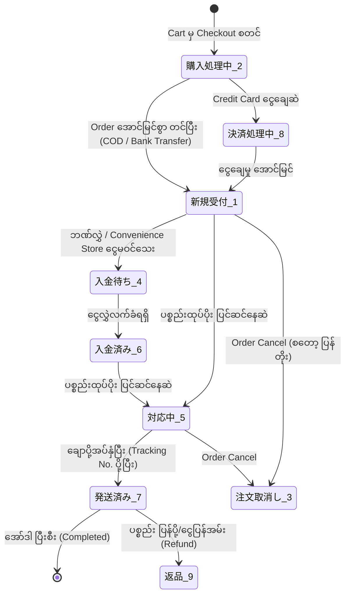
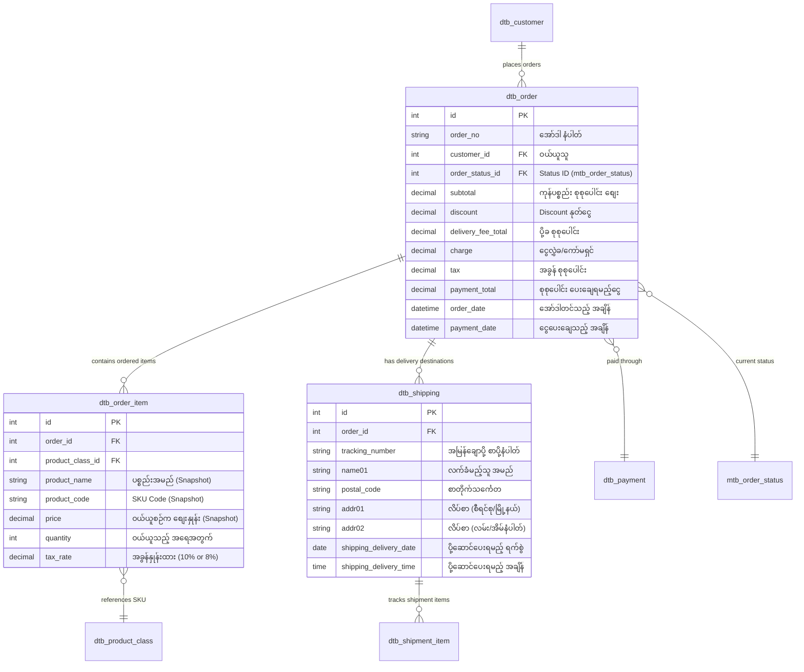

# EC-CUBE Client Requirements: Order Management (မြန်မာဘာသာ)

EC-CUBE (Version 4.x / 4.2+) ၏ **Order Management (အော်ဒါ စီမံခန့်ခွဲမှုစနစ်)** ဆိုင်ရာ Client Requirements များနှင့် **Order Lifecycle** တစ်ခုလုံးကို အခြေခံမှစ၍ အသေးစိတ် ရှင်းလင်းထားသော လေ့လာမှု လမ်းညွှန်ဖြစ်ပါသည်။

EC-CUBE တွင် Order စနစ်သည် E-Commerce တစ်ခု၏ နှလုံးသည်းပွတ်ဖြစ်ပြီး **PurchaseFlow Architecture**၊ **State Machine**၊ ငွေပေးချေမှု (Payment Gateways) နှင့် ပို့ဆောင်ရေး (Logistics) စနစ်များနှင့် နက်ရှိုင်းစွာ ဆက်စပ်နေပါသည်။

---

## 🔄 EC-CUBE Order Lifecycle Overview (ဝယ်ယူမှု သံသရာ အဆင့်ဆင့်)

EC-CUBE တွင် Customer တစ်ယောက် ဝဘ်ဆိုက်သို့ ရောက်ရှိလာချိန်မှစ၍ ပစ္စည်းလက်ခံရရှိပြီးသည်အထိ အောက်ပါ Lifecycle အတိုင်း အလုပ်လုပ်ပါသည်:

```
[1. Customer (顧客)]
       │
       ▼ ပစ္စည်းရွေးချယ်ပြီး Cart ထဲသို့ ထည့်ခြင်း
[2. Cart (カート)] ── CartService / CartSession
       │
       ▼ Checkout စတင်ခြင်း (လိပ်စာ၊ ပို့ဆောင်ရေး၊ ငွေပေးချေမှု ရွေးချယ်ခြင်း)
[3. Checkout (購入手続き / Shopping)] ── ShoppingController & PurchaseFlow
       │
       ▼ "အော်ဒါတင်မည် (注文する)" နှိပ်လိုက်ချိန် (dtb_order row created)
[4. Order Created (新規受付 / 購入処理中)] ── OrderHelper::createPurchaseData()
       │
       ▼ Payment Gateway နှင့် ချိတ်ဆက်ငွေပေးချေခြင်း
[5. Payment (決済処理 / 入金確認)] ── PaymentMethod / Webhook Callback
       │
       ▼ ဂိုဒေါင်မှ ပစ္စည်းထုပ်ပိုးခြင်းနှင့် အမြန်ချောပို့အပ်နှံခြင်း
[6. Shipping (発送準備 / 発送済み)] ── Tracking Number & dtb_shipping
       │
       ▼ Customer ထံ ပစ္စည်းရောက်ရှိပြီး Order အပြီးသတ်ခြင်း
[7. Completed (完了)]
```

---

## 🚦 Order Status Master (အော်ဒါ အခြေအနေ သတ်မှတ်ချက်များ)

EC-CUBE တွင် Order Status များကို `mtb_order_status` Master Table ထဲတွင် အောက်ပါ ID များဖြင့် သတ်မှတ်ထားပါသည်:



| Status ID | ဂျပန်အမည် | မြန်မာ အဓိပ္ပာယ် | အဓိပ္ပာယ် ရှင်းလင်းချက် |
|:---:|:---|:---|:---|
| **1** | **新規受付** (Shinki Uketsuke) | New Order | အော်ဒါအသစ် ရောက်ရှိလာခြင်း (Admin က မစစ်ဆေးရသေးမီ အခြေအနေ) |
| **2** | **購入処理中** (Kounyuu Shorichuu) | Processing Purchase | Customer က Checkout ပြုလုပ်နေဆဲ ယာယီအခြေအနေ (Cart Session) |
| **3** | **注文取消し** (Chuumon Torikeshi) | Cancelled | အော်ဒါ ဖျက်သိမ်းခြင်း (စတော့ ပြန်လည်ပေါင်းထည့်ပေးသည်) |
| **4** | **入金待ち** (Nyuukin Machi) | Awaiting Payment | ဘဏ်လွှဲ သို့မဟုတ် ကွန်ဗီးနီးယားစတိုး ငွေပေးချေမှု စောင့်ဆိုင်းနေဆဲ |
| **5** | **対応中** (Taiouchuu) | In Progress | ငွေလက်ခံရရှိပြီး ပစ္စည်းထုတ်ပိုးနေဆဲ အခြေအနေ |
| **6** | **入金済み** (Nyuukinzumi) | Payment Received | ငွေလွှဲဝင်ရောက်ကြောင်း အတည်ပြုပြီးချိန် |
| **7** | **発送済み** (Hassouzumi) | Shipped | ပစ္စည်း ပို့ဆောင်ပြီးစီးခြင်း (အော်ဒါပြီးဆုံး) |
| **8** | **決済処理中** (Kessai Shorichuu) | Payment Processing | Credit Card / QR Pay ငွေပေးချေမှု Gateway တွင် လုပ်ဆောင်နေဆဲ |
| **9** | **返品** (Henpin) | Returned / Refund | ပစ္စည်းပြန်အပ်ခြင်းနှင့် ငွေပြန်အမ်းခြင်း (Refund) |

---

## 📑 မာတိကာ (Table of Contents)

အောက်ပါ သင်ခန်းစာဖိုင်များတွင် Order Management Requirement တစ်ခုချင်းစီကို အသေးစိတ် ခွဲခြမ်း လေ့လာနိုင်ပါသည်:

| No. | Requirement ခေါင်းစဉ် | ဖိုင်လမ်းကြောင်း | လေ့လာရမည့် အဓိက အကြောင်းအရာများ |
|:---:|:---|:---|:---|
| 01 | **Order Lifecycle & Logic Architecture** | [01_order_lifecycle_and_statuses.md](./01_order_lifecycle_and_statuses.md) | Customer မှ Completed အထိ Flow၊ PurchaseFlow Architecture၊ Status တစ်ခုချင်းစီ၏ Logic တည်ရှိရာနေရာများ |
| 02 | **Order List & Order Detail** | [02_order_list_and_detail.md](./02_order_list_and_detail.md) | `OrderController::index`, Search Filter, `OrderEditController::edit`, Order Items, Customer info, Mail history |
| 03 | **Change Order Status & Bulk Processing** | [03_order_status_change_and_bulk.md](./03_order_status_change_and_bulk.md) | Status ပြောင်းလဲခြင်း Logic၊ Auto-mail notification၊ အော်ဒါ အများအပြားကို တစ်ပြိုင်နက် Status ပြောင်းခြင်း (一括操作) |
| 04 | **Cancel Order & Refund Handling** | [04_cancel_and_refund.md](./04_cancel_and_refund.md) | Order Cancel စတော့ ပြန်တိုးခြင်း (`StockReduceProcessor` rollback)၊ Payment Gateway Credit Card Refund API ချိတ်ဆက်ခြင်း |
| 05 | **Shipping Status & Address Management** | [05_shipping_and_address_management.md](./05_shipping_and_address_management.md) | `dtb_shipping`, Tracking Number (送り状番号), Yamato/Sagawa integration, လိပ်စာ ပြင်ဆင်ခြင်း, 複数配送 (Multi-shipping) |
| 06 | **Payment Status & Changing Ordered Products** | [06_payment_status_and_ordered_products.md](./06_payment_status_and_ordered_products.md) | Pre-payment vs Post-payment, Webhook callback, အော်ဒါထဲမှ ပစ္စည်း တိုး/လျှော့ခြင်းနှင့် စျေးနှုန်း/အခွန် ပြန်တွက်ခြင်း |
| 07 | **Order CSV Export** | [07_order_csv_export.md](./07_order_csv_export.md) | `OrderCsvExportController`, Yamato B2 / Sagawa e-Hiden ပို့ဆောင်ရေး CSV Format သို့ ထုတ်ယူနည်း |

---

## 🏛️ EC-CUBE Order Core Database Architecture (ERD)



---

## 🇯🇵 အရေးကြီးသော ဂျပန် ဝေါဟာရများ (Japanese Order Terms)

| Japanese (漢字/カタカナ) | Romaji | အဓိပ္ပာယ် |
|:---|:---|:---|
| **受注管理** | Juchuu Kanri | Order Management (အော်ဒါ စီမံခန့်ခွဲမှု) |
| **注文番号** | Chuumon Bangou | Order Number |
| **購入手続き** | Kounyuu Tetsuzuki | Checkout Process |
| **お支払い合計** | Oshiharai Goukei | Total Payment Amount |
| **配送先** | Haisousaki | Shipping Destination / Address |
| **送り状番号** | Okurijou Bangou | Shipping Tracking Number |
| **入金確認** | Nyuukin Kakunin | Payment Verification / Confirmation |
| **キャンセル** | Kyanseru | Order Cancellation |
| **返金** | Henkin | Refund |
| **一括発送** | Ikkatsu Hassou | Bulk Shipping Processing |

အထက်ပါ မာတိကာဇယားမှ သက်ဆိုင်ရာ လေ့လာမှု ဖိုင်များကို တစ်ခုချင်းစီ ဖွင့်ဖတ်၍ အသေးစိတ် စတင် လေ့လာနိုင်ပါသည်။
