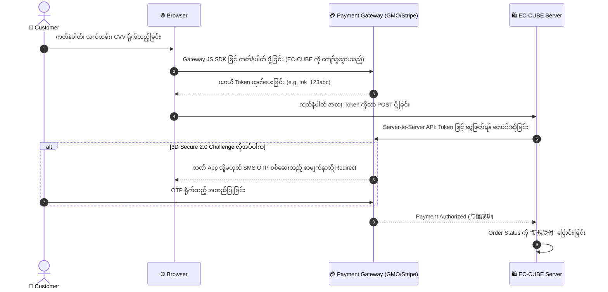

# 02 - Payment Methods Integration (ငွေပေးချေမှု နည်းလမ်းများ ထည့်သွင်းခြင်း)

> **Client Requirements**:
> 1. **Credit Card (クレジットカード決済)**: Customer ၏ ကတ်နံပါတ်ကို ဆာဗာတွင် လုံးဝ မသိမ်းဆည်းဘဲ Token စနစ်ဖြင့် လုံခြုံစွာ ငွေဖြတ်နိုင်ရမည်။ ဂျပန်နိုင်ငံ ဥပဒေအရ မဖြစ်မနေ လိုအပ်သော **3D Secure 2.0 (本人認証)** ပါဝင်ရမည်။
> 2. **Convenience Store (コンビニ決済)**: 7-Eleven, Lawson, FamilyMart စတိုးဆိုင်များတွင် ငွေချေရန် ငွေလွှဲကုဒ်နံပါတ် (払込番号) နှင့် Barcode Link ထုတ်ပေးနိုင်ရမည်။ ငွေချေရမည့် ရက်သတ်မှတ်ချက် (支払い期限) ထည့်သွင်းနိုင်ရမည်။
> 3. **Bank Transfer (銀行振込)**: အော်ဒါတင်ပြီးပါက ဘဏ်စာရင်း အချက်အလက်များ အလိုအလျောက် ပေးပို့ပေးရမည်။

---

## 🏛️ EC-CUBE Payment Architecture: `PaymentMethodInterface`

EC-CUBE တွင် ငွေပေးချေမှု နည်းလမ်းအသစ်များ (Plugin) ချိတ်ဆက်သည့်အခါ **`PaymentMethodInterface`** ကို Implement လုပ်ဆောင်ရပါသည်:

```php
namespace Eccube\Service\Payment;

use Eccube\Entity\Order;
use Symfony\Component\Form\FormInterface;

interface PaymentMethodInterface
{
    /**
     * Checkout စာမျက်နှာတွင် ငွေချေနည်းလမ်း Form (ဥပမာ- ကတ်ရွေးရန် Form) ပြသခြင်း
     */
    public function setFormType(FormInterface $form);

    /**
     * အော်ဒါ မတင်မီ စစ်ဆေးခြင်း (Validation)
     */
    public function verify();

    /**
     * "အော်ဒါတင်မည်" နှိပ်လိုက်ချိန်တွင် Payment Gateway API သို့ ငွေတောင်းခံခြင်း
     */
    public function apply();
}
```

---

## 💳 1. Credit Card 決済 (Tokenization & 3D Secure 2.0)

ဂျပန်နိုင်ငံ၏ **割賦販売法 (Installment Sales Act)** အရ Website ဆာဗာပေါ်တွင် Credit Card နံပါတ်များ ဖြတ်သန်းခွင့် လုံးဝ မရှိပါ (Non-retention of Card Information):



### 3D Secure 2.0 (本人認証):
- ဂျပန်နိုင်ငံတွင် ၂၀၂၅ ခုနှစ်မှစ၍ အွန်လိုင်း Credit Card အရောင်းအဝယ်တိုင်းတွင် **EMV 3-D Secure (3D Secure 2.0)** မဖြစ်မနေ ထည့်သွင်းရမည်ဟု အစိုးရက သတ်မှတ်ထားပါသည်။
- **Frictionless Flow**: သံသယဖြစ်ဖွယ် မရှိသော ပုံမှန် ငွေလွှဲများတွင် OTP ရိုက်စရာမလိုဘဲ ချက်ချင်း ငွေပြတ်သည်။
- **Challenge Flow**: သံသယဖြစ်ဖွယ် ငွေလွှဲများတွင် Customer ၏ ဘဏ် App (Biometric/Fingerprint) သို့မဟုတ် SMS OTP ဖြင့် အတည်ပြုခိုင်းသည်။

---

## 🏪 2. Convenience Store 決済 (コンビニ決済)

ဂျပန်နိုင်ငံတွင် လူငယ်များနှင့် Credit Card မရှိသူများ အသုံးအများဆုံး စနစ် ဖြစ်ပါသည်:

### အလုပ်လုပ်ပုံ အဆင့်ဆင့်:
1. Customer က Checkout တွင် Convenience Store (7-Eleven, Lawson, FamilyMart, Ministop) တစ်ခုခုကို ရွေးချယ်သည်။
2. EC-CUBE က Payment Gateway API သို့ လှမ်းခေါ်ပြီး **ငွေချေကုဒ်နံပါတ် (払込票番号)** ကို တောင်းယူသည်။
3. အော်ဒါ အောင်မြင်သွားပြီး Status သည် **`4: 入金待ち`** ဖြစ်သွားသည်။
4. Completion စာမျက်နှာနှင့် Email တွင် စတိုးဆိုင် ကောင်တာတွင် ပြသရမည့် Barcode URL ကို ပေးပို့သည်။
5. **သတ်မှတ်ရက် ကုန်ဆုံးခြင်း (支払い期限)**: ပုံမှန်အားဖြင့် ၇ ရက်မှ ၁၄ ရက်အတွင်း ငွေမချေပါက အော်ဒါကို အလိုအလျောက် ပယ်ဖျက် (Cancel) ပေးသည့် Cron Task ကို တပ်ဆင်ထားလေ့ရှိသည်။

---

## 🏦 3. Bank Transfer (銀行振込)

### နည်းလမ်း ၂ မျိုး ရှိပါသည်:
1. **ပုံမှန် ဘဏ်စာရင်း (Static Bank Account)**:  
   ဆိုင်၏ ပင်မ ဘဏ်စာရင်းကို Email တွင် ရေးသားပေးပို့ပြီး၊ Customer က ငွေလွှဲသည့်အခါ နာမည်နှင့် အော်ဒါနံပါတ်ကို စစ်ဆေး၍ Admin က Manual Status ပြောင်းရသည်။
2. **Virtual Account (バーチャル口座 / 口座振替)**:  
   အော်ဒါတစ်ခုချင်းစီအတွက် တစ်ခါသုံး သီးသန့် ဘဏ်စာရင်းနံပါတ် (Virtual Account No) တစ်ခုစီ ထုတ်ပေးသည်။ Customer က ငွေလွှဲလိုက်သည်နှင့် ဘဏ်မှ Webhook အလိုအလျောက် ရောက်ရှိလာပြီး Status သည် **`6: 入金済み`** သို့ လူမလိုဘဲ အလိုအလျောက် ပြောင်းလဲသွားပါသည်။

---

## 🇯🇵 သက်ဆိုင်ရာ ဂျပန် ဝေါဟာရများ

- **トークン決済 (Tookun Kessai)**: Token-based Payment (ကတ်နံပါတ် မသိမ်းဆည်းသော လုံခြုံရေး စနစ်)
- **本人認証サービス (Honnin Ninshou Saabisu)**: 3-D Secure 2.0 Identity Verification
- **払込票番号 (Haraikomihyou Bangou)**: Convenience Store Payment Slip Number
- **支払い期限 (Shiharai Kigen)**: Payment Expiration Deadline
- **バーチャル口座 (Baacharu Kouza)**: Virtual Bank Account
