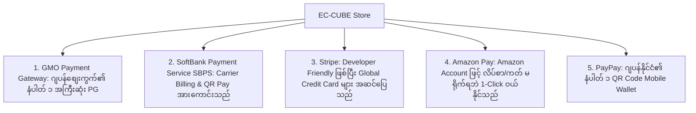

# 03 - External Payment Services & APIs (ပြင်ပ ငွေပေးချေမှု ဝန်ဆောင်မှုများနှင့် API များ)

> **Client Requirements**:
> 1. **External payment services (ပြင်ပ ငွေချေ Gateway များ ချိတ်ဆက်ခြင်း)**: ဂျပန်နိုင်ငံတွင် အသုံးအများဆုံး Payment Gateway များဖြစ်သော GMO Payment Gateway, SoftBank Payment Service (SBPS), Stripe, Amazon Pay နှင့် PayPay တို့ကို ချိတ်ဆက် အသုံးပြုနိုင်ရမည်။
> 2. **Payment API (API ပုံစံများ ရွေးချယ်ခြင်း)**: ဝဘ်ဆိုက်၏ Checkout စာမျက်နှာတွင် တိုက်ရိုက် ငွေချေနိုင်သော **Token API (Embedded Type)** သို့မဟုတ် Gateway ဆာဗာသို့ ခေတ္တ လွှဲပြောင်းပေးသော **Redirect Type (Hosted Page)** ပုံစံများကို သင့်လျော်သလို အသုံးပြုနိုင်ရမည်။

---

## 🏢 ဂျပန်နိုင်ငံ၏ ထိပ်တန်း Payment Gateway (PG) ၅ ခု



---

## 🔌 Payment API Architecture ပုံစံ ၂ မျိုး နှိုင်းယှဉ်ချက်

Payment Gateway ချိတ်ဆက်ရာတွင် အဓိက ဗိသုကာပုံစံ ၂ မျိုး ရှိပါသည်:

| ကဏ္ဍ | ၁။ Token-based API (Embedded Type / トークン型) | ၂။ Redirect Type (Hosted Page / リンク型) |
|:---|:---|:---|
| **လုပ်ဆောင်ပုံ** | ငွေချေ Form သည် EC-CUBE ဝဘ်ဆိုက် စာမျက်နှာပေါ်တွင်ပင် တိုက်ရိုက် ရှိနေသည် | ငွေချေရန်အတွက် Payment Gateway ၏ လုံခြုံသော စာမျက်နှာသို့ ခေတ္တ Redirect လုပ်ပေးသည် |
| **User Experience (UX)** | အလွန်ကောင်းမွန်သည် (ဝဘ်ဆိုက်မှ ထွက်ခွာသွားခြင်း မရှိပါ) | စာမျက်နှာ အခြားဆိုက်သို့ ကူးပြောင်းသွားသဖြင့် အချို့ Customer များ လန့်သွားတတ်သည် |
| **လုံခြုံရေးတာဝန်** | Gateway JS SDK ဖြင့် Token ထုတ်ယူပြီး Server သို့ ပေးပို့ရသည် | Gateway ကတ်စာမျက်နှာပေါ်တွင် တိုက်ရိုက် ရိုက်သဖြင့် အလွန် လုံခြုံသည် |
| **သင့်လျော်သော စနစ်** | Credit Card, PayPay In-App | 3D Secure Verification, SBPS Multiple Payments |

---

## 💻 1. Token-based API Call နမူနာ (Stripe / GMO-PG)

EC-CUBE ဆာဗာမှ Payment Gateway သို့ Backend API ခေါ်ယူပုံ နမူနာ:

```php
// Plugin/StripePayment/Service/Payment/StripePaymentService.php
public function chargeWithToken(Order $Order, string $paymentToken): bool
{
    try {
        // Payment Gateway REST API သို့ တောင်းဆိုခြင်း
        $charge = \Stripe\Charge::create([
            'amount' => (int) $Order->getPaymentTotal(), // ငွေပမာဏ
            'currency' => 'jpy',
            'source' => $paymentToken, // Frontend မှ ရရှိလာသော Token
            'description' => 'Order #'.$Order->getOrderNo(),
            'capture' => false, // false = 与信 (Auth only), true = 即時売上 (Capture)
        ]);

        if ($charge->status === 'succeeded' || $charge->status === 'pending') {
            // Transaction ID ကို မှတ်သားထားခြင်း
            $Order->setPaymentTransactionId($charge->id);
            return true;
        }
    } catch (\Exception $e) {
        $this->logger->error('Payment Gateway Error: '.$e->getMessage());
    }

    return false;
}
```

---

## 🛒 2. Amazon Pay (CVR အမြင့်မားဆုံး စနစ်)

ဂျပန် Client တော်တော်များများသည် **Amazon Pay** ကို မဖြစ်မနေ ထည့်သွင်းပေးရန် တောင်းဆိုလေ့ရှိကြသည်:
- **အဘယ်ကြောင့်နည်း?**: Customer သည် အသင်းဝင် စာရင်းသွင်းရန် မလိုသလို၊ လိပ်စာနှင့် Credit Card နံပါတ်များ ရိုက်ထည့်နေရန် မလိုဘဲ မိမိ၏ Amazon.co.jp Account ဖြင့် Login ဝင်ရုံဖြင့် အော်ဒါတင်နိုင်သောကြောင့် **Cart ထဲမှ စွန့်ခွာသွားခြင်း (Cart Abandonment)** ကို သိသာစွာ လျှော့ချပေးနိုင်သောကြောင့် ဖြစ်ပါသည်။

---

## 📱 3. PayPay Integration (QR Code Scan & App Deep Linking)

- **Desktop PC တွင်**: မျက်နှာပြင်ပေါ်တွင် PayPay QR Code ပေါ်လာပြီး ဖုန်းဖြင့် Scan ဖတ်ကာ ငွေချေရသည်။
- **Mobile Smartphone တွင်**: "PayPay で支払う" နှိပ်လိုက်သည်နှင့် ဖုန်းထဲရှိ PayPay App သို့ App-to-App Deep Link ဖြင့် အလိုအလျောက် ပွင့်သွားပြီး၊ Fingerprint စကန်ဖတ်ကာ ငွေချေပြီးသည်နှင့် EC-CUBE သို့ ပြန်လည် ရောက်ရှိလာပါသည်။

---

## 🇯🇵 သက်ဆိုင်ရာ ဂျပန် ဝေါဟာရများ

- **決済代行会社 / 決済プロバイダ (Kessai Daikou Gaisha)**: Payment Gateway (PG)
- **トークン型決済 (Tookun-gata Kessai)**: In-page Token-based Payment
- **リダイレクト型 / リンク型決済 (Ridairekuto-gata Kessai)**: Redirect / Hosted Payment
- **カゴ落ち防止 (Kago-ochi Boushi)**: Cart Abandonment Prevention (e.g. Amazon Pay)
- **決済連携 (Kessai Renkei)**: Payment System Integration
