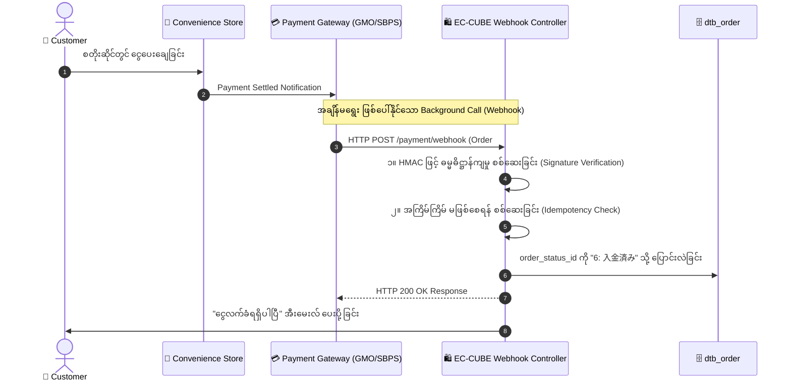

# 04 - Webhook & Asynchronous Processing (Webhook နှင့် အချိန်မတူ လုပ်ဆောင်မှုများ)

> **Client & Engineering Requirement**:  
> "Customer က အော်ဒါတင်ပြီးနောက် ကွန်ဗီးနီးယားစတိုးတွင် ငွေသွားချေလိုက်သည့်အခါ (သို့မဟုတ် 3D Secure အတည်ပြုနေစဉ် Browser ပိတ်သွားသည့်အခါ) Payment Gateway မှ EC-CUBE သို့ အသိပေးချက် (Webhook) မည်သို့ ရောက်ရှိလာသနည်း? လိမ်လည်တောင်းဆိုမှုများ (Fake Requests) မဖြစ်စေရန် မည်သို့ ကာကွယ်ရမည်နည်း?"

---

## 📡 Webhook ဆိုသည်မှာ အဘယ်နည်း? (Why Webhook is Mandatory)

**Webhook** ဆိုသည်မှာ အဖြစ်အပျက်တစ်ခု ဖြစ်ပွားသွားချိန်တွင် (ဥပမာ- Customer က 7-Eleven ကောင်တာတွင် ငွေချေလိုက်ချိန်) Payment Gateway ဆာဗာက EC-CUBE ဆာဗာ၏ သတ်မှတ်ထားသော URL သို့ **အချိန်မတူ အလိုအလျောက် ပေးပို့လာသော HTTP POST အသိပေးချက် (Asynchronous Notification)** ဖြစ်ပါသည်:



---

## 🛡️ Webhook တွင် မဖြစ်မနေ လိုအပ်သော လုံခြုံရေး စည်းမျဉ်း ၂ ခု

### ၁။ Signature Verification (အတုအယောင် ဟက်ကာများ ကာကွယ်ခြင်း)
အကယ်၍ မည်သူမဆို `/payment/webhook` သို့ `order_id=101&status=paid` ဟု လှမ်းပို့နိုင်ပါက ဟက်ကာများသည် ငွေမချေဘဲ အော်ဒါများကို "ငွေရပြီး" အဖြစ် လိမ်လည် ပြောင်းလဲနိုင်ပါသည်။  
- **ကာကွယ်နည်း**: Payment Gateway နှင့် EC-CUBE ကြား လျှို့ဝှက် **Secret Key** ထားရှိပြီး **HMAC-SHA256 Signature** ကို တိုက်ဆိုင် စစ်ဆေးရပါသည်:

```php
// Webhook Controller အတွင်း Signature စစ်ဆေးပုံ
$payload = $request->getContent();
$receivedSignature = $request->headers->get('X-Signature');
$secretKey = $this->eccubeConfig['payment_webhook_secret'];

// ဆာဗာဘက်မှ Hash ပြန်တွက်ခြင်း
$expectedSignature = hash_hmac('sha256', $payload, $secretKey);

if (!hash_equals($expectedSignature, $receivedSignature)) {
    // လက်မှတ် မကိုက်ညီပါက လိမ်လည် တောင်းဆိုမှုအဖြစ် ပယ်ချခြင်း
    return new Response('Invalid Signature', 400);
}
```

---

### ၂။ Idempotency (冪等性 - အကြိမ်ကြိမ် မဖြစ်စေရန် ထိန်းချုပ်ခြင်း)
အင်တာနက် လိုင်းကျခြင်းကြောင့် Payment Gateway သည် တူညီသော Webhook ကို ၂ ကြိမ်၊ ၃ ကြိမ် ထပ်ခါတလဲလဲ ပို့တတ်ပါသည်:
- **ကာကွယ်နည်း**: Order သည် `6: 入金済み` ဖြစ်နှင့်ပြီးသား ဖြစ်နေပါက Logic များကို ထပ်ခါထပ်ခါ မလုပ်တော့ဘဲ ချက်ချင်း **HTTP 200 OK** ပြန်ပေးရပါမည်:

```php
// Idempotency Check
if ($Order->getOrderStatus()->getId() === OrderStatus::ORDER_PAID) {
    // ပြောင်းလဲပြီးသား ဖြစ်နေပါက အောင်မြင်ကြောင်းသာ ပြန်ပြောပြီး ရပ်တန့်ခြင်း
    return new Response('Already Processed', 200);
}
```

---

## 💻 Webhook Controller Implementation နမူနာ

`app/Plugin/MyPayment/Controller/WebhookController.php`
```php
namespace Plugin\MyPayment\Controller;

use Eccube\Controller\AbstractController;
use Eccube\Entity\Master\OrderStatus;
use Symfony\Component\HttpFoundation\Request;
use Symfony\Component\HttpFoundation\Response;
use Symfony\Component\Routing\Annotation\Route;

class WebhookController extends AbstractController
{
    #[Route('/payment/webhook/notify', name: 'my_payment_webhook', methods: ['POST'])]
    public function notify(Request $request): Response
    {
        $data = json_decode($request->getContent(), true);
        $orderNo = $data['order_no'] ?? null;
        $status = $data['status'] ?? null;

        $Order = $this->orderRepository->findOneBy(['order_no' => $orderNo]);

        if (!$Order) {
            return new Response('Order Not Found', 404);
        }

        if ($status === 'PAID') {
            // Status ကို "6: 入金済み" သို့ ပြောင်းလဲခြင်း
            $PaidStatus = $this->orderStatusRepository->find(OrderStatus::ORDER_PAID);
            $Order->setOrderStatus($PaidStatus);
            $Order->setPaymentDate(new \DateTime());

            $this->entityManager->flush();

            // ငွေလက်ခံရရှိကြောင်း Customer ထံ အီးမေးလ် ပို့ခြင်း
            $this->mailService->sendPaymentReceivedMail($Order);
        }

        return new Response('SUCCESS', 200);
    }
}
```

---

## 🇯🇵 သက်ဆိုင်ရာ ဂျပန် ဝေါဟာရများ

- **非同期通知 (Hidouki Tsuuchi)**: Asynchronous Notification / Webhook
- **署名検証 (Shomei Kenshou)**: Signature Verification
- **冪等性 (Bekitou-sei)**: Idempotency (အကြိမ်ကြိမ် လုပ်ဆောင်စေကာမူ ရလဒ် တူညီနေစေခြင်း)
- **決済完了通知 (Kessai Kanryou Tsuuchi)**: Payment Completion Notice
- **二重処理防止 (Nijuu Shorii Boushi)**: Double Processing Prevention
