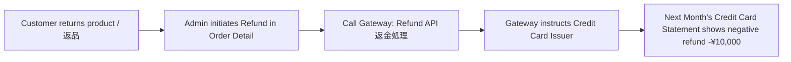

# 05 - Payment Errors, Cancellation & Refund (ငွေချေမှု အမှားများ၊ ပယ်ဖျက်ခြင်းနှင့် ငွေပြန်အမ်းခြင်း)

> **Client Requirements**:
> 1. **Payment errors (ငွေပေးချေမှု အမှားများ ကိုင်တွယ်ခြင်း)**: Customer ၏ ကတ်ငွေမလုံလောက်ခြင်း၊ 3D Secure စစ်ဆေးမှု ပျက်ပြယ်ခြင်း သို့မဟုတ် ကတ်သက်တမ်း ကုန်ဆုံးနေခြင်း စသည့် အမှားများ ဖြစ်ပေါ်ပါက နားလည်လွယ်သော သတိပေးချက် ပြသပေးပြီး Cart စာမျက်နှာသို့ အန္တရာယ်ကင်းစွာ ပြန်လည် ပို့ဆောင်ပေးရမည်။
> 2. **Cancellation (ငွေဖြတ်ယူမှု မတိုင်မီ ပယ်ဖျက်ခြင်း - 与信取消)**: ပစ္စည်းမပို့မီ အော်ဒါ ဖျက်သိမ်းပါက Customer ၏ ကတ်ထဲမှ ငွေမနုတ်ယူရသေးမီ Credit Hold ကို ချက်ချင်း ပယ်ဖျက်ပေးနိုင်ရမည် (Void API)။
> 3. **Refund (ငွေဖြတ်ပြီးမှ ပြန်အမ်းခြင်း - 売上取消 / 返金)**: ပစ္စည်းပို့ဆောင်ပြီး ငွေဖြတ်ယူပြီးမှ ပစ္စည်းပြန်ပို့လာပါက Payment Gateway သို့ Refund API ခေါ်ယူပြီး ငွေပြန်အမ်းနိုင်ရမည်။

---

## ⚠️ 1. Common Payment Errors (အသုံးများသော ကတ် အမှားများ)

ဂျပန်နိုင်ငံ Credit Card ငွေချေစနစ်များတွင် အဖြစ်အများဆုံး Error Codes များနှင့် ကိုင်တွယ်ပုံ:

| Error အကြောင်းရင်း | Gateway Code ဥပမာ | Customer အား ပြသမည့် ဖော်ရွေသော စာသား |
|:---|:---|:---|
| **ကတ်ငွေပမာဏ မလုံလောက်ခြင်း** | `G12`, `G55` (限度額オーバー) | "カードのご利用限度額を超えているため、ご利用いただけません。別のクレジットカードまたはお支払い方法をお試しください。" |
| **CVV သို့မဟုတ် သက်တမ်း မှားခြင်း** | `G44`, `G83` | "カード番号、有効期限、またはセキュリティコードをご確認ください。" |
| **3D Secure 2.0 ကျရှုံးခြင်း** | Authentication Failed | "本人認証（3Dセキュア）が完了しませんでした。カード会社へお問い合わせいただくか、別のお支払い方法をご利用ください。" |
| **Gateway Network Timeout** | Gateway Timeout | "決済処理中に通信エラーが発生しました。時間を置いて再度お試しください。" |

> 🛡️ **လုံခြုံရေးနှင့် UX စည်းမျဉ်း**:  
> Gateway မှ ပြန်လာသော Raw Error Code များ (ဥပမာ- `E01020001: Card Expired`) ကို Customer ထံ တိုက်ရိုက် မပြသရပါ။ လူနားလည်လွယ်သော ရှင်းလင်းချက် အဖြစ် ပြောင်းလဲ ဖော်ပြပေးရပါမည်။

---

## 🚫 2. Cancellation: 与信取消 (Void / Auth Cancel)

အော်ဒါသည် ပစ္စည်းမပို့ရသေးသော အခြေအနေဖြစ်ပြီး ငွေမနုတ်ယူရသေးမီ (仮売上 / Auth ကာလအတွင်း) ဖျက်သိမ်းပါက Customer ထံမှ ငွေလုံးဝ မဖြတ်တောက်စေရန် **与信取消 (Void)** ကို လုပ်ဆောင်ပါသည်:

```mermaid
graph LR
    A[Admin changes Order to '注文取消し'] --> B{Check Payment Status}
    B -->|Status is '与信 (Auth Hold)'| C[Call Gateway: Void API 与信取消]
    C --> D[Credit Limit Released immediately]
    D --> E[Customer is NEVER charged]
```

### Void API Integration နမူနာ:
```php
public function cancelAuth(Order $Order): bool
{
    $transactionId = $Order->getPaymentTransactionId();

    try {
        // Payment Gateway Void API
        $response = $this->gatewayClient->cancelAuthorization($transactionId);

        if ($response->isSuccess()) {
            $this->logger->info('Payment Auth Cancelled for Order #'.$Order->getOrderNo());
            return true;
        }
    } catch (\Exception $e) {
        $this->logger->error('Void Failed: '.$e->getMessage());
    }

    return false;
}
```

---

## 💸 3. Refund: 売上取消 / 返金 (Capture Refund)

ပစ္စည်း ပို့ဆောင်ပြီးစီးသွားသည့်အတွက် Customer ၏ ကတ်ထဲမှ ငွေအပြီးသတ် ဖြတ်ယူပြီးစီးသွားသော အခါ (売上確定 / Capture ပြီးချိန်) ငွေပြန်အမ်းရန်အတွက် **売上取消 (Refund API)** ကို ခေါ်ယူရပါသည်:



### အပြည့်အဝ ငွေပြန်အမ်းခြင်း (Full Refund) vs တစ်စိတ်တစ်ပိုင်း ငွေပြန်အမ်းခြင်း (Partial Refund):
- **Full Refund (全額返金)**: အော်ဒါ တစ်ခုလုံး ပယ်ဖျက်ပြီး ကျသင့်ငွေ အားလုံး ပြန်အမ်းခြင်း။
- **Partial Refund (一部返金)**: ဥပမာ - ပစ္စည်း ၃ မျိုးထဲမှ ၁ မျိုးသာ ပြန်ပို့လာသဖြင့် ထိုပစ္စည်းတန်ဖိုး (ဥပမာ- ¥3,000) ကိုသာ ဖြတ်တောက် ပြန်အမ်းခြင်း။

```php
public function refundOrder(Order $Order, ?int $refundAmount = null): bool
{
    $transactionId = $Order->getPaymentTransactionId();
    $amountToRefund = $refundAmount ?? $Order->getPaymentTotal();

    try {
        // Payment Gateway Refund API
        $refundResult = $this->gatewayClient->refund([
            'transaction_id' => $transactionId,
            'amount' => $amountToRefund,
        ]);

        if ($refundResult->isSuccess()) {
            // Status ကို "9: 返品" သို့ ပြောင်းလဲခြင်း
            $Order->setOrderStatus($this->orderStatusRepository->find(OrderStatus::ORDER_RETURNED));
            $this->entityManager->flush();

            return true;
        }
    } catch (\Exception $e) {
        $this->logger->error('Refund API Failed: '.$e->getMessage());
    }

    return false;
}
```

---

## 🇯🇵 သက်ဆိုင်ရာ ဂျပန် ဝေါဟာရများ

- **決済エラー (Kessai Eraa)**: Payment Error
- **限度額オーバー (Gendogaku Oobaa)**: Credit Limit Exceeded
- **与信取消 (Yoshin Torikeshi)**: Authorization Void / Cancel (ငွေမဖြတ်မီ ပယ်ဖျက်ခြင်း)
- **売上取消 / 返金 (Uriage Torikeshi / Henkin)**: Capture Refund (ငွေဖြတ်ပြီးမှ ပြန်အမ်းခြင်း)
- **全額返金 (Zengaku Henkin)**: Full Refund
- **一部返金 (Ichibu Henkin)**: Partial Refund
- **引き落とし (Hikiotoshi)**: Bank Account Debit / Charge
