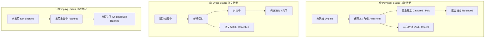

# EC-CUBE Client Requirements: Payment (မြန်မာဘာသာ)

EC-CUBE (Version 4.x / 4.2+) ၏ **Payment (ငွေပေးချေမှုစနစ် / 決済機能)** ဆိုင်ရာ Client Requirements များနှင့် **Payment Architecture** ကို အခြေခံမှစ၍ အသေးစိတ် ရှင်းလင်းထားသော လေ့လာမှု လမ်းညွှန်ဖြစ်ပါသည်။

ဂျပန်နိုင်ငံ E-Commerce စျေးကွက်တွင် ငွေပေးချေမှုသည် အလွန်အရေးကြီးပြီး Credit Card (3D Secure 2.0)၊ Convenience Store (コンビニ決済)၊ Bank Transfer (銀行振込)၊ Amazon Pay၊ PayPay နှင့် Payment Gateway (GMO-PG, SBPS, Stripe) များ၏ Webhook စနစ်များနှင့် နက်ရှိုင်းစွာ ဆက်စပ်နေပါသည်။

---

## ⚖️ အလွန်အရေးကြီးသော သဘောတရား ၃ ခု ကွာခြားချက် (Crucial Distinction)

Junior Developer များ အများဆုံး ရောထွေးလေ့ရှိသော **Payment Status**၊ **Order Status** နှင့် **Shipping Status** တို့၏ ကွာခြားချက်မှာ အောက်ပါအတိုင်း ဖြစ်ပါသည်:



| ခေါင်းစဉ် | မေးခွန်း (မေးခွန်းထုတ်ပုံ) | အဓိပ္ပာယ် ရှင်းလင်းချက် | ဥပမာ အခြေအနေများ |
|:---|:---|:---|:---|
| **1. Payment Status** (決済状況) | *"ပိုက်ဆံ ပေးပြီးပြီလား?"* | Customer ထံမှ ငွေကြေး အမှန်တကယ် လက်ခံရရှိမှု အခြေအနေ | `未決済` (မပေးရသေး), `与信中` (Card Hold), `売上確定` (ငွေရပြီ), `返金` (ပြန်အမ်းပြီး) |
| **2. Order Status** (注文状況) | *"ဒီ အော်ဒါ ဘာလုပ်နေလဲ?"* | အော်ဒါတစ်ခုလုံး၏ အလုံးစုံ စီမံခန့်ခွဲမှု အခြေအနေ | `新規受付` (အော်ဒါအသစ်), `対応中` (လုပ်ဆောင်ဆဲ), `発送済み` (ပို့ပြီး), `注文取消し` (ပယ်ဖျက်) |
| **3. Shipping Status** (発送状況) | *"ပစ္စည်း ပို့ပြီးပြီလား?"* | ဂိုဒေါင်မှ ချောပို့ယာဉ်ပေါ်သို့ ပစ္စည်း တင်ပို့ပြီးစီးမှု အခြေအနေ | `未出荷` (မပို့ရသေး), `出荷準備中` (ထုပ်ပိုးဆဲ), `出荷完了` (ချောပို့အပ်ပြီး) |

> 💡 **ဥပမာ လက်တွေ့ အခြေအနေ**:  
> Customer က အော်ဒါတင်လိုက်ချိန်တွင် **Order Status** သည် `新規受付` ဖြစ်သော်လည်း၊ ကွန်ဗီးနီးယားစတိုးတွင် ငွေမပေးရသေးသဖြင့် **Payment Status** သည် `未入金 (Unpaid)` ဖြစ်နေမည်ဖြစ်ပြီး၊ ပစ္စည်းမပို့ရသေးသဖြင့် **Shipping Status** သည် `未出荷` ဖြစ်နေပါမည်။

---

## 📑 မာတိကာ (Table of Contents)

| No. | ခေါင်းစဉ် | ဖိုင်လမ်းကြောင်း | အဓိက အကြောင်းအရာများ |
|:---:|:---|:---|:---|
| 01 | **Payment vs Order vs Shipping Status** | [01_payment_status_vs_order_vs_shipping.md](./01_payment_status_vs_order_vs_shipping.md) | Status ၃ မျိုး၏ အသေးစိတ် ကွာခြားချက်၊ သံသရာ လည်ပတ်ပုံ (Lifecycle Transition Matrix) |
| 02 | **Payment Methods Integration** | [02_payment_methods_integration.md](./02_payment_methods_integration.md) | `PaymentMethodInterface`, Credit Card (Tokenization & 3D Secure 2.0), CVS Payment, Bank Transfer |
| 03 | **External Payment Services & APIs** | [03_external_services_and_apis.md](./03_external_services_and_apis.md) | GMO-PG, SBPS, Stripe, Amazon Pay, PayPay, Token-based API vs Hosted Redirect Flow |
| 04 | **Webhook & Asynchronous Processing** | [04_webhook_and_asynchronous_processing.md](./04_webhook_and_asynchronous_processing.md) | Payment Gateway မှ ခေါ်ယူသော Webhook Callback, Signature Verification, Idempotency |
| 05 | **Payment Errors, Cancellation & Refund** | [05_errors_cancel_and_refund.md](./05_errors_cancel_and_refund.md) | 3D Secure ပျက်ပြယ်ခြင်းနှင့် ကတ်ငွေမလောက်ခြင်း Error ကိုင်တွယ်ပုံ၊ Auth Cancel (与信取消) နှင့် Capture Refund (売上取消) |

---

## 🗄️ Database Architecture (`dtb_payment`)

EC-CUBE တွင် ငွေပေးချေမှု နည်းလမ်းများကို `dtb_payment` ဇယားတွင် သတ်မှတ်ထားပါသည်:

```sql
CREATE TABLE dtb_payment (
    id INT AUTO_INCREMENT PRIMARY KEY,
    creator_id INT DEFAULT NULL,
    method VARCHAR(255) NOT NULL,          -- ငွေပေးချေမှု အမည် (e.g. クレジットカード, コンビニ決済)
    charge DECIMAL(12,2) DEFAULT 0.00,     -- ငွေလွှဲခ / ကော်မရှင် (Service Fee)
    rule_min DECIMAL(12,2) DEFAULT NULL,   -- အနိမ့်ဆုံး သုံးစွဲနိုင်သော ငွေပမာဏ
    rule_max DECIMAL(12,2) DEFAULT NULL,   -- အမြင့်ဆုံး သုံးစွဲနိုင်သော ငွေပမာဏ
    sort_no INT NOT NULL,
    fixed SMALLINT DEFAULT 1,
    payment_image VARCHAR(255) DEFAULT NULL,
    create_date DATETIME NOT NULL,
    update_date DATETIME NOT NULL,
    discriminator_type VARCHAR(255) NOT NULL
);
```

---

## 🇯🇵 အရေးကြီးသော ဂျပန် ဝေါဟာရများ (Payment Terms)

| Japanese (漢字/カタカナ) | Romaji | အဓိပ္ပာယ် |
|:---|:---|:---|
| **決済 (決済方法)** | Kessai (Kessai Houhou) | Payment (Payment Method) |
| **与信 (仮売上)** | Yoshin (Kari Uriage) | Authorization / Credit Hold (ငွေမဖြတ်သေးဘဲ ထိန်းထားခြင်း) |
| **売上確定 (即時売上)** | Uriage Kakutei (Sokuji Uriage) | Capture / Final Charge (ငွေအပြီးသတ် ဖြတ်ယူခြင်း) |
| **与信取消** | Yoshin Torikeshi | Void / Auth Cancel (ထိန်းထားသောငွေ ပယ်ဖျက်ခြင်း) |
| **売上取消 / 返金** | Uriage Torikeshi / Henkin | Refund (ငွေပြန်အမ်းခြင်း) |
| **トークン決済** | Tookun Kessai | Token-based Payment (PCI-DSS လုံခြုံရေး စံနှုန်း) |
| **3Dセキュア 2.0** | Surii Dii Sekyua | 3-D Secure 2.0 (Identity Authentication) |
| **コンビニ決済** | Konbini Kessai | Convenience Store Payment (7-Eleven, Lawson) |
| **代金引換 (代引)** | Daikin Hikikae (Daibiki) | Cash on Delivery (COD) |

အထက်ပါ မာတိကာဇယားမှ သက်ဆိုင်ရာ လေ့လာမှုဖိုင်များကို ဖွင့်ဖတ်၍ အသေးစိတ် စတင် လေ့လာနိုင်ပါသည်။
