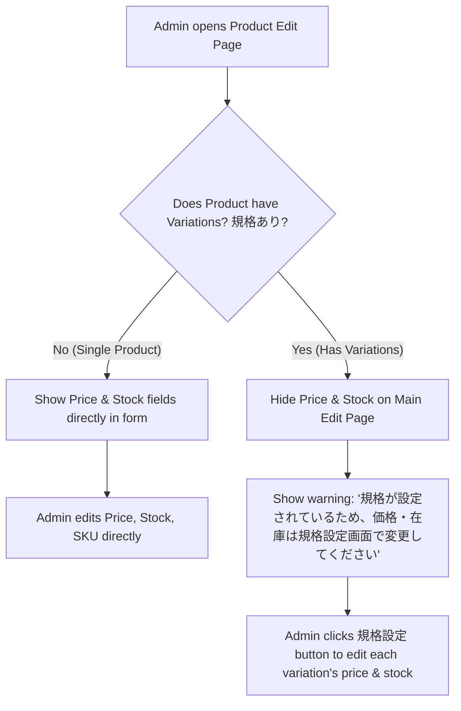

# 02 - Edit Product (ကုန်ပစ္စည်း အချက်အလက် ပြင်ဆင်ခြင်း)

> **Client Requirement**: "တင်ထားပြီးသား ကုန်ပစ္စည်းတွေရဲ့ စျေးနှုန်း၊ ပုံ၊ စတော့၊ အသေးစိတ် ဖော်ပြချက်တွေ ဒါမှမဟုတ် ရောင်းချမှု အခြေအနေ (公開 / 非公開) တွေကို ပြန်လည် ပြင်ဆင်နိုင်ရပါမယ်။"

---

## 🎯 Client က အများဆုံး တောင်းဆိုလေ့ရှိသော အချက်များ

1. ကုန်ပစ္စည်း အမည်၊ အကြောင်းအရာ၊ ဓာတ်ပုံများကို အချိန်မရွေး လွတ်လပ်စွာ Edit လုပ်လိုခြင်း။
2. ပစ္စည်းပြတ်သွားပါက သို့မဟုတ် ရာသီကုန်သွားပါက Website ပေါ်မှ ခေတ္တဖျောက်ထားရန် **非公開 (Unpublished)** ပြောင်းလဲလိုခြင်း။
3. **အထူးသတိပြုရန်**: ကုန်ပစ္စည်းတွင် Variation (အရွယ်အစား/အရောင် စသည့် 規格) ထည့်သွင်းထားပါက ပင်မ Edit စာမျက်နှာတွင် စျေးနှုန်းနှင့် စတော့ကို ပြင်ခွင့်မပြုဘဲ **規格設定 (Class Setting)** စာမျက်နှာတွင်သာ သီးသန့် ပြင်ဆင်ခွင့်ပြုရခြင်း။

---

## 🏛️ EC-CUBE Implementation Architecture

ကုန်ပစ္စည်း ပြင်ဆင်ခြင်းကို EC-CUBE တွင် အောက်ပါ Architecture အတိုင်း လုပ်ဆောင်ပါသည်:

```
[Admin Browser]
       │
       ▼ (HTTP GET /%eccube_admin_route%/product/product/{id}/edit)
[ProductEditController::edit($request, $id)]
       │
       ├─► [ProductRepository->find($id)] ─── Database မှ လက်ရှိ Data ဆွဲထုတ်ခြင်း
       │
       ├─► [Doctrine UnitOfWork] ─── မူလ Entity Snapshot ကို မှတ်သားထားခြင်း
       │
       ▼ (HTTP POST with modified data)
[Form Submission & Validation]
       │
       ├─► [Doctrine Dirty Checking] ─── ပြောင်းလဲသွားသော Field များကိုသာ တွက်ချက်ခြင်း
       │
       ├─► [PreUpdate Event / Timestampable] ─── update_date ကို လက်ရှိအချိန်သို့ အလိုအလျောက် ပြောင်းလဲခြင်း
       │
       └─► [EntityManager->flush()]
              │
              ├── UPDATE dtb_product SET name = '...', update_date = '...' WHERE id = ?
              ├── UPDATE dtb_product_class SET price02 = '...' WHERE product_id = ?
              └── COMMIT
```

### သက်ဆိုင်ရာ အဓိက ဖိုင်များ:
- **Admin Controller**: `src/Eccube/Controller/Admin/Product/ProductEditController.php`
- **Form Type**: `src/Eccube/Form/Type/Admin/ProductType.php`
- **Event Dispatcher**: `EccubeEvents::ADMIN_PRODUCT_EDIT_COMPLETE`
- **Admin Twig Template**: `src/Eccube/Resource/template/admin/Product/product.twig`

---

## 🗄️ အရေးကြီးသော ဗိသုကာဆိုင်ရာ ကွာခြားချက် (Single Product vs Variation Product)

EC-CUBE တွင် ကုန်ပစ္စည်း တစ်ခုကို Edit လုပ်သည့်အခါ အောက်ပါအခြေအနေ ၂ မျိုး ရှိပါသည်:



### Twig Template ထဲတွင် စစ်ဆေးပုံ (`product.twig`):
```twig

    {# Variation ရှိသော ကုန်ပစ္စည်းဖြစ်ပါက ပင်မစာမျက်နှာတွင် စျေးနှုန်း/စတော့ကို Disable လုပ်ခြင်း #}
    <div class="alert alert-warning">
        {{ 'admin.product.has_product_class_warning'|trans }}
    </div>

    {# Single Product ဖြစ်ပါက တိုက်ရိုက် ပြင်ဆင်ခွင့် ပြုခြင်း #}
    {{ form_row(form.class.price02) }}
    {{ form_row(form.class.stock) }}

```

---

## 📝 အဆင့်ဆင့် အလုပ်လုပ်ပုံ (Step-by-Step Flow)

### အဆင့် ၁: လက်ရှိ ကုန်ပစ္စည်းကို ရှာဖွေရယူခြင်း
Admin က Product ID ဖြင့် ဝင်ရောက်လာပါက Controller မှ Entity ကို ရှာဖွေပြီး Form နှင့် ချိတ်ဆက် (Bind) ပေးပါသည်:

```php
$Product = $this->productRepository->find($id);

if (!$Product) {
    throw new NotFoundHttpException();
}

// Form ကို ရှိပြီးသား Entity ဖြင့် Initialize လုပ်ခြင်း
$form = $this->formFactory->createBuilder(ProductType::class, $Product)->getForm();
$form->handleRequest($request);
```

### အဆင့် ၂: Form Submission နှင့် ပြင်ဆင်မှု စစ်ဆေးခြင်း
Admin က အချက်အလက်များ ပြင်ပြီး "登録" (Save) ခလုတ်ကို နှိပ်လိုက်သောအခါ:
1. Form Validation စစ်ဆေးသည်။
2. ပုံအသစ် တင်ထားပါက ယာယီလမ်းကြောင်း (`/html/upload/temp_image`) မှ အမြဲတမ်းလမ်းကြောင်း (`/html/upload/save_image`) သို့ ရွှေ့ပြောင်းသည်။
3. ပုံဟောင်း ဖျက်ရန် အမှန်ခြစ်ထားပါက `dtb_product_image` မှ Delete လုပ်ပြီး Storage မှ ဖိုင်ကို ရှင်းထုတ်သည်။

### အဆင့် ၃: Doctrine Dirty Checking & Update Date
Doctrine ORM သည် မူလ Snapshot နှင့် အသစ်ရောက်လာသော Data ကို နှိုင်းယှဉ်ပြီး ပြောင်းလဲမှုရှိသော Column များကိုသာ `UPDATE` Query ထုတ်ပေးပါသည်။
ထို့အပြင် `update_date` Column သည် လက်ရှိ အချိန် (Current Timestamp) သို့ အလိုအလျောက် Update ဖြစ်သွားပါသည်။

```php
if ($form->isSubmitted() && $form->isValid()) {
    // Doctrine သည် ပြောင်းလဲသွားသော data များကိုသာ အလိုအလျောက် detect လုပ်သည်
    $this->entityManager->flush();

    // Event ပစ်ပေးခြင်း (အခြား Plugin များမှ ဝင်ရောက် ချိတ်ဆက်နိုင်ရန်)
    $event = new EventArgs(['form' => $form, 'Product' => $Product], $request);
    $this->eventDispatcher->dispatch($event, EccubeEvents::ADMIN_PRODUCT_EDIT_COMPLETE);

    $this->addSuccess('admin.common.save_complete', 'admin');
    return $this->redirectToRoute('admin_product_product_edit', ['id' => $Product->getId()]);
}
```

---

## ⚡ Real-World Client Issue: ကုန်ပစ္စည်း စျေးပြင်သော်လည်း Order ဟောင်းများ မထိခိုက်စေခြင်း

Junior Developer များ မကြာခဏ မေးလေ့ရှိသော မေးခွန်း:
> *"ကုန်ပစ္စည်း စျေးနှုန်းကို ၁,၀၀၀ ယန်း မှ ၁,၅၀၀ ယန်းသို့ ပြင်လိုက်ပါက ယခင်က ဝယ်ယူခဲ့ပြီးသော အော်ဒါများထဲမှ စျေးနှုန်းပါ ၁,၅၀၀ ယန်း ဖြစ်သွားနိုင်သလား?"*

**အဖြေ: မဖြစ်သွားပါ!**  
EC-CUBE Architecture အရ Order တင်လိုက်သည့်အခိုက်အတန့်တွင် ထိုအချိန်က စျေးနှုန်းကို `dtb_order_item.price` ထဲသို့ ကူးယူ (Snapshot Copy) သိမ်းဆည်းလိုက်သည့်အတွက် နောက်ပိုင်းတွင် `dtb_product_class.price02` ကို မည်မျှပင် ပြင်စေကာမူ ယခင် Order များ၏ စျေးနှုန်းသည် လုံးဝ ပြောင်းလဲခြင်း မရှိပါ။

---

## 💡 Beginner Tips & Best Practices

1. **Status စီမံမှု**: ကုန်ပစ္စည်းကို Website ပေါ် မပြချင်တော့ပါက ချက်ချင်း မဖျက်ဘဲ **非公開 (Unpublished)** သို့ အရင်ပြောင်းထားသင့်ပါသည်။ အဘယ်ကြောင့်ဆိုသော် ဖျက်လိုက်ပါက SEO Link များ ကျိုးပေါက် (404 Error) သွားနိုင်သောကြောင့် ဖြစ်သည်။
2. **Tag & Category များ ပြင်ဆင်ခြင်း**: Form submission ဖြစ်သည့်အခါ `ProductCategory` ဆက်သွယ်ချက်များသည် အသစ်ရွေးချယ်ထားသော Category များနှင့် အလိုအလျောက် Sync ဖြစ်သွားပါသည်။
