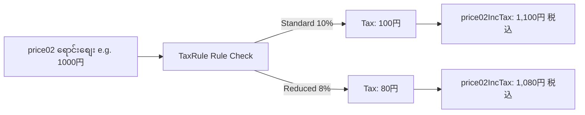

# 07 - Price Management (စျေးနှုန်း ပြောင်းလဲခြင်းနှင့် ပုံမှန်စျေး/ရောင်းစျေး)

> **Client Requirements**:
> 1. **Product price changes (စျေးနှုန်း ပြောင်းလဲခြင်း)**: ကုန်ပစ္စည်း စျေးနှုန်းကို အချိန်မရွေး လွယ်ကူစွာ တိုးမြှင့်ခြင်း၊ လျှော့ချခြင်း ပြုလုပ်နိုင်ရမည်။
> 2. **Normal price / sale price (ပုံမှန်စျေးနှင့် ရောင်းစျေး)**: မူလစျေး (ပုံမှန်စျေး) နှင့် ယခုရောင်းချမည့် စျေးနှုန်း (Discount စျေး) ကို ယှဉ်ပြပြီး Discount ရာခိုင်နှုန်း (ဥပမာ- `20% OFF`) အလိုအလျောက် တွက်ချက်ပြသပေးရမည်။
> 3. **Japanese Consumption Tax (ဂျပန် အခွန်စနစ်)**: စျေးနှုန်းများကို အခွန်ပါပြီး (税込 - Tax Included) နှင့် အခွန်မပါ (税抜 - Tax Excluded) စနစ်တကျ ပြသပေးရမည်။

---

## 🎯 Client က အများဆုံး တောင်းဆိုလေ့ရှိသော အချက်များ

1. **Discount Badge ပြသခြင်း**: မူလစျေးထက် လျှော့ရောင်းပါက မူလစျေးကို မျဉ်းသားပြပြီး (`~~¥5,000~~ ¥3,900`) ဘေးတွင် `[22% OFF]` Badge အလိုအလျောက် ပေါ်စေလိုခြင်း။
2. **အခွန်သတ်မှတ်ချက် (Standard 10% vs Food 8%)**: ဂျပန်နိုင်ငံ၏ စားသောက်ကုန် 軽減税率 (8%) သို့မဟုတ် အထွေထွေကုန်စည် (10%) အခွန်နှုန်းထားများကို ကုန်ပစ္စည်းအလိုက် သတ်မှတ်နိုင်ခြင်း။
3. **Variation စျေးနှုန်း ကွာခြားချက်**: အင်္ကျီဆိုဒ် S/M သည် ¥2,000 ဖြစ်ပြီး XL/XXL ဆိုဒ်သည် ¥2,500 ဖြစ်ပါက Website တွင် `¥2,000 ～ ¥2,500 (税込)` ဟု စျေးနှုန်းအကွာအဝေး (Min ～ Max) ပြသပေးရန်။

---

## 🏛️ EC-CUBE Implementation Architecture: `price01` vs `price02`

EC-CUBE တွင် စျေးနှုန်းများကို `dtb_product` တွင် မသိမ်းဘဲ **`dtb_product_class`** ဇယားတွင် သိမ်းဆည်းပါသည်:

```
[dtb_product_class Table]
├── price01 (DECIMAL) ── 通常価格 (Normal Price / MSRP) -> မဖြစ်မနေ ထည့်ရန် မလို (Optional)
└── price02 (DECIMAL) ── 販売価格 (Sale Price / Selling Price) -> မဖြစ်မနေ ထည့်ရမည် (Required)
```

### အခွန်တွက်ချက်မှု Architecture (`TaxRuleService`):
ဂျပန်နိုင်ငံ E-Commerce ဥပဒေအရ စျေးနှုန်းကို Customer အား ပြသရာတွင် **အခွန်ပါပြီး စျေးနှုန်း (総額表示 - 税込)** ကို မဖြစ်မနေ ပြသရပါသည်:



---

## 🗄️ Database Columns & Entity Methods

### `ProductClass` Entity ရှိ အဓိက Methods များ:
```php
// src/Eccube/Entity/ProductClass.php

// မူလပုံမှန်စျေး (အခွန်မပါ)
$productClass->getPrice01();

// ရောင်းစျေး (အခွန်မပါ)
$productClass->getPrice02();

// ရောင်းစျေး (အခွန်ပါပြီး)
$productClass->getPrice02IncTax();
```

### ကုန်ပစ္စည်းတွင် Variation (規格) များစွာ ရှိနေပါက (`Product` Entity):
ကုန်ပစ္စည်းတွင် ဆိုဒ်အလိုက် စျေးမတူပါက `Product` Entity သည် အနိမ့်ဆုံးနှင့် အမြင့်ဆုံး စျေးကို တွက်ပေးနိုင်ပါသည်:
```php
// src/Eccube/Entity/Product.php
$product->getPrice02IncTaxMin(); // အနိမ့်ဆုံး ရောင်းစျေး (အခွန်ပါပြီး)
$product->getPrice02IncTaxMax(); // အမြင့်ဆုံး ရောင်းစျေး (အခွန်ပါပြီး)
```

---

## 📝 အဆင့်ဆင့် အကောင်အထည်ဖော်ပုံ (Practical Implementation)

### အဆင့် ၁: Admin မှ စျေးနှုန်း ထည့်သွင်း/ပြင်ဆင်ခြင်း
Admin Product Form တွင် `price01` (通常価格) နှင့် `price02` (販売価格) ကို ထည့်သွင်းနိုင်ပါသည်:

```php
// ProductClassType.php
$builder
    ->add('price01', PriceType::class, [
        'label' => 'admin.product.normal_price', // 通常価格
        'required' => false,
    ])
    ->add('price02', PriceType::class, [
        'label' => 'admin.product.sale_price',   // 販売価格
        'required' => true,
        'constraints' => [
            new NotBlank(),
            new GreaterThanOrEqual(['value' => 0]),
        ],
    ]);
```

### အဆင့် ၂: Twig Template တွင် Discount Badge နှင့် စျေးနှုန်း တွက်ချက်ပြသခြင်း

Client အများစု တောင်းဆိုသော **Discount crossed-out price + Percentage OFF Badge** ကို Twig တွင် အောက်ပါအတိုင်း အလွယ်တကူ ရေးသားနိုင်ပါသည်:

```twig
{# Resource/template/default/Product/detail.twig #}

<div class="product-price-box">
    {# ၁။ ပုံမှန်စျေး (price01) ရှိပြီး ရောင်းစျေး (price02) ထက် ကြီးနေပါက Discount ပြသခြင်း #}
    
        
        
        

        {# မူလစျေးကို မျဉ်းသားပြခြင်း #}
        <div class="product-price__normal text-muted">
            通常価格: <del>{{ normalPrice|number_format }} 円</del>
        </div>

        {# Discount Badge #}
        <span class="badge badge-danger">
            {{ discountPercent }}% OFF
        </span>
    

    {# ၂။ အမှန်တကယ် ရောင်းချမည့် စျေးနှုန်း (税込) #}
    <div class="product-price__sale text-danger font-weight-bold h3">
        
            
                {{ Product.price02IncTaxMin|number_format }} 円 <small class="text-muted">(税込)</small>
            
                {{ Product.price02IncTaxMin|number_format }} ～ {{ Product.price02IncTaxMax|number_format }} 円 <small class="text-muted">(税込)</small>
            
        
            {{ Product.ProductClasses[0].price02IncTax|number_format }} 円 <small class="text-muted">(税込)</small>
        
    </div>
</div>
```

---

## ⚡ Client Requirement: စျေးနှုန်း ပြောင်းလဲမှု သမိုင်း (Price History)

Client အချို့သည် စျေးနှုန်းများကို မကြာခဏ အတိုးအလျှော့ လုပ်တတ်ပြီး **မည်သူက မည်သည့်နေ့တွင် စျေးမည်မျှ ပြောင်းသွားသနည်း** ကို မှတ်တမ်းတင်လိုကြသည်။

### ဖြေရှင်းနည်း:
Entity Listener ဖြင့် `dtb_product_class.price02` ပြောင်းလဲတိုင်း Custom History Table (ဥပမာ- `plg_price_history`) ထဲသို့ Log ရေးသားပေးသော Plugin တစ်ခုကို ဖန်တီးနိုင်ပါသည်။

---

## 🇯🇵 သက်ဆိုင်ရာ ဂျပန် ဝေါဟာရများ

- **通常価格 (Tsuujou Kakaku)**: Normal Price / Regular Price (`price01`)
- **販売価格 (Hanbai Kakaku)**: Selling Price / Sale Price (`price02`)
- **税込 (Zei-komi)**: Tax Included (အခွန်ပါပြီး စျေး)
- **税抜 (Zei-nuki)**: Tax Excluded (အခွန်မပါ စျေး)
- **総額表示 (Sougaku Hyouji)**: Total Price Display Obligation (ဂျပန်ဥပဒေအရ အခွန်ပါစျေး မဖြစ်မနေ ပြသရခြင်း)
- **軽減税率 (Keigen Zeiritsu)**: Reduced Tax Rate (၈% အထူး အခွန်နှုန်းထား)
