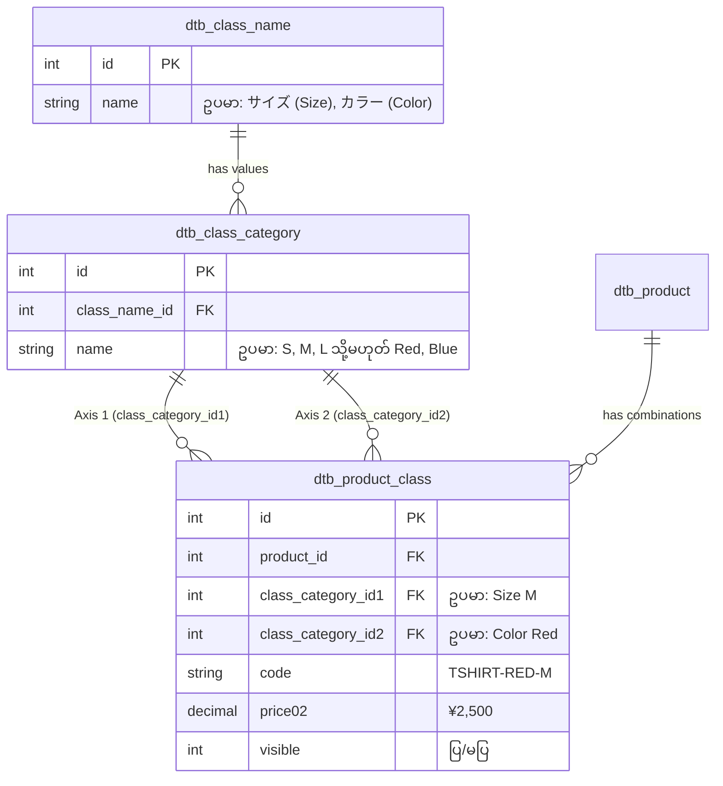

# 10 - Product Variations (規格 - Variations နှင့် Size/Color စနစ်)

> **Client Requirements**:
> 1. **Product variations (規格)**: ကုန်ပစ္စည်းတစ်ခုတည်းတွင် အရွယ်အစား (Size)၊ အရောင် (Color)၊ ပမာဏ (Capacity) စသည့် အမျိုးအစားကွဲများကို ရွေးချယ်ဝယ်ယူနိုင်အောင် ပြုလုပ်လိုခြင်း။
> 2. **Size / color variations (အရွယ်အစားနှင့် အရောင် ၂ မျိုး ပေါင်းစပ်မှု)**: အင်္ကျီ ၁ ထည်တွင် Size (S, M, L) နှင့် Color (Red, Blue, Black) စုစုပေါင်း 3 x 3 = 9 မျိုးအထိ Matrix ပုံစံ ခွဲခြားပြီး တစ်ခုချင်းစီအတွက် စျေးနှုန်း၊ စတော့နှင့် SKU သတ်မှတ်လိုခြင်း။
> 3. **Dynamic Frontend Selection**: Front စာမျက်နှာတွင် Customer က အရောင် "Red" ကို ရွေးလိုက်ပါက ရရှိနိုင်သော Size များသာ Dropdown တွင် ကျန်နေစေရန် Dynamic AJAX ဖြင့် အလုပ်လုပ်ပေးရမည်။

---

## 🎯 EC-CUBE ၏ အဓိက သဘောတရား: 2-Axis Variation (၂ ဝင်ရိုး စနစ်)

EC-CUBE သည် ကုန်ပစ္စည်း ကွဲပြားမှုများ (Variations) အတွက် **2-Axis System (ဝင်ရိုး ၂ ခုစနစ်)** ကို အခြေခံထားပါသည်:

- **Axis 1 (規格1)**: ဥပမာ - အရွယ်အစား (Size: S, M, L)
- **Axis 2 (規格2)**: ဥပမာ - အရောင် (Color: White, Black, Red)

---

## 🏛️ EC-CUBE Implementation Architecture & ERD



### သက်ဆိုင်ရာ အဓိက ဖိုင်များ:
- **Admin Variation Names**: `src/Eccube/Controller/Admin/Product/ClassNameController.php`
- **Admin Variation Categories**: `src/Eccube/Controller/Admin/Product/ClassCategoryController.php`
- **Admin Product Class Matrix Setting**: `src/Eccube/Controller/Admin/Product/ProductClassController.php`
- **Front AJAX Dynamic Swapping**: `src/Eccube/Resource/template/default/Product/detail.twig`

---

## 🗄️ Database Tables ၃ ခု၏ ဆက်စပ်ပုံ

| Table နာမည် | တာဝန် | ဥပမာ Data |
|:---|:---|:---|
| `dtb_class_name` | Variation ခေါင်းစဉ် (規格名) | ID: 1 ➔ "サイズ (Size)", ID: 2 ➔ "カラー (Color)" |
| `dtb_class_category` | Variation ရွေးချယ်စရာ တန်ဖိုးများ (規格分類) | ID: 10 ➔ "S", ID: 11 ➔ "M", ID: 20 ➔ "Black", ID: 21 ➔ "White" |
| `dtb_product_class` | တကယ့် ကုန်ပစ္စည်း ပေါင်းစပ်မှု Matrix | Product ID: 5 + ClassCategory1: 10 (S) + ClassCategory2: 20 (Black) |

---

## 📝 အဆင့်ဆင့် အလုပ်လုပ်ပုံ (Step-by-Step Matrix Flow)

### အဆင့် ၁: Global Variation များ သတ်မှတ်ခြင်း
Admin သည် **商品管理 ➔ 規格管理 (Class Name Management)** တွင်:
1. "サイズ" (Size) ခေါင်းစဉ် ဆောက်ပြီး ၎င်းအောက်တွင် "S", "M", "L", "XL" Value များကို ထည့်သည်။
2. "カラー" (Color) ခေါင်းစဉ် ဆောက်ပြီး ၎င်းအောက်တွင် "Red", "Blue", "Black" Value များကို ထည့်သည်။

### အဆင့် ၂: ကုန်ပစ္စည်းနှင့် Variation ချိတ်ဆက်ခြင်း (規格設定)
Admin သည် ကုန်ပစ္စည်း စာရင်းမှ "規格設定" ခလုတ်ကို နှိပ်ပြီး:
- 規格1 အဖြစ် "サイズ" ကို ရွေးသည်။
- 規格2 အဖြစ် "カラー" ကို ရွေးသည်။
- "設定" ခလုတ် နှိပ်လိုက်သည်နှင့် EC-CUBE သည် Size (4) x Color (3) = **12 Rows Matrix** ကို အလိုအလျောက် တွက်ချက် ထုတ်ပေးပါသည်။

```php
// ProductClassController.php (Matrix တည်ဆောက်ခြင်း အကျဉ်း)
foreach ($classCategories1 as $ClassCategory1) {
    foreach ($classCategories2 as $ClassCategory2) {
        $ProductClass = new ProductClass();
        $ProductClass->setProduct($Product);
        $ProductClass->setClassCategory1($ClassCategory1);
        $ProductClass->setClassCategory2($ClassCategory2);
        // Default Sale Price, Delivery Type များ သတ်မှတ်ခြင်း
        $this->entityManager->persist($ProductClass);
    }
}
$this->entityManager->flush();
```

---

## 🎨 Front-End တွင် Customer ရွေးချယ်ပုံ (Dynamic JavaScript)

Front Store ၏ Product Detail စာမျက်နှာတွင် Customer က ClassCategory1 (ဥပမာ- Size) ကို ရွေးလိုက်သည်နှင့် JavaScript/AJAX က ClassCategory2 (ဥပမာ- Color) Dropdown ကို သက်ဆိုင်ရာ တန်ဖိုးများသာ ကျန်အောင် Filter လုပ်ပေးပါသည်:

```javascript
// Product/detail.twig ရှိ JavaScript အကျဉ်း
$('#classcategory_id1').change(function () {
    var classcategory_id1 = $(this).val();
    
    // ClassCategory1 နှင့် ချိတ်ဆက်နေသော ClassCategory2 များကို JSON Matrix မှ ဆွဲထုတ်ခြင်း
    var classCategories2 = eccube.classCategories[classcategory_id1];
    
    var $select2 = $('#classcategory_id2');
    $select2.empty();
    $select2.append($('<option>').val('').text('カラーを選択してください'));
    
    $.each(classCategories2, function (index, item) {
        $select2.append($('<option>').val(item.classcategory_id2).text(item.name));
    });
});

// Variation ၂ ခုစလုံး ရွေးပြီးပါက စျေးနှုန်းနှင့် စတော့ကို Real-time ပြောင်းလဲပြသခြင်း
$('#classcategory_id2').change(function () {
    var classcategory_id2 = $(this).val();
    var selectedClass = eccube.classCategories[$('#classcategory_id1').val()]['#' + classcategory_id2];
    
    // Real-time DOM Update
    $('#product-price-display').text(selectedClass.price02_inc_tax + ' 円');
    $('#product-code-display').text(selectedClass.product_code);
});
```

---

## ⚠️ Client အမေးများသော မေးခွန်း: ဝင်ရိုး ၃ ခု (3-Axis) ဖြစ်နိုင်သလား?

> **မေးခွန်း**: *"ကျွန်တော်တို့ဆိုင်က Size, Color အပြင် Material (အထည်သား) ပါ ပေါင်းပြီး ၃ မျိုး ရွေးချယ်ခွင့် ပေးချင်ပါတယ်၊ EC-CUBE မှာ ရနိုင်ပါသလား?"*

**အဖြေ**:  
EC-CUBE Standard Core သည် `class_category_id1` နှင့် `class_category_id2` ဟူသော **ဝင်ရိုး ၂ ခု (2-Axis)** အထိသာ Default အထောက်အပံ့ ပေးထားပါသည်။  
ဝင်ရိုး ၃ ခု သို့မဟုတ် ၎င်းထက်ပိုလိုပါက:
1. 規格 များကို ပေါင်းစပ်၍ အမည်ပေးခြင်း (ဥပမာ- Color နေရာတွင် "Red / Cotton", "Red / Silk" ဟု ထည့်သွင်းခြင်း)။
2. သို့မဟုတ် **3-Axis Variation Plugin (多軸規格プラグイン)** ကို တပ်ဆင်အသုံးပြုခြင်းဖြင့် ဖြေရှင်းနိုင်ပါသည်။

---

## 🇯🇵 သက်ဆိုင်ရာ ဂျပန် ဝေါဟာရများ

- **規格 (Kikaku)**: Variation / Specification
- **規格名 (Kikaku Mei)**: Variation Name (Axis Title, e.g. サイズ, カラー)
- **規格分類 (Kikaku Bunrui)**: Variation Option / Value (e.g. S, M, L, Red, Blue)
- **規格設定 (Kikaku Settei)**: Variation Matrix Configuration
- **2軸規格 (Ni-jiku Kikaku)**: 2-Axis Variation (အလျား/အနံ ၂ ဝင်ရိုး ပေါင်းစပ်မှု)
- **規格なし (Kikaku Nashi)**: Single Product without variations
