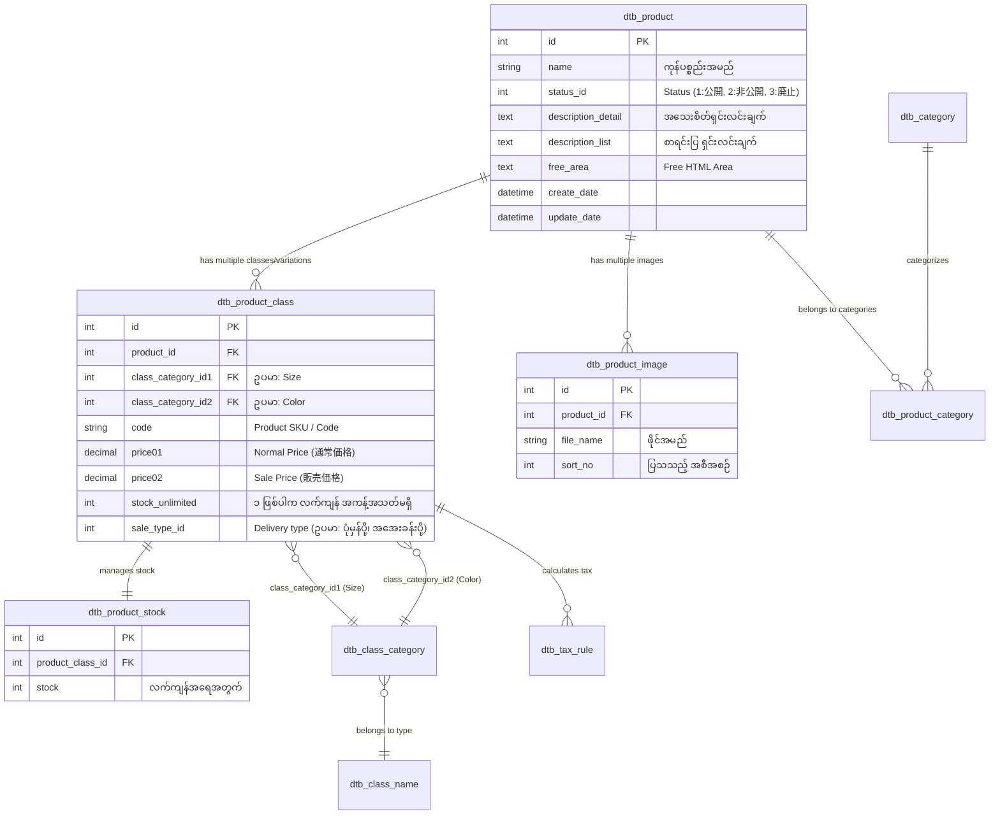

# EC-CUBE Client Requirements: Product Management (မြန်မာဘာသာ)

EC-CUBE (Version 4.x / 4.2+) ၏ **Product Management (ကုန်ပစ္စည်း စီမံခန့်ခွဲမှုစနစ်)** ဆိုင်ရာ Client Requirements များကို အခြေခံမှစ၍ အသေးစိတ် ရှင်းလင်းထားသော လေ့လာမှု လမ်းညွှန်ဖြစ်ပါသည်။

EC-CUBE သည် Japan တွင် အသုံးအများဆုံး Open-source E-Commerce Platform ဖြစ်ပြီး Symfony Framework နှင့် Doctrine ORM အပေါ်တွင် အခြေခံ တည်ဆောက်ထားပါသည်။

---

## 📑 မာတိကာ (Table of Contents)

အောက်ပါ Requirement တစ်ခုချင်းစီအတွက် ဖိုင်ခွဲ၍ Architecture၊ Database Schema၊ Code Logic နှင့် Step-by-Step အလုပ်လုပ်ပုံများကို အသေးစိတ် ရှင်းပြထားပါသည်:

| No. | Requirement (တောင်းဆိုချက်) | ဖိုင်လမ်းကြောင်း | အဓိက သဘောတရားများ |
|:---:|:---|:---|:---|
| 01 | **Add product** (ကုန်ပစ္စည်း အသစ်ထည့်သွင်းခြင်း) | [01_add_product.md](./01_add_product.md) | `ProductEditController::edit`, `ProductType`, `Product` & `ProductClass` Entity generation |
| 02 | **Edit product** (ကုန်ပစ္စည်း အချက်အလက် ပြင်ဆင်ခြင်း) | [02_edit_product.md](./02_edit_product.md) | Existing Entity fetching, Form binding, Dirty checking, Flush |
| 03 | **Delete product** (ကုန်ပစ္စည်း ဖျက်ခြင်း) | [03_delete_product.md](./03_delete_product.md) | Soft Delete (`dtb_product.discriminator_type`), Cascade removal vs History constraint |
| 04 | **Product category management** (Category စီမံခြင်း) | [04_product_category.md](./04_product_category.md) | `dtb_category`, `dtb_product_category`, Tree structure, Many-to-Many via Join Entity |
| 05 | **Product images** (ကုန်ပစ္စည်း ဓာတ်ပုံများ) | [05_product_images.md](./05_product_images.md) | File upload workflow, Temp storage (`/temp_image`), Final storage (`/save_image`), `ProductImage` Entity |
| 06 | **Product descriptions** (ကုန်ပစ္စည်း ဖော်ပြချက်) | [06_product_descriptions.md](./06_product_descriptions.md) | Description List (`description_list`) vs Description Detail (`description_detail`), Free Area (`free_area`) |
| 07 | **Product price changes** (စျေးနှုန်း ပြောင်းလဲခြင်း) | [07_price_management.md](./07_price_management.md) | `ProductClass::setPrice02()`, TaxRule calculation, Price history considerations |
| 08 | **Normal price / sale price** (ပုံမှန်စျေး / ရောင်းစျေး) | [07_price_management.md#8-normal-price--sale-price](./07_price_management.md#8-normal-price--sale-price) | `price01` (通常価格) vs `price02` (販売価格), Discount badge calculation in Twig |
| 09 | **Stock management** (လက်ကျန်ပစ္စည်း စီမံခြင်း) | [08_stock_management.md](./08_stock_management.md) | `dtb_product_stock`, `stock_unlimited`, Purchase stock deduction, Out-of-stock handling |
| 10 | **Product SKU / product code** (ကုန်ပစ္စည်း ကုဒ်) | [09_product_sku_code.md](./09_product_sku_code.md) | `code` column in `dtb_product_class`, Unique validation, Barcode/SKU integration |
| 11 | **Product variations** (規格 - Variations စနစ်) | [10_product_variations.md](./10_product_variations.md) | ClassName (規格名), ClassCategory (規格分類), 2-Axis Matrix (`class_category_id1`, `id2`) |
| 12 | **Size / color variations** (အရွယ်အစားနှင့် အရောင်) | [10_product_variations.md#12-size--color-variations-လက်တွေ့-ဥပမာ](./10_product_variations.md#12-size--color-variations-လက်တွေ့-ဥပမာ) | Frontend AJAX variation switcher, Stock & Price per variation |
| 13 | **Product ranking** (အရောင်းရဆုံး အဆင့်သတ်မှတ်ချက်) | [11_product_marketing.md#13-product-ranking-အရောင်းရဆုံး-ranking](./11_product_marketing.md#13-product-ranking-အရောင်းရဆုံး-ranking) | Order history query, Sales count aggregation, Display block in Home page |
| 14 | **Recommended products** (အကြံပြု ကုန်ပစ္စည်းများ) | [11_product_marketing.md#14-recommended-products-အကြံပြု-ကုန်ပစ္စည်းများ](./11_product_marketing.md#14-recommended-products-အကြံပြု-ကုန်ပစ္စည်းများ) | `Recommend` Plugin, Manual curation block, Cross-selling logic |
| 15 | **New products** (ကုန်ပစ္စည်းအသစ်များ) | [11_product_marketing.md#15-new-products-ကုန်ပစ္စည်းအသစ်-new-arrivals](./11_product_marketing.md#15-new-products-ကုန်ပစ္စည်းအသစ်-new-arrivals) | Creation date query (`create_date DESC`), Status condition, Twig block display |
| 16 | **Product search** (ကုန်ပစ္စည်း ရှာဖွေခြင်း) | [12_search_and_filtering.md#16-product-search-အခြေခံ-ရှာဖွေမှု](./12_search_and_filtering.md#16-product-search-အခြေခံ-ရှာဖွေမှု) | `ProductRepository::getQueryBuilderBySearchData()`, Keyword, Category & Status query |
| 17 | **Product filtering** (အသေးစိတ် စစ်ထုတ်ခြင်း) | [12_search_and_filtering.md#17-product-filtering-facet--advanced-filter](./12_search_and_filtering.md#17-product-filtering-facet--advanced-filter) | Price range filter, Stock filter, Custom attribute filter (Color/Size/Brand) |
| 18 | **Product CSV import** (CSV ဖြင့် ကုန်ပစ္စည်းသွင်းခြင်း) | [13_csv_import_export.md#18-product-csv-import-csv-ဖြင့်-ကုန်ပစ္စည်း-ထည့်သွင်းခြင်း](./13_csv_import_export.md#18-product-csv-import-csv-ဖြင့်-ကုန်ပစ္စည်း-ထည့်သွင်းခြင်း) | `ProductCsvImportController`, CSV Header mapping, Line-by-line validation & persistence |
| 19 | **Product CSV export** (CSV ထုတ်ယူခြင်း) | [13_csv_import_export.md#19-product-csv-export-csv-ထုတ်ယူခြင်း](./13_csv_import_export.md#19-product-csv-export-csv-ထုတ်ယူခြင်း) | `CsvExportService`, `dtb_csv`, StreamedResponse memory optimization |

---

## 🏛️ EC-CUBE Product Core Architecture Overview

EC-CUBE ၏ Product စနစ်တွင် အရေးအကြီးဆုံး နားလည်ထားရမည့် Database ဇယားများနှင့် ချိတ်ဆက်မှု (ERD) မှာ အောက်ပါအတိုင်း ဖြစ်ပါသည်:

---

## 🔑 အရေးကြီးသော EC-CUBE Concept: `Product` vs `ProductClass`

EC-CUBE တွင် Beginner များ အမှားအများဆုံး အချက်မှာ **စျေးနှုန်း (Price)၊ စတော့ (Stock)၊ SKU Code များသည် `dtb_product` တွင် မရှိဘဲ `dtb_product_class` တွင် ရှိခြင်း** ဖြစ်ပါသည်။

1. **`Product` (商品 Entity)**:
   - ကုန်ပစ္စည်း၏ ယေဘုယျ အချက်အလက်များကို သိမ်းသည် (Name, Description, Images, Categories, Status)။
2. **`ProductClass` (商品規格 Entity)**:
   - တကယ့် ဝယ်ယူရောင်းချနိုင်သော စျေးနှုန်း (Price), လက်ကျန် (Stock), SKU Code (商品コード), ပို့ဆောင်မှု အမျိုးအစား (SaleType) တို့ကို သိမ်းသည်။
   - ကုန်ပစ္စည်းတွင် Variation (規格) မရှိပါကလည်း EC-CUBE သည် `Default ProductClass` တစ်ခု အလိုအလျောက် တည်ဆောက်ပြီး စျေးနှုန်းနှင့် စတော့ကို ထို Class တွင် သိမ်းဆည်းပါသည်။

---

## 🇯🇵 မဖြစ်မနေ သိထားရမည့် ဂျပန် ဝေါဟာရများ (Japanese Glossary)

EC-CUBE Client ပရောဂျက်များတွင် အသုံးပြုသော ဂျပန်ဝေါဟာရများ:

| Japanese (漢字/カタカナ) | Romaji | အဓိပ္ပာယ် | EC-CUBE Entity / Field |
|:---|:---|:---|:---|
| **商品** | Shouhin | Product (ကုန်ပစ္စည်း) | `Product` |
| **商品登録** | Shouhin Touroku | Add Product | `ProductEditController::edit` |
| **規格** | Kikaku | Variation / Spec | `ProductClass`, `ClassName` |
| **規格分類** | Kikaku Bunrui | Variation Category (ဥပမာ Red, XL) | `ClassCategory` |
| **通常価格** | Tsuujou Kakaku | Normal Price (အခြေခံစျေး) | `price01` |
| **販売価格** | Hanbai Kakaku | Sale Price (ရောင်းစျေး) | `price02` |
| **在庫数** | Zaiko Suu | Stock quantity | `dtb_product_stock.stock` |
| **在庫無制限** | Zaiko Museigen | Unlimited Stock | `stock_unlimited` |
| **公開 / 非公開** | Koukai / Hikoukai | Published / Unpublished | `status_id` (1: 公開, 2: 非公開) |
| **廃止 (削除)** | Haishi (Sakujo) | Deleted (Soft Delete) | `status_id` (3: 廃止) |
| **おすすめ商品** | Osusume Shouhin | Recommended Products | Plugin / Block |
| **新着商品** | Shinchaku Shouhin | New Arrival Products | `ProductRepository` custom query |
| **商品コード** | Shouhin Koudo | Product Code / SKU | `dtb_product_class.code` |

---

ယခု အထက်ပါ ဇယားရှိ သက်ဆိုင်ရာ သင်ခန်းစာဖိုင်များကို တစ်ခုချင်းစီ ဖွင့်ဖတ်၍ အသေးစိတ် စတင်လေ့လာနိုင်ပါသည်။
