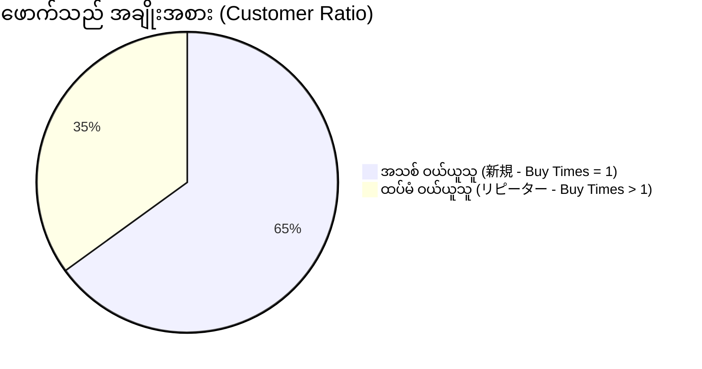

# 03 - Product & Customer Rankings (ကုန်ပစ္စည်းနှင့် ဖောက်သည် အဆင့်သတ်မှတ်ချက်များ)

> **Client Requirements**:
> 1. **Product ranking (အရောင်းရဆုံး ကုန်ပစ္စည်း Ranking)**: ဆိုင်တွင် မည်သည့် ကုန်ပစ္စည်းသည် ရောင်းရငွေ အများဆုံး (Revenue Base) ဖြစ်ပြီး၊ မည်သည့် ပစ္စည်းသည် အရေအတွက် အများဆုံး (Quantity Base) ရောင်းချရသည်ကို ခွဲခြား သိရှိနိုင်ရမည်။
> 2. **Customer purchase ranking (အဝယ်အများဆုံး VIP ဖောက်သည် Ranking)**: ဆိုင်တွင် ငွေကြေး အများဆုံး သုံးစွဲထားသော VIP အသင်းဝင်များကို စာရင်းထုတ်ပြီး အထူး Discount သို့မဟုတ် VIP လက်ဆောင်များ ပေးနိုင်ရမည် (LTV Analysis)။
> 3. **Customer statistics (ဖောက်သည် စာရင်းအင်း လေ့လာမှု)**: ဝယ်ယူသူများထဲတွင် **အသစ်ဝယ်ယူသူ (新規客)** နှင့် **ထပ်မံဝယ်ယူသူ (リピーター)** အချိုးအစား မည်မျှရှိပြီး၊ ကျား/မ နှင့် အသက်အရွယ်အပိုင်းအခြား (Demographics) မည်သို့ ရှိသည်ကို လေ့လာဆန်းစစ်နိုင်ရမည်။

---

## 🏆 1. Product Sales Ranking Architecture (商品別売上ランキング)

ကုန်ပစ္စည်း Ranking တွက်ချက်ရာတွင် အမြင် ၂ မျိုး ရှိပါသည်:
1. **金額ベース (By Total Revenue)**: ဥပမာ - စျေးကြီးသော ကုတ်အင်္ကျီ (¥30,000) သည် ၅ ထည်သာ ရောင်းရသော်လည်း ရောင်းအား ¥150,000 ရရှိသည်။
2. **個数ベース (By Units Sold)**: ဥပမာ - စျေးပေါသော ခြေအိတ် (¥500) သည် အထည် ၁၀၀ ရောင်းရသဖြင့် ရေပန်းအစားဆုံး ဖြစ်သည်။

```php
// Product Sales Ranking Query
public function getProductSalesRanking(string $sortBy = 'revenue', int $limit = 10): array
{
    $qb = $this->entityManager->createQueryBuilder();

    $qb->select('p.id, p.name, pc.code')
        ->addSelect('SUM(oi.quantity) AS total_quantity')
        ->addSelect('SUM(oi.priceIncTax * oi.quantity) AS total_revenue')
        ->from('Eccube\Entity\OrderItem', 'oi')
        ->innerJoin('oi.Order', 'o')
        ->innerJoin('oi.ProductClass', 'pc')
        ->innerJoin('pc.Product', 'p')
        ->where('o.OrderStatus NOT IN (:excludeStatuses)')
        ->setParameter('excludeStatuses', [OrderStatus::ORDER_CANCEL, OrderStatus::ORDER_RETURNED])
        ->groupBy('p.id');

    if ($sortBy === 'quantity') {
        $qb->orderBy('total_quantity', 'DESC'); // အရေအတွက် ဦးစားပေး
    } else {
        $qb->orderBy('total_revenue', 'DESC');  // ရောင်းရငွေ ဦးစားပေး
    }

    $qb->setMaxResults($limit);

    return $qb->getQuery()->getResult();
}
```

---

## 👑 2. Customer Purchase Ranking (အဝယ်အများဆုံး VIP ဖောက်သည်များ)

Customer များ၏ **Lifetime Value (LTV / 累計購入金額)** ကို အခြေခံ၍ အဆင့်သတ်မှတ်ခြင်း:

```php
// Top Spending Customers Query
public function getTopCustomersRanking(int $limit = 10): array
{
    $qb = $this->entityManager->createQueryBuilder();

    $qb->select('c.id, c.name01, c.name02, c.email')
        ->addSelect('COUNT(o.id) AS total_orders')
        ->addSelect('SUM(o.payment_total) AS total_spent')
        ->addSelect('MAX(o.order_date) AS last_order_date')
        ->from('Eccube\Entity\Customer', 'c')
        ->innerJoin('c.Orders', 'o')
        ->where('o.OrderStatus NOT IN (:excludeStatuses)')
        ->setParameter('excludeStatuses', [OrderStatus::ORDER_CANCEL, OrderStatus::ORDER_RETURNED])
        ->groupBy('c.id')
        ->orderBy('total_spent', 'DESC')
        ->setMaxResults($limit);

    return $qb->getQuery()->getResult();
}
```

---

## 👥 3. Customer Statistics (新規 vs リピーター比率)

E-Commerce လုပ်ငန်း ရေရှည်ရပ်တည်နိုင်မှု၏ အဓိက လျှို့ဝှက်ချက်မှာ **တစ်ကြိမ်ထက်မက ပြန်လည်ဝယ်ယူသူ (Repeat Customers)** အချိုးအစား ဖြစ်ပါသည်:



```php
// New vs Repeat Ratio Query
public function getCustomerRatio(): array
{
    $em = $this->entityManager;

    // အသစ် ဝယ်ယူသူ အရေအတွက် (၁ ကြိမ်သာ ဝယ်ဖူးသူ)
    $newCount = $em->createQuery('SELECT COUNT(c.id) FROM Eccube\Entity\Customer c WHERE c.buy_times = 1')
        ->getSingleScalarResult();

    // ထပ်မံ ဝယ်ယူသူ အရေအတွက် (၂ ကြိမ်နှင့်အထက် ဝယ်ဖူးသူ)
    $repeatCount = $em->createQuery('SELECT COUNT(c.id) FROM Eccube\Entity\Customer c WHERE c.buy_times > 1')
        ->getSingleScalarResult();

    $total = $newCount + $repeatCount;
    $repeatRate = $total > 0 ? round(($repeatCount / $total) * 100, 1) : 0;

    return [
        'new_customers' => $newCount,
        'repeat_customers' => $repeatCount,
        'repeat_rate' => $repeatRate . '%', // e.g. 35.0%
    ];
}
```

---

## 🇯🇵 သက်ဆိုင်ရာ ဂျပန် ဝေါဟာရများ

- **商品別売上ランキング (Shouhin-betsu Uriage Rankingu)**: Product Sales Ranking
- **金額ベース (Kingaku Beesu)**: Revenue-based Ranking
- **個数ベース (Kosuи Beesu)**: Quantity-based Ranking
- **優良顧客 (Yuuryou Kokyaku)**: High-value / VIP Customers
- **顧客生涯価値 (Kokyaku Shougui Kachi - LTV)**: Lifetime Value
- **新規顧客 (Shinki Kokyaku)**: New First-time Buyers
- **リピーター (Ripiitaa)**: Returning / Repeat Buyers
- **リピート率 (Ripiito-ritsu)**: Repeat Customer Rate
