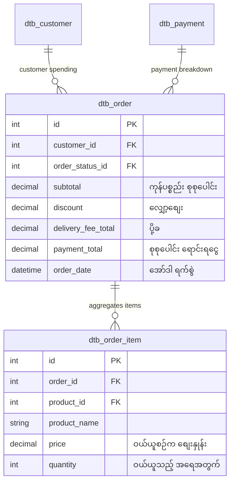

# EC-CUBE Client Requirements: Sales & Reports (မြန်မာဘာသာ)

EC-CUBE (Version 4.x / 4.2+) ၏ **Sales & Reports (အရောင်းစာရင်းဇယားများ၊ အစီရင်ခံစာနှင့် စာရင်းအင်း လေ့လာဆန်းစစ်မှုစနစ်)** ဆိုင်ရာ Client Requirements များနှင့် **QueryBuilder Aggregation** ဗိသုကာကို အခြေခံမှစ၍ အသေးစိတ် ရှင်းလင်းထားသော လေ့လာမှု လမ်းညွှန်ဖြစ်ပါသည်။

အွန်လိုင်းစတိုးတစ်ခု အောင်မြင်ရန်အတွက် နေ့စဉ်ရောင်းအား၊ လစဉ်ရောင်းအား၊ လူကြိုက်အများဆုံး ကုန်ပစ္စည်း Ranking၊ အဝယ်အများဆုံး VIP ဖောက်သည်စာရင်းနှင့် ပျမ်းမျှတစ်ကြိမ်ဝယ်ယူငွေ (Average Order Value - 客単価) များကို တိကျစွာ တွက်ချက်နိုင်ရန် မရှိမဖြစ် လိုအပ်ပါသည်။

---

## ⚠️ အရေးကြီးဆုံး စီးပွားရေး စည်းမျဉ်း: Gross Sales vs Net Sales

Beginner Developer များ ရောင်းအား တွက်ချက်ရာတွင် အများဆုံး မှားယွင်းတတ်သော အချက်:
> ❌ **အမှား**: `SELECT SUM(payment_total) FROM dtb_order;`  
> အော်ဒါအားလုံးကို ပေါင်းလိုက်ပါက ဖျက်သိမ်းထားသော အော်ဒါများ (**キャンセル**) နှင့် ပစ္စည်းပြန်ပို့ထားသော ငွေပြန်အမ်းမှုများ (**返品**) ပါ ပါဝင်သွားသဖြင့် စာရင်းအင်းတွင် ရောင်းအားများ အဆမတန် ဖောင်းပွသွားပါမည်။

### ✅ မှန်ကန်သော စည်းမျဉ်း (純売上高 - Net Sales):
အမှန်တကယ် ရောင်းအားကို တွက်ချက်ရာတွင် **ဖျက်သိမ်းထားသော အော်ဒါများကို မဖြစ်မနေ ဖယ်ထုတ် (Exclude)** ရပါမည်:
```sql
WHERE o.order_status_id NOT IN (3, 9) -- Cancel (3) နှင့် Returned (9) ကို ဖယ်ထုတ်ခြင်း
-- သို့မဟုတ် တရားဝင် ငွေရပြီး/ပို့ပြီးသော Status များကိုသာ ရွေးထုတ်ခြင်း
WHERE o.order_status_id IN (1, 5, 6, 7)
```

---

## 📑 မာတိကာ (Table of Contents)

| No. | ခေါင်းစဉ် | ဖိုင်လမ်းကြောင်း | အဓိက အကြောင်းအရာများ |
|:---:|:---|:---|:---|
| 01 | **QueryBuilder Aggregation Fundamentals** | [01_querybuilder_aggregations.md](./01_querybuilder_aggregations.md) | `COUNT`, `SUM`, `AVG`, `GROUP BY`, `ORDER BY` ၅ မျိုး၏ သဘောတရားနှင့် QueryBuilder ရေးသားနည်းများ |
| 02 | **Daily, Monthly Sales & Order Statistics** | [02_daily_and_monthly_sales.md](./02_daily_and_monthly_sales.md) | နေ့စဉ်ရောင်းအား (日別)၊ လစဉ်ရောင်းအား (月別)၊ အော်ဒါ စာရင်းအင်းများ၊ ပျမ်းမျှတစ်ကြိမ်ဝယ်ယူငွေ (客単価)၊ Sales CSV ထုတ်ယူနည်း |
| 03 | **Product & Customer Rankings / Demographics** | [03_product_and_customer_rankings.md](./03_product_and_customer_rankings.md) | အရောင်းရဆုံး ပစ္စည်း Ranking၊ အဝယ်အများဆုံး VIP ဖောက်သည် Ranking၊ အသစ် vs အဟောင်းဝယ်ယူသူ အချိုး (新規/リピーター比率) |
| 04 | **Top Client Sales Tasks & Fixes (လက်တွေ့ ပြင်ဆင်နည်းများ)** | [04_top_client_tasks_and_troubleshooting.md](./04_top_client_tasks_and_troubleshooting.md) | **Client များ အများဆုံး တောင်းဆိုသော ပြင်ဆင်မှု ၅ ခုနှင့် Fix လုပ်နည်းများ** (Cancel ဖယ်ထုတ်နည်း၊ အခွန် ၈% vs ၁၀% ခွဲထုတ် CSV၊ အော်ဒါသိန်းချီအတွက် Nightly Cron Batch စနစ်) |

---

## 🗄️ Database Architecture for Sales Analytics



---

## 🇯🇵 အရေးကြီးသော ဂျပန် ဝေါဟာရများ (Sales & Reports Terms)

| Japanese (漢字/カタカナ) | Romaji | အဓိပ္ပာယ် |
|:---|:---|:---|
| **売上集計** | Uriage Shuukei | Sales Aggregation / Total Revenue |
| **日別売上** | Hibetsu Uriage | Daily Sales |
| **月別売上** | Tsukibetsu Uriage | Monthly Sales |
| **客単価 (平均購入額)** | Kyakutanka | Average Order Value (AOV) |
| **商品別売上ランキング** | Shouhin-betsu Uriage Rankingu | Product Sales Ranking |
| **優良顧客 / LTV** | Yuuryou Kokyaku / LTV | VIP Customers / Lifetime Value |
| **リピート率** | Ripiito-ritsu | Repeat Customer Rate |
| **純売上高** | Jun-uriagedaka | Net Sales (Cancel နှင့် Refund နှုတ်ပြီး ရောင်းရငွေ) |
| **集計バッチ** | Shuukei Batchi | Scheduled Aggregation Batch Job (Nightly Cron) |

အထက်ပါ မာတိကာဇယားမှ သက်ဆိုင်ရာ လေ့လာမှုဖိုင်များကို ဖွင့်ဖတ်၍ အသေးစိတ် စတင် လေ့လာနိုင်ပါသည်။
