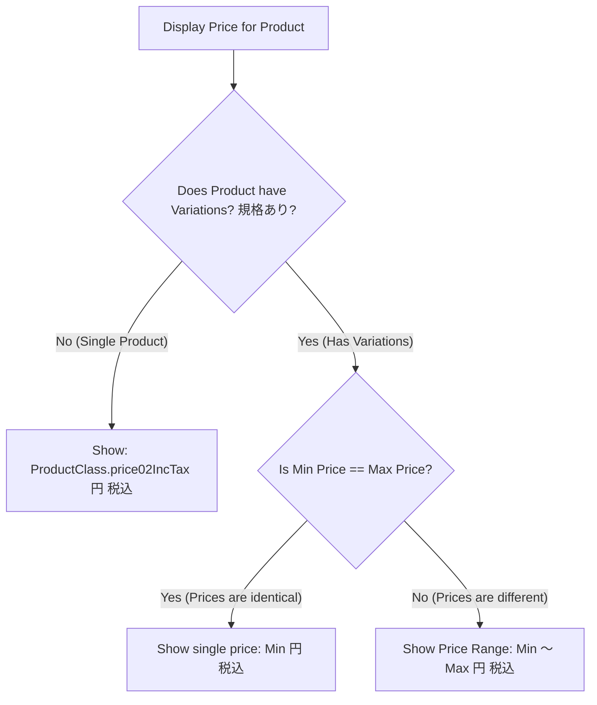

# 04 - Case Study:「価格に範囲がある場合の表示についても商品一覧と合わせるようにしてください。」

> **Client Requirement (လက်တွေ့ လုပ်ငန်းခွင် တောင်းဆိုချက်)**:  
> **「価格に範囲がある場合の表示についても商品一覧と合わせるようにしてください。」**  
> *(ကုန်ပစ္စည်းတွင် စျေးနှုန်း အပိုင်းအခြား (Price Range) ရှိနေပါက ထိုစျေးနှုန်း ဖော်ပြပုံကိုလည်း ကုန်ပစ္စည်းစာရင်း (商品一覧) စာမျက်နှာနှင့် ပုံစံတူညီအောင် ညှိပေးပါ။)*

ဤသင်ခန်းစာတွင် အဆိုပါ Client Requirement ၏ **စီးပွားရေးဆိုင်ရာ အဓိပ္ပာယ် (Client Intent)**၊ **UI မျက်နှာပြင် လိုအပ်ချက်** နှင့် **Backend / QueryBuilder Logic** တို့ကို စုံလင်စွာ ခွဲခြမ်း ရှင်းပြထားပါသည်။

---

## 🎯 1. Client က ဘာကို ဆိုလိုတာလဲ? (The Background & Root Cause)

EC-CUBE တွင် ကုန်ပစ္စည်းတစ်ခု၌ Color သို့မဟုတ် Size ကဲ့သို့သော Variation (規格) များ ရှိနေသည့်အခါ စျေးနှုန်းသည် ကွဲပြားနိုင်ပါသည်:
- **ဥပမာ**: အင်္ကျီဆိုဒ် S/M သည် `¥2,000` ဖြစ်ပြီး၊ ဆိုဒ် XL/XXL သည် `¥2,800` ဖြစ်နေပါက စျေးနှုန်းသည် အနိမ့်ဆုံးမှ အမြင့်ဆုံး အပိုင်းအခြား (Price Range: `¥2,000 ～ ¥2,800`) ဖြစ်သွားပါသည်။

### ပြဿနာ ဖြစ်ပွားရသည့် အကြောင်းရင်း:
EC-CUBE ၏ Standard List (`Product/list.twig`) စာမျက်နှာတွင် စျေးနှုန်း အပိုင်းအခြား ရှိပါက `¥2,000 ～ ¥2,800 (税込)` ဟု စနစ်တကျ ပြသထားသော်လည်း၊ Developer များက **အခြား Custom နေရာများ (ဥပမာ- Search Suggest Box, အကြိုက်ဆုံးစာရင်း Wishlist, Top Page Slider, ဆက်စပ်ပစ္စည်း Recommend Block)** များ တည်ဆောက်သည့်အခါ အောက်ပါအတိုင်း ပေါ့ဆစွာ ရေးသားမိတတ်ကြပါသည်:

```twig
{# ❌ အမှားဖြစ်စေသော ရေးသားနည်း (စျေးအနိမ့်ဆုံး တစ်ခုတည်းသာ ပြမိခြင်း) #}
<p class="price">{{ Product.price02IncTaxMin|number_format }} 円</p>
{# ရလဒ်: ပစ္စည်းတွင် စျေးကွာခြားချက် ရှိနေသော်လည်း "¥2,000 円" ဟုသာ ပေါ်နေသဖြင့် ဝယ်ယူသူ မျက်စိလည်သွားစေသည် #}
```

Client က ဤ မညီညွတ်မှုကို စစ်ဆေးတွေ့ရှိသွားပြီး:  
> *"အခြား နေရာအားလုံးတွင်လည်း Product List စာမျက်နှာအတိုင်း စျေးနှုန်းအကွာအဝေး ရှိပါက `Min ～ Max` ပုံစံ မှန်ကန်စွာ ပေါ်အောင် ပြင်ဆင်ပေးပါ!"* ဟု တောင်းဆိုလာခြင်း ဖြစ်ပါသည်။

---

## 🎨 2. The UI Requirement (မျက်နှာပြင်ဆိုင်ရာ ဖြေရှင်းချက်)

UI တွင် စျေးနှုန်း ပြသရာ၌ အခြေအနေ ၂ မျိုးကို အမြဲတမ်း စစ်ဆေးရပါမည်:



### ✅ Standard UI Implementation (Twig Code):
နေရာတိုင်းတွင် အသုံးပြုနိုင်သော စံသတ်မှတ်ချက် UI ကုဒ် ဖြစ်ပါသည်:

```twig
<div class="product-price-display font-weight-bold">
    
        {# ကုန်ပစ္စည်းတွင် Variation ရှိပါက #}
        
            {# အနိမ့်ဆုံးနှင့် အမြင့်ဆုံး စျေး တူညီနေပါက စျေးနှုန်း ၁ ခုသာ ပြသခြင်း #}
            <span class="price-single text-danger">
                {{ Product.price02IncTaxMin|number_format }} 円 <small class="text-muted">(税込)</small>
            </span>
        
            {# စျေးနှုန်း ကွာခြားနေပါက စျေးနှုန်း အပိုင်းအခြား (Min ～ Max) ဖြင့် ပြသခြင်း #}
            <span class="price-range text-danger">
                {{ Product.price02IncTaxMin|number_format }} ～ {{ Product.price02IncTaxMax|number_format }} 円 <small class="text-muted">(税込)</small>
            </span>
        
    
        {# Variation မရှိသော Single Product ဖြစ်ပါက #}
        <span class="price-single text-danger">
            {{ Product.ProductClasses[0].price02IncTax|number_format }} 円 <small class="text-muted">(税込)</small>
        </span>
    
</div>
```

---

## ⚙️ 3. The Backend & Business Logic (QueryBuilder ဆိုင်ရာ လိုအပ်ချက်)

UI ပြသရုံသာမက Backend Search Logic တွင်ပါ စျေးနှုန်း အပိုင်းအခြား ရှိသော ကုန်ပစ္စည်းများကို မှန်ကန်စွာ ကိုင်တွယ်ရပါမည်။

### စီးပွားရေးဆိုင်ရာ စည်းမျဉ်း (Business Logic Rule):
ဥပမာ- ကုန်ပစ္စည်း A ၏ စျေးနှုန်းသည် `¥2,000 ～ ¥2,800` ဖြစ်နေချိန်တွင် Customer က စျေးနှုန်း Filter အား **"¥2,200 မှ ¥2,500 ကြား"** ဟု သတ်မှတ် ရှာဖွေလိုက်ပါက ထို ကုန်ပစ္စည်း A သည် ရှာဖွေမှု ရလဒ်ထဲတွင် ပါဝင်သင့်ပါသလား?
- **အဖြေ: မဖြစ်မနေ ပါဝင်ရပါမည်!** အကြောင်းမှာ ထိုကုန်ပစ္စည်းတွင် ¥2,200~¥2,500 ကြား ကျရောက်သော ဆိုဒ် M သို့မဟုတ် L (ဥပမာ- ¥2,400) ပါဝင်နေသောကြောင့် ဖြစ်သည်။

### QueryBuilder Implementation:
EC-CUBE ၏ `Product` နှင့် `ProductClass` ဆက်သွယ်ချက်တွင် `dtb_product_class.price02` ပေါ်၌ စစ်ဆေးပါသည်:

```php
// ProductRepository.php
if (isset($searchData['price_min']) && is_numeric($searchData['price_min'])) {
    $qb->andWhere('pc.price02 >= :price_min')
       ->setParameter('price_min', $searchData['price_min']);
}

if (isset($searchData['price_max']) && is_numeric($searchData['price_max'])) {
    $qb->andWhere('pc.price02 <= :price_max')
       ->setParameter('price_max', $searchData['price_max']);
}
```

### အခွန်ပါပြီး စျေးနှုန်း (税込) ဖြင့် ရှာဖွေလိုပါက:
Database ထဲရှိ `price02` သည် အခွန်မပါ (税抜) ဖြစ်နေသောကြောင့် Customer ရိုက်ထည့်လိုက်သော စျေးနှုန်းသည် အခွန်ပါပြီး (税込) ဖြစ်ပါက Tax Rate (10%) ဖြင့် ပြန်လည် နုတ်ယူ ချိန်ညှိပြီးမှ QueryBuilder သို့ ပေးပို့ရပါသည်:

```php
// ဥပမာ- Customer ရိုက်ထည့်သော စျေးနှုန်းကို အခွန်မပါ စျေးနှုန်းအဖြစ် တွက်ချက်ခြင်း
$taxRate = 1.10; // 10% Tax
$priceMinTaxExcluded = round($searchData['price_min'] / $taxRate);
$priceMaxTaxExcluded = round($searchData['price_max'] / $taxRate);

$qb->andWhere('pc.price02 BETWEEN :min AND :max')
   ->setParameter('min', $priceMinTaxExcluded)
   ->setParameter('max', $priceMaxTaxExcluded);
```

---

## 💡 Developer Checklist (လုပ်ငန်းခွင် စစ်ဆေးရန် စာရင်း)

Client ဆီသို့ Code မအပ်မီ အောက်ပါနေရာများတွင် စျေးနှုန်း ဖော်ပြပုံ တူညီမှု ရှိမရှိ စစ်ဆေးပါ:
- [ ] **Product List (`Product/list.twig`)**: `Min == Max` vs `Min != Max` စစ်ဆေးထားခြင်း ရှိ/မရှိ။
- [ ] **Top Page New Arrivals / Recommend Blocks**: Variation စျေးနှုန်းများကို `Min ～ Max` ပြသထားခြင်း ရှိ/မရှိ။
- [ ] **Search Autocomplete Modal / Dropdown**: အနိမ့်ဆုံးစျေး တစ်ခုတည်းသာ မဟုတ်ဘဲ အပိုင်းအခြား ပြသထားခြင်း ရှိ/မရှိ။
- [ ] **MyPage Favorite List**: စျေးနှုန်း အပိုင်းအခြား မှန်ကန်စွာ ပေါ်မပေါ်။

---

## 🇯🇵 သက်ဆိုင်ရာ ဂျပန် ဝေါဟာရများ

- **価格に範囲がある場合 (Kakaku ni Han'i ga Aru Baai)**: When there is a price range (Min != Max)
- **商品一覧と合わせる (Shouhin Ichiran to Awaseru)**: Match with the product list display
- **規格価格 (Kikaku Kakaku)**: Variation Price
- **最安値 / 最高値 (Saiyasune / Saikoune)**: Minimum Price / Maximum Price (`price02IncTaxMin` / `Max`)
- **表記揺れ (Hyouki Yure)**: Inconsistent Display / Wording (နေရာအလိုက် ပုံစံ ကွဲလွဲနေခြင်း)
