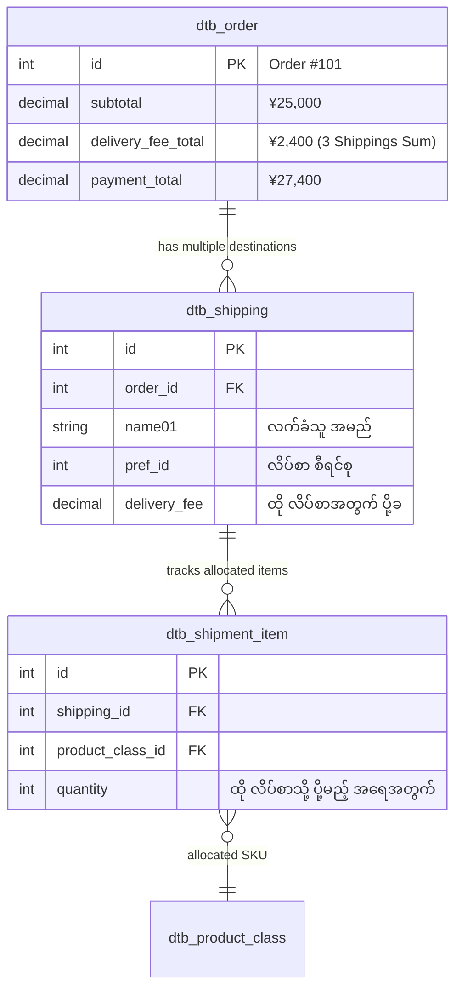

# 04 - Multiple Shipping Destinations (အော်ဒါတစ်ခုတည်းဖြင့် လိပ်စာများစွာ ခွဲပို့ခြင်း - 複数配送)

> **Client Requirements**:
> 1. **Multiple shipping destinations (လိပ်စာများစွာ ခွဲပို့ခြင်း)**: Customer တစ်ဦးတည်းက အော်ဒါ တစ်ခုတည်းဖြင့် ပစ္စည်းများကို လက်ခံမည့်သူ မတူညီသော လိပ်စာ ၃ ခု သို့မဟုတ် ၅ ခုဆီသို့ လိပ်စာခွဲ၍ တစ်ပြိုင်နက် မှာယူနိုင်ရမည်။
> 2. **Product allocation (ပစ္စည်းများ ခွဲဝေ သတ်မှတ်ခြင်း)**: မှာယူထားသော ပစ္စည်းများထဲမှ "ပန်းသီးခြင်း ၁ ခြင်းကို အိုဆာကာလိပ်စာသို့"၊ "ဝိုင် ၂ ပုလင်းကို တိုကျိုလိပ်စာသို့" စသည်ဖြင့် ပစ္စည်းနှင့် အရေအတွက်ကို လိပ်စာအလိုက် စိတ်ကြိုက် ခွဲဝေနိုင်ရမည်။
> 3. **Shipping fee per destination (လိပ်စာအလိုက် ပို့ခ သီးခြားစီ တွက်ချက်ခြင်း)**: ပို့ဆောင်မည့် လိပ်စာတစ်ခုချင်းစီ၏ စီရင်စုအကွာအဝေးပေါ် မူတည်၍ ပို့ခများကို သီးခြားစီ တိကျစွာ ပေါင်းစပ် တွက်ချက်ပေးရမည်။

---

## 🎁 Business Context: ဂျပန်နိုင်ငံ၏ အိုချူးဂန်းနှင့် အိုဆဲဘို (お中元・お歳暮)

ဂျပန်နိုင်ငံတွင် နွေရာသီ (お中元 - ဇူလိုင်/သြဂုတ်) နှင့် နှစ်ကုန်ပိုင်း (お歳暮 - ဒီဇင်ဘာ) ကာလများတွင် ဆွေမျိုး၊ မိတ်ဆွေနှင့် စီးပွားဖက် ကုမ္ပဏီများဆီသို့ လက်ဆောင်များ ပေးပို့ကြသည့် အလွန်ကြီးမားသော ယဉ်ကျေးမှုစျေးကွက် ရှိပါသည်။
- Customer တစ်ဦးသည် လက်ဆောင် ၁၀ မျိုး ဝယ်ယူပြီး လိပ်စာ ၁၀ ခုသို့ ပို့လိုသည့်အခါ ၁၀ ကြိမ် ခွဲ၍ ငွေမချေရဘဲ **အော်ဒါ ၁ ခုတည်းဖြင့် ငွေတစ်ကြိမ်တည်း ချေနိုင်ရန်** EC-CUBE တွင် **複数配送 (Multi-Shipping)** စနစ်ကို အဓိက Feature အဖြစ် ထည့်သွင်း တည်ဆောက်ထားပါသည်။

---

## 🏛️ Database Architecture: 1 Order to Many Shippings



---

## 🔄 အဆင့်ဆင့် အလုပ်လုပ်ပုံ (Step-by-Step Multi-Shipping Flow)

```
[1. Customer Carts Items: Fruit Gift Set x 3]
                   │
                   ▼ Checkout တွင် "複数のお届け先に送る" ကို နှိပ်ခြင်း
[2. ShoppingController::shippingMultiple()]
                   │
                   ▼ လိပ်စာခွဲများ ရွေးချယ်ခြင်း (dtb_customer_address မှ)
[3. Destination 1: မိဘအိမ် (Tokyo)  ── Allocation: 1 Set]
[   Destination 2: မိတ်ဆွေအိမ် (Osaka) ── Allocation: 1 Set]
[   Destination 3: ဆရာ့အိမ် (Fukuoka) ── Allocation: 1 Set]
                   │
                   ▼ ပို့ခ ပြန်လည်တွက်ချက်ခြင်း (DeliveryFeePreprocessor)
   Tokyo (¥700) + Osaka (¥800) + Fukuoka (¥900) = ပို့ခစုစုပေါင်း: ¥2,400
                   │
                   ▼
[4. Final Confirmation & Payment: ¥25,000 + ¥2,400 = ¥27,400]
```

---

## 🧮 ပို့ခ တွက်ချက်မှုဆိုင်ရာ အရေးကြီးသော စည်းမျဉ်းများ

1. **ပို့ခသည် လိပ်စာတစ်ခုချင်းစီအတွက် ကျသင့်သည်**:  
   လိပ်စာ ၃ ခု ခွဲပို့ပါက သေတ္တာ ၃ လုံး ထွက်သွားမည် ဖြစ်သဖြင့် ပို့ခသည်လည်း ၃ ကြိမ်စာ ပေါင်းစပ် ကျသင့်ပါမည်။
2. **"送料無料 (ပို့ခအခမဲ့)" စည်းမျဉ်း သတ်မှတ်ချက်**:  
   - *"¥5,000 ကျော်ပါက ပို့ခ အခမဲ့"* စည်းမျဉ်းတွင် Client အများစုသည် **"လိပ်စာတစ်ခုချင်းစီသို့ ပို့သော တန်ဖိုးက ¥5,000 ကျော်မှသာ ထိုလိပ်စာအတွက် ပို့ခ အခမဲ့"** အဖြစ် သတ်မှတ်လေ့ရှိကြသည်။
   - စုစုပေါင်း မှာယူငွေ ¥10,000 ဖြစ်စေကာမူ လိပ်စာတစ်ခုဆီသို့ ¥3,000 စီသာ ပို့ပါက သတ်မှတ်ငွေ မပြည့်သဖြင့် ပို့ခ ပေးဆောင်ရပါမည်။

---

## 💻 Controller & PurchaseFlow Implementation

`src/Eccube/Controller/ShoppingController.php`
```php
#[Route('/shopping/shipping_multiple', name: 'shopping_shipping_multiple')]
public function shippingMultiple(Request $request)
{
    $Order = $this->orderHelper->getPurchaseProcessingOrder();
    
    // Multi-shipping Form Binding
    $form = $this->formFactory->createBuilder(ShippingMultipleType::class, $Order)->getForm();
    $form->handleRequest($request);

    if ($form->isSubmitted() && $form->isValid()) {
        // PurchaseFlow မှတဆင့် လိပ်စာတစ်ခုချင်းစီအတွက် ပို့ခများ ပြန်တွက်ခြင်း
        $purchaseContext = new PurchaseContext();
        $this->purchaseFlow->prepare($Order, $purchaseContext);
        
        $this->entityManager->flush();
        return $this->redirectToRoute('shopping');
    }

    return ['form' => $form->createView()];
}
```

---

## 🇯🇵 သက်ဆိုင်ရာ ဂျပန် ဝေါဟာရများ

- **複数配送 (Fukusuu Haisou)**: Multi-destination Delivery
- **お届け先振分 (Otodokesaki Furiwake)**: Destination Allocation / Assignment
- **お中元 (Ochugen)**: Summer Gift Giving Season
- **お歳暮 (Oseibo)**: Year-end Gift Giving Season
- **ギフト配送 (Gifuto Haisou)**: Gift Shipping / Delivery
- **配送個別計算 (Haisou Kobetsu Keisan)**: Individual Shipping Calculation
