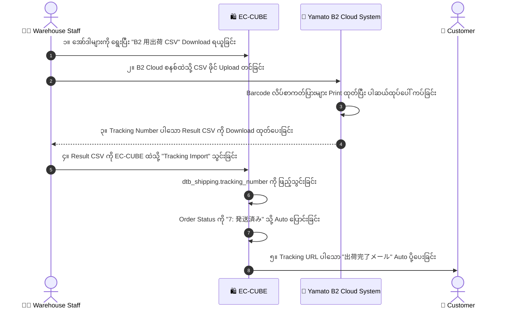

# 05 - Carrier Integration & Shipping CSV (ချောပို့ စနစ်များနှင့် CSV ချိတ်ဆက်မှု)

> **Client Requirements**:
> 1. **Carrier integration (ဂျပန် ထိပ်တန်း ချောပို့ ၃ ခုနှင့် ချိတ်ဆက်ခြင်း)**: Yamato Transport (ヤマト運輸), Sagawa Express (佐川急便) နှင့် Japan Post (日本郵便) တို့၏ စနစ်များနှင့် ချိတ်ဆက်၍ စာပို့ကတ်ပြား (送り状 / Shipping Labels) များကို တစ်ပြိုင်နက် ရိုက်ထုတ်နိုင်ရမည်။
> 2. **Shipping CSV Export (ပို့ဆောင်ရေး CSV ထုတ်ယူခြင်း)**: အော်ဒါများကို တစ်ခုချင်းစီ ရိုက်မနေဘဲ ချောပို့စနစ်များ (B2 Cloud, e-Hiden) ထဲသို့ တိုက်ရိုက် Upload တင်နိုင်သော CSV Format ဖြင့် Export ထုတ်ပေးနိုင်ရမည်။
> 3. **Tracking Number Import & Auto Mail (Tracking နံပါတ် ပြန်သွင်းခြင်းနှင့် Auto Email)**: ချောပို့ စနစ်မှ ထွက်လာသော Tracking နံပါတ်များပါသည့် CSV ကို EC-CUBE ထဲသို့ ပြန်လည် Import သွင်းလိုက်သည်နှင့် Status သည် **"発送済み (Shipped)"** သို့ အလိုအလျောက် ပြောင်းသွားပြီး Customer ထံ Tracking Link ပါသော အီးမေးလ် Auto ပို့ပေးရမည်။

---

## 🔄 The 2-Way Shipping Loop (ပို့ဆောင်ရေး အသွားအပြန် သံသရာ)

လုပ်ငန်းခွင်တွင် ဂိုဒေါင်ဝန်ထမ်းများသည် နေ့စဉ် အောက်ပါ 2-Way Loop အတိုင်း အလုပ်လုပ်ကြပါသည်:



---

## 🏢 ဂျပန်နိုင်ငံ ထိပ်တန်း ချောပို့ကုမ္ပဏီကြီး ၃ ခု၏ စနစ်များ

| ချောပို့ ကုမ္ပဏီ | အဓိက ဝန်ဆောင်မှုများ | အသုံးပြုသော ဆော့ဖ်ဝဲလ်စနစ် |
|:---|:---|:---|
| **ヤマト運輸 (Yamato Transport)** | 宅急便 (Standard), クール宅急便 (Frozen), ネコポス (Letterbox) | **B2 Cloud (B2クラウド)** |
| **佐川急便 (Sagawa Express)** | 飛脚宅配便 (Standard), 飛脚クール便 (Chilled), 飛脚ラージサイズ (Large) | **e-Hiden (e飛伝 II / e飛伝 III)** |
| **日本郵便 (Japan Post)** | ゆうパック (Yu-Pack), ゆうパケット (Yu-Packet) | **Yu-Pack Print R (ゆうパックプリントR)** |

---

## 💻 1. Yamato B2 Cloud CSV Export Format

Yamato B2 Cloud စနစ်သည် **Shift-JIS (CP932)** Encoding ဖြင့် အောက်ပါ Header ပုံစံအတိုင်း လက်ခံပါသည်:

```php
// Yamato B2 Cloud CSV Header Structure
$headers = [
    'お客様管理番号',     // Order Number (e.g. 20260921-0001)
    '送り状種類',         // 0: ပုံမှန်, 2: အအေးခန်း Cool
    'クール区分',         // 0: None, 1: 冷蔵 (Chilled), 2: 冷凍 (Frozen)
    'お届け先電話番号',   // Phone
    'お届け先郵便番号',   // Postal Code
    'お届け先住所',       // Address
    'お届け先名称',       // Recipient Name
    'ご依頼主電話番号',   // Sender Phone
    'ご依頼主名称',       // Sender / Shop Name
    '品名コード１',       // Product SKU
    '品名１',             // Product Title
    'お届け予定日',       // Delivery Date (YYYY/MM/DD)
    '配達時間帯',         // Time Slot Code (08: 午前中, 14: 14-16, 16: 16-18, etc.)
];
```

---

## 📥 2. Tracking Number CSV Import Controller (ပြန်လည် သွင်းယူခြင်း)

ချောပို့ဆော့ဖ်ဝဲလ်မှ ထွက်လာသော CSV ကို ပြန်သွင်းသည့်အခါ အော်ဒါများကို အလိုအလျောက် Status ပြောင်းပေးသော Logic:

```php
namespace Plugin\ShippingCsv\Controller\Admin;

use Eccube\Entity\Master\OrderStatus;
use Symfony\Component\HttpFoundation\Request;

class ShippingImportController extends AbstractController
{
    public function importTrackingCsv(Request $request)
    {
        $csvFile = $request->files->get('csv_file');
        $csvData = $this->parseCsv($csvFile);

        $this->entityManager->beginTransaction();
        try {
            $updatedCount = 0;
            foreach ($csvData as $row) {
                $orderNo = $row['お客様管理番号'];
                $trackingNumber = $row['送り状番号']; // Yamato မှ ထုတ်ပေးသော Tracking No

                $Order = $this->orderRepository->findOneBy(['order_no' => $orderNo]);
                if ($Order) {
                    // ၁။ Tracking Number ထည့်သွင်းခြင်း
                    foreach ($Order->getShippings() as $Shipping) {
                        $Shipping->setTrackingNumber($trackingNumber);
                        $Shipping->setShippingDate(new \DateTime());
                    }

                    // ၂။ Status ကို "7: 発送済み" သို့ ပြောင်းလဲခြင်း
                    $ShippedStatus = $this->orderStatusRepository->find(OrderStatus::ORDER_DELIVERED);
                    $Order->setOrderStatus($ShippedStatus);

                    // ၃။ Customer ထံ အလိုအလျောက် အီးမေးလ် ပေးပို့ခြင်း
                    $this->mailService->sendShippingNotifyMail($Order);

                    $updatedCount++;
                }
            }

            $this->entityManager->flush();
            $this->entityManager->commit();

            $this->addSuccess($updatedCount.' 件の出荷情報を更新し、メールを送信しました。');
        } catch (\Exception $e) {
            $this->entityManager->rollback();
            $this->addError('CSV Import အမှားဖြစ်ပွားပါသည်: '.$e->getMessage());
        }

        return $this->redirectToRoute('admin_shipping');
    }
}
```

---

## 🇯🇵 သက်ဆိုင်ရာ ဂျပန် ဝေါဟာရများ

- **送り状 (Okurijou)**: Shipping Slip / Waybill / Label
- **B2クラウド (Bi-tsuu Kuraudo)**: Yamato B2 Cloud System
- **e飛伝 (Ii-Hiden)**: Sagawa e-Hiden Shipping System
- **出荷CSV登録 (Shukka CSV Touroku)**: Shipping Tracking CSV Import
- **送り状番号取込 (Okurijou Bangou Torikomi)**: Tracking Number Batch Import
- **出荷完了メール (Shukka Kanryou Meeru)**: Shipping Completion Email
