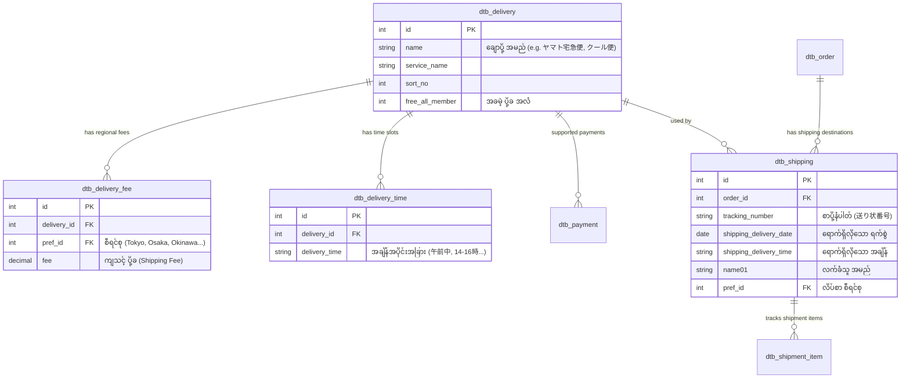

# EC-CUBE Client Requirements: Shipping (မြန်မာဘာသာ)

EC-CUBE (Version 4.x / 4.2+) ၏ **Shipping (ကုန်ပစ္စည်း ပို့ဆောင်ရေး၊ ပို့ခတွက်ချက်မှုနှင့် ချောပို့ စီမံခန့်ခွဲမှုစနစ်)** ဆိုင်ရာ Client Requirements များနှင့် **Shipping Architecture** ကို အခြေခံမှစ၍ အသေးစိတ် ရှင်းလင်းထားသော လေ့လာမှု လမ်းညွှန်ဖြစ်ပါသည်။

ဂျပန်နိုင်ငံ E-Commerce စျေးကွက်တွင် ပို့ဆောင်ရေးသည် အလွန်အသေးစိတ်ကျပြီး စီရင်စုအလိုက် ပို့ခတွက်ချက်ခြင်း၊ ရောက်ရှိလိုသည့် ရက်စွဲ/အချိန် (日時指定)၊ အအေးခန်းပို့ဆောင်မှု (クール便)၊ လက်ဆောင်ခွဲပို့ခြင်း (複数配送) နှင့် Yamato B2 / Sagawa e-Hiden ချောပို့စနစ်များနှင့် နက်ရှိုင်းစွာ ချိတ်ဆက်ထားပါသည်။

---

## 🚚 EC-CUBE Shipping Core Architecture (ERD)

EC-CUBE တွင် ပို့ဆောင်ရေးစနစ်ကို အောက်ပါ Database Tables များဖြင့် ချိတ်ဆက် ဖွဲ့စည်းထားပါသည်:

---

## 📑 မာတိကာ (Table of Contents)

| No. | ခေါင်းစဉ် | ဖိုင်လမ်းကြောင်း | အဓိက အကြောင်းအရာများ |
|:---:|:---|:---|:---|
| 01 | **Shipping Methods & Regional Zones** | [01_shipping_methods_and_regions.md](./01_shipping_methods_and_regions.md) | ချောပို့နည်းလမ်းများ (`dtb_delivery`), ၄၇ စီရင်စု ဒေသအလိုက် ခွဲခြားမှု၊ ကျွန်းဝေးဒေသများ (離島)၊ ပုံမှန်ပို့ vs အအေးခန်းပို့ (クール便) |
| 02 | **Shipping Fee Calculation & Free Shipping** | [02_shipping_fee_calculation_and_free_shipping.md](./02_shipping_fee_calculation_and_free_shipping.md) | တစ်နိုင်ငံလုံး တပြေးညီပို့ခ၊ စီရင်စုအလိုက် ပို့ခ၊ ပစ္စည်းအလိုက် ပို့ခ၊ "〇〇円以上で送料無料" စနစ်နှင့် အဝေးဒေသ ခြွင်းချက်များ |
| 03 | **Delivery Date & Time Slot Management** | [03_delivery_date_and_time.md](./03_delivery_date_and_time.md) | အရောက်ပို့ရက် သတ်မှတ်ခြင်း (リードタイム Lead Time တွက်ချက်ပုံ)၊ အလုပ်ပိတ်ရက်များ ဖယ်ထုတ်ခြင်း၊ အချိန်အပိုင်းအခြား ရွေးချယ်ခြင်း |
| 04 | **Multiple Shipping Destinations (複数配送)** | [04_multiple_shipping_destinations.md](./04_multiple_shipping_destinations.md) | အော်ဒါတစ်ခုတည်းဖြင့် လိပ်စာများစွာ ခွဲပို့ခြင်း (お歳暮/お中元 Gift Season)၊ Destination အလိုက် ပို့ခ သီးခြားစီ တွက်ချက်ပုံ |
| 05 | **Carrier Integration & Shipping CSV** | [05_carrier_integration_and_shipping_csv.md](./05_carrier_integration_and_shipping_csv.md) | Yamato B2 Cloud, Sagawa e-Hiden, Japan Post Yu-Pack သို့ CSV ထုတ်ယူနည်းနှင့် Tracking No. ပြန်လည် Import သွင်းနည်း |

---

## 🇯🇵 အရေးကြီးသော ဂျပန် ဝေါဟာရများ (Shipping Terms)

| Japanese (漢字/カタカナ) | Romaji | အဓိပ္ပာယ် |
|:---|:---|:---|
| **配送方法** | Haisou Houhou | Shipping / Delivery Method |
| **送料** | Souryou | Shipping Fee (ပို့ဆောင်ခ) |
| **送料無料条件** | Souryou Muryou Jouken | Free Shipping Condition (ဥပမာ- ¥5,000 ကျော်ပါက ပို့ခအခမဲ့) |
| **お届け希望日** | Otodoke Kiboubi | Preferred Delivery Date |
| **お届け時間帯** | Otodoke Jikantai | Preferred Delivery Time Slot |
| **リードタイム** | Riido Taimu | Lead Time (အော်ဒါတင်ပြီးနောက် အနည်းဆုံး ပို့ဆောင်ရက်) |
| **複数配送** | Fukusuu Haisou | Multiple Shipping Destinations in One Order |
| **クール便** | Kuuru-bin | Chilled / Frozen Delivery (အအေးခန်း ကုန်ပစ္စည်းပို့ယာဉ်) |
| **送り状番号** | Okurijou Bangou | Tracking Number (အမြန်ချောပို့ စာပို့နံပါတ်) |
| **離島・中継料** | Ritou / Chuukeiryou | Isolated Islands / Remote Area Surcharge Fee |

အထက်ပါ မာတိကာဇယားမှ သက်ဆိုင်ရာ လေ့လာမှုဖိုင်များကို ဖွင့်ဖတ်၍ အသေးစိတ် စတင် လေ့လာနိုင်ပါသည်။
