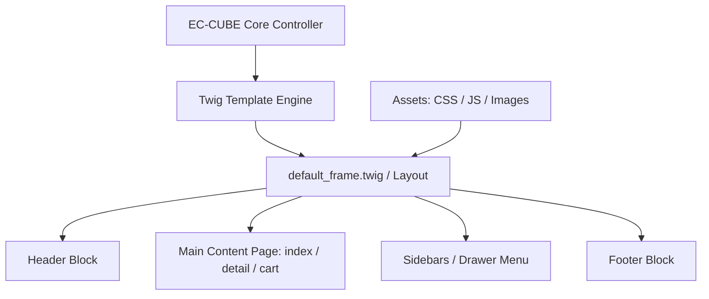
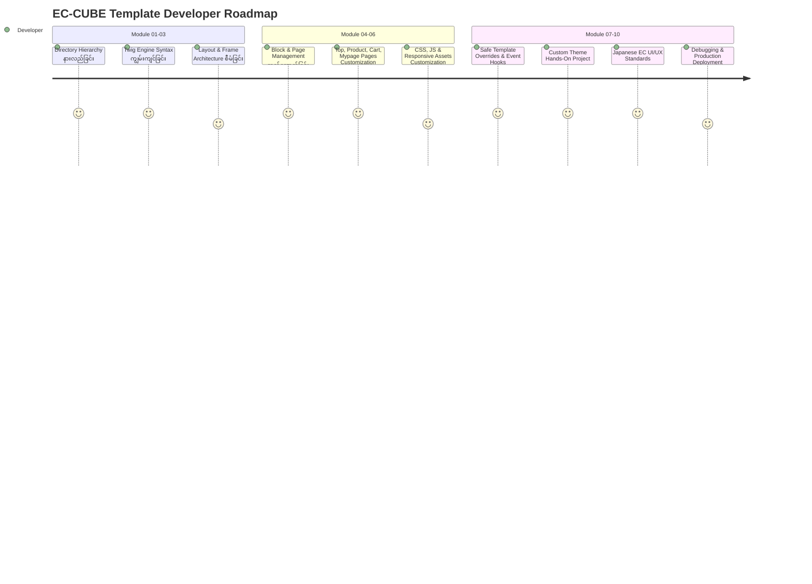

# Module 00: Course Overview & Prerequisites (သင်တန်းမိတ်ဆက်နှင့် အခြေခံလိုအပ်ချက်များ)

---

## ၁။ EC-CUBE Template System ဆိုတာဘာလဲ?

**EC-CUBE** သည် ဂျပန်နိုင်ငံတွင် အသုံးအများဆုံး Open-Source E-Commerce Platform ဖြစ်ပြီး Symfony PHP Framework ကို အခြေခံထားပါသည်။ EC-CUBE ၏ မျက်နှာစာ (Frontend Storefront) ဒီဇိုင်းတစ်ခုလုံးကို **Template System** မှတစ်ဆင့် ထိန်းချုပ်ထားပါသည်။

Template System တွင် အောက်ပါအဓိက အစိတ်အပိုင်းများ ပါဝင်ပါသည်-
1. **Twig Template Engine**: HTML ထဲတွင် PHP Logic များကို သန့်ရှင်းလုံခြုံစွာ ရေးသားနိုင်သော Template Engine ဖြစ်ပါသည်။
2. **Layout & Block Architecture**: စာမျက်နှာများကို Header, Footer, Sidebar စသည့် Block အပိုင်းအစများဖြင့် ဖွဲ့စည်းတည်ဆောက်ထားသော စနစ်ဖြစ်ပါသည်။
3. **Asset Pipeline**: CSS, JavaScript, Web Fonts, Images များကို စနစ်တကျ ချိတ်ဆက်ထားသော ဖွဲ့စည်းမှု ဖြစ်ပါသည်။
4. **Override & Fallback Mechanism**: မူရင်း Core ဖိုင်များကို မထိခိုက်စေဘဲ ဒီဇိုင်းကို စိတ်ကြိုက် ပြင်ဆင်နိုင်သော စနစ်ဖြစ်ပါသည်။

---

## ၂။ ဘာကြောင့် EC-CUBE Template Customization ကို လေ့လာသင့်တာလဲ?

ဂျပန်နိုင်ငံရှိ E-Commerce လုပ်ငန်းများသည် Default Template ဒီဇိုင်းအတိုင်း အသုံးပြုလေ့မရှိဘဲ၊ Brand Identity နှင့် ကိုက်ညီသော **Original Custom Theme** များကို အသုံးပြုကြပါသည်။

EC-CUBE Template Customization ကို ကျွမ်းကျင်စွာ တတ်မြောက်ပါက-
- ဂျပန် Brand များအတွက် Professional Custom E-Commerce Theme များကို အစမှအဆုံး တည်ဆောက်နိုင်မည်။
- EC-CUBE ၏ Storefront UI/UX ကို Customer များ ဝယ်ယူအားကောင်းစေမည့် (Conversion Rate မြင့်မားစေမည့်) ပုံစံသို့ ပြင်ဆင်နိုင်မည်။
- Plugin များ သွင်းသည့်အခါ ပေါ်လာသော UI Design များကို Template နှင့် လိုက်ဖက်အောင် ညှိယူပြင်ဆင်နိုင်မည်။
- ဂျပန် E-Commerce စံနှုန်းများဖြစ်သော **特商法表記 (Specified Commercial Transactions Act)**၊ **軽減税率 (Reduced Tax Rate)**၊ **スマホファースト (Mobile-First)** ဒီဇိုင်းများကို တိကျစွာ ရေးသားနိုင်မည်။

---

## ၃။ Template နှင့် Plugin ကွာခြားချက် (Template vs Plugin)

EC-CUBE တွင် Customization ပြုလုပ်ရာတွင် Template နှင့် Plugin ၏ လုပ်ဆောင်ချက်ကို ရှင်းလင်းစွာ ခွဲခြားသိရန် အရေးကြီးပါသည်-

| အချက်အလက် | Template (ဒီဇိုင်း ပုံစံခွက်) | Plugin (စနစ် တိုးချဲ့မှု) |
| :--- | :--- | :--- |
| **အဓိက ဦးတည်ချက်** | UI/UX ဒီဇိုင်း၊ Layout၊ HTML/CSS/JS မျက်နှာစာ ပြင်ဆင်ခြင်း | Backend Logic၊ Database တိုးချဲ့ခြင်း၊ Payment Gateway ချိတ်ဆက်ခြင်း |
| **တည်နေရာ** | `app/template/<template_code>/` | `app/Plugin/<PluginCode>/` |
| **အသုံးပြုသော နည်းပညာ** | Twig, HTML5, CSS3, JavaScript, Bootstrap | PHP (Symfony), Doctrine ORM, Twig, Service Container |
| **စီမံခန့်ခွဲသည့် နေရာ** | Admin Panel -> `設定` -> `店舗設定` -> `レイアウト管理` | Admin Panel -> `設定` -> `プラグイン` -> `プラグイン一覧` |

---

## ၄။ သင်တန်းတက်ရောက်ရန် လိုအပ်သော အခြေခံဗဟုသုတများ (Prerequisites)

ဤသင်တန်းကို အောင်မြင်စွာ လေ့လာနိုင်ရန် အောက်ပါ အခြေခံများကို နားလည်ထားရန် လိုအပ်ပါသည်-

1. **HTML5 & CSS3 အခြေခံ**: HTML Tags, Semantic Elements, CSS Flexbox/Grid, Responsive Media Queries များ။
2. **JavaScript (ES6) အခြေခံ**: DOM Manipulation, Event Listeners, Fetch/Ajax အခြေခံများ။
3. **Twig / Template Engine အခြေခံသဘောတရား**: Variables ဖော်ပြခြင်း, Loops, Conditions စသည့် အခြေခံများ (Module 02 တွင် အသေးစိတ် ထပ်မံသင်ကြားပါမည်)။
4. **Local EC-CUBE 4.x Environment**: Docker သို့မဟုတ် Local Server (PHP 8.1+, MySQL / PostgreSQL) ပေါ်တွင် EC-CUBE 4.x Install ပြုလုပ်ထားပြီး ဖြစ်ရပါမည်။

---

## ၅။ Course Learning Path (လေ့လာမှု လမ်းညွှန်ချက်)

> [!TIP]
> **အကြံပြုချက်**: သင်ခန်းစာတစ်ခုချင်းစီရှိ Code Example များကို မိမိ၏ Local EC-CUBE Project တွင် တိုက်ရိုက် ရေးသားစမ်းသပ်ပြီး Cache Clear ပြုလုပ်ကာ Result ကို စစ်ဆေးသွားပါ။
