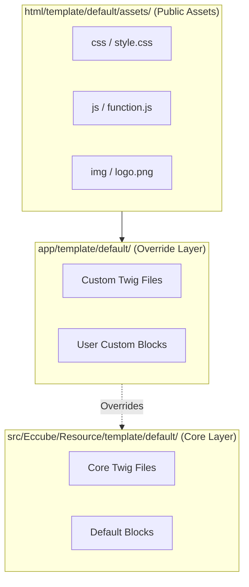
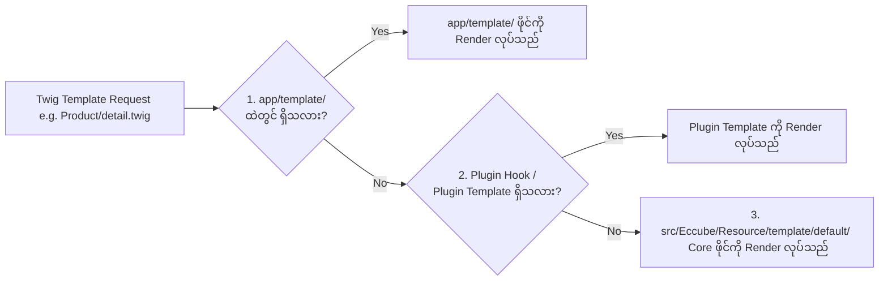

# Module 01: Template Architecture & Directory Hierarchy (ဖိုင်တည်ဆောက်ပုံနှင့် လမ်းကြောင်းများ)

---

## ၁။ EC-CUBE 4 Template Directory Hierarchy (ဖိုင်တည်ဆောက်ပုံ ခြုံငုံသုံးသပ်ချက်)

EC-CUBE 4.x တွင် Template ဖိုင်များသည် အဓိကအားဖြင့် **နေရာ ၃ ခု** ခွဲခြားတည်ရှိပါသည်-

```
[EC-CUBE Root Directory]
├── src/Eccube/Resource/template/default/       # (၁) Core Default Templates (စနစ်မူရင်းဖိုင်များ - မပြင်ရ)
├── app/template/default/                      # (၂) User Override Templates (မိမိစိတ်ကြိုက် ပြင်ဆင်ရမည့် နေရာ)
└── html/template/default/assets/              # (၃) Public Frontend Assets (CSS, JS, Images, Fonts)
```



---

## ၂။ အဓိက ဖိုင်တွဲ ၃ ခု၏ အခန်းကဏ္ဍ (Detailed Breakdown)

### (၁) Core Template Directory: `src/Eccube/Resource/template/default/`
- EC-CUBE ၏ စနစ်မူရင်း Twig ဖိုင်များ အားလုံး တည်ရှိသော နေရာဖြစ်ပါသည်။
- **အရေးကြီးသော စည်းမျဉ်း**: ဤဖိုင်တွဲအတွင်းရှိ မည်သည့်ဖိုင်ကိုမျှ တိုက်ရိုက် Edit မလုပ်ရပါ။ အကြောင်းမှာ EC-CUBE Version Upgrade ပြုလုပ်သည့်အခါ သင်ပြင်ထားသော Code များ အားလုံး အစားထိုးပျက်စီးသွားမည် ဖြစ်သောကြောင့် ဖြစ်ပါသည်။

### (၂) Override Template Directory: `app/template/default/`
- Developer များသည် မူရင်းဒီဇိုင်းကို ပြင်ဆင်လိုပါက `src/Eccube/Resource/template/default/` ထဲမှ သက်ဆိုင်ရာ Twig ဖိုင်ကို `app/template/default/` အောက်သို့ လမ်းကြောင်းတူ ကူးယူပြီးမှ စိတ်ကြိုက် ပြင်ဆင်ရပါမည်။
- EC-CUBE သည် ဤဖိုင်တွဲရှိ ဖိုင်များကို Core ဖိုင်များထက် ဦးစားပေး (Priority) အဆင့် သတ်မှတ်၍ အသုံးပြုပါသည်။

### (၃) Public Assets Directory: `html/template/default/assets/`
- Browser မှ တိုက်ရိုက်ခေါ်ယူအသုံးပြုနိုင်သော Static File များ (CSS, JS, Images, Icons, Web Fonts) တည်ရှိသော ဖိုင်တွဲ ဖြစ်ပါသည်။
- Twig ထဲတွင် `{{ asset('assets/css/style.css') }}` function ဖြင့် လှမ်းခေါ်အသုံးပြုပါသည်။

---

## ၃။ Default Template အတွင်းရှိ Subfolders များ ရှင်းလင်းချက်

`src/Eccube/Resource/template/default/` (သို့မဟုတ် `app/template/default/`) အောက်ရှိ ဖိုင်တွဲများ၏ လုပ်ဆောင်ချက်များမှာ အောက်ပါအတိုင်း ဖြစ်ပါသည်-

```
template/default/
├── Block/                      # Header, Footer, Slider, New Item စသည့် Blocks များ
│   ├── category.twig           # Category Menu Block
│   ├── footer.twig             # Footer Block
│   ├── header.twig             # Header & Navigation Block
│   ├── main_visual.twig        # Top Hero Slider Block
│   └── new_item.twig           # New Arrivals Block
├── Cart/                       # Shopping Cart စာမျက်နှာ
│   └── index.twig              # ကုန်ပစ္စည်းခြင်းတောင်း UI
├── Contact/                    # စုံစမ်းမေးမြန်းမှု (Inquiry) စာမျက်နှာများ
│   ├── index.twig              # Input Form
│   ├── confirm.twig            # Confirmation Step
│   └── complete.twig           # Thank You / Complete Step
├── Entry/                      # အသင်းဝင် မှတ်ပုံတင်ခြင်း (User Registration)
│   ├── index.twig              # Member Registration Form
│   ├── activate.twig           # Email Confirmation Activation
│   └── complete.twig           # Registration Success
├── Forgot/                     # စကားဝှက် ပြန်လည်ရယူခြင်း (Forgot Password)
├── Help/                       # About Us, Privacy Policy, 特商法表記 (Law Page)
│   ├── about.twig              # ကုမ္ပဏီအကြောင်း (About Us)
│   ├── privacy.twig            # Privacy Policy (個人情報保護方針)
│   ├── tr辦 (tradelaw).twig    # 特定商取引法に基づく表記
│   └── guide.twig              # Shopping Guide (ご利用ガイド)
├── Mypage/                     # Customer Account Dashboard
│   ├── index.twig              # Purchase History List (購入履歴一覧)
│   ├── history.twig            # Order Detail (注文詳細)
│   ├── favorite.twig           # Wishlist (お気に入り一覧)
│   ├── change.twig             # Profile Edit (会員情報編集)
│   └── withdraw.twig           # Account Deletion (退会手続き)
├── Product/                    # ကုန်ပစ္စည်း စာမျက်နှာများ
│   ├── list.twig               # Product Catalog / Category List
│   └── detail.twig             # Product Details (規格, Price, Images, Add to Cart)
├── Shopping/                   # Checkout Flow (၄ ဆင့် ငွေချေစနစ်)
│   ├── index.twig              # Order Setup (လိပ်စာ၊ ပို့ဆောင်မှု၊ ငွေပေးချေနည်း ရွေးချယ်မှု)
│   ├── confirm.twig            # Final Review & Order Placement
│   ├── complete.twig           # Purchase Completed (購入完了)
│   └── nonmember.twig          # Guest Checkout (会員登録せずに購入)
├── default_frame.twig          # Master Page Layout (HTML Head, Body wrapper, Header/Footer slot)
├── frame.twig                  # Base Frame
└── index.twig                  # Homepage / Top Page
```

---

## ၄။ Template Fallback & Resolution Order (ဦးစားပေးစနစ်)

EC-CUBE သည် Controller မှ Twig ဖိုင်တစ်ခုကို Render လုပ်ရန် ခေါ်ယူသည့်အခါ အောက်ပါ ဦးစားပေးအစဉ်လိုက် ရှာဖွေပါသည်-



### ဥပမာ-
1. သင်သည် `app/template/default/Product/detail.twig` ဖိုင်ကို ဖန်တီးထားပါက၊ EC-CUBE သည် Core ဖိုင်ကို ကျော်၍ `app/template/default/Product/detail.twig` ကိုသာ အသုံးပြုပါမည်။
2. အကယ်၍ `app/template/default/Product/detail.twig` ဖိုင် မရှိပါက `src/Eccube/Resource/template/default/Product/detail.twig` မူရင်း Core ဖိုင်ကို fallback ပြုလုပ်ကာ အသုံးပြုပါမည်။

---

## ၅။ Public Assets (CSS, JS, Images) လမ်းကြောင်း စီမံခန့်ခွဲမှု

EC-CUBE ၏ Static Asset ဖိုင်တွဲတည်ဆောက်ပုံ-

```
html/template/default/assets/
├── css/
│   ├── style.css               # Main Theme Stylesheet
│   └── customize.css           # စိတ်ကြိုက်ထပ်ဆောင်း CSS
├── js/
│   ├── function.js             # General UI Interactions
│   └── eccube.js               # EC-CUBE Core JS (Cart Ajax, Form helpers)
├── img/
│   ├── common/                 # Logos, Placeholders, Payment icons
│   └── top/                    # Top page hero banners
└── font/                       # Custom Web Fonts / Icons
```

### Twig ထဲတွင် Asset URL များ ရယူပုံ
```twig
{# CSS File ချိတ်ဆက်ခြင်း #}
<link rel="stylesheet" href="{{ asset('assets/css/style.css') }}">

{# Custom JavaScript File ချိတ်ဆက်ခြင်း #}
<script src="{{ asset('assets/js/function.js') }}"></script>

{# Image ဖိုင် ပြသခြင်း #}

```

> [!IMPORTANT]
> **သတိပြုရန်**: CSS သို့မဟုတ် Twig ဖိုင်များ ပြင်ဆင်ပြီးပါက EC-CUBE ၏ Cache ကြောင့် ချက်ချင်း မပြောင်းလဲနိုင်ပါ။ ထိုအခါ Admin Panel မှ `コンテンツ管理` -> `キャッシュ管理` -> `キャッシュ削除` (သို့မဟုတ် Terminal မှ `bin/console cache:clear`) ပြုလုပ်ပေးရန် လိုအပ်ပါသည်။
