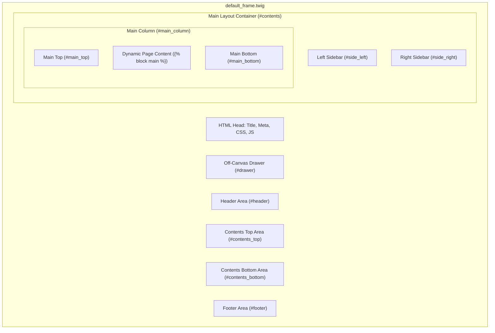

# Module 03: Layout & Frame System Deep-Dive (Layout နှင့် Frame ဖွဲ့စည်းပုံ)

---

## ၁။ Layout & Frame Architecture ခြုံငုံသုံးသပ်ချက်

EC-CUBE တွင် စာမျက်နှာအားလုံး၏ အခြေခံ အရိုးတည်ဆောက်ပုံ (Skeleton) ကို **`default_frame.twig`** မှ ထိန်းချုပ်ထားပါသည်။ 

Master Frame သည် HTML `<head>`, Meta Tags, CSS/JS Bundle များနှင့်အတူ စာမျက်နှာတွင် Block များ ဝင်ရောက်နေရာယူနိုင်သော **Layout Slots (Positions)** များကို သတ်မှတ်ပေးထားပါသည်။



---

## ၂။ `default_frame.twig` ဖိုင် တည်ဆောက်ပုံ အသေးစိတ်

`src/Eccube/Resource/template/default/default_frame.twig` ၏ အဓိက Code တည်ဆောက်ပုံမှာ အောက်ပါအတိုင်း ဖြစ်ပါသည်-

```twig
<!doctype html>
<html lang="{{ eccube_config.locale }}">
<head>
    <meta charset="utf-8">
    <meta name="viewport" content="width=device-width, initial-scale=1, shrink-to-fit=no">
    <title>{{ Page.name ? Page.name ~ ' | ' : '' }}{{ BaseInfo.shop_name }}</title>
    
    {# SEO Meta Tags #}
    <meta name="description" content="{{ Page.meta_description|default(BaseInfo.meta_description) }}">
    <meta name="keywords" content="{{ Page.meta_keyword|default(BaseInfo.meta_keyword) }}">
    
    {# Global CSS Assets #}
    <link rel="stylesheet" href="{{ asset('assets/css/style.css') }}">
    
    {# Page Specific CSS Block #}
    
</head>
<body id="page_{{ Page.id }}" class="{{ Page.url ? 'page_' ~ Page.url : '' }}">
    <div class="ec-layoutRole">
        
        {# ၁။ Header Block Slot #}
        <header class="ec-layoutRole__header">
            {{ render_block(Layout.header) }}
        </header>

        {# ၂။ Contents Top Slot #}
        
            <div class="ec-layoutRole__contentsTop">
                {{ render_block(Layout.contents_top) }}
            </div>
        

        {# ၃။ Main Contents Wrapper #}
        <div class="ec-layoutRole__contents">
            
            {# Left Sidebar #}
            
                <div class="ec-layoutRole__left">
                    {{ render_block(Layout.side_left) }}
                </div>
            

            {# Main Column #}
            <div class="ec-layoutRole__main">
                {# Main Top Block Slot #}
                {{ render_block(Layout.main_top) }}
                
                {# Dynamic Main Content of Current Page #}
                
                
                {# Main Bottom Block Slot #}
                {{ render_block(Layout.main_bottom) }}
            </div>

            {# Right Sidebar #}
            
                <div class="ec-layoutRole__right">
                    {{ render_block(Layout.side_right) }}
                </div>
            
        </div>

        {# ၄။ Contents Bottom Slot #}
        
            <div class="ec-layoutRole__contentsBottom">
                {{ render_block(Layout.contents_bottom) }}
            </div>
        

        {# ၅။ Footer Block Slot #}
        <footer class="ec-layoutRole__footer">
            {{ render_block(Layout.footer) }}
        </footer>

    </div>

    {# Global JS Assets #}
    <script src="{{ asset('assets/js/eccube.js') }}"></script>
    <script src="{{ asset('assets/js/function.js') }}"></script>
    
    {# Page Specific JS Block #}
    
</body>
</html>
```

---

## ၃။ Layout Positions & Slots ရှင်းလင်းချက်

EC-CUBE Layout System တွင် Block များကို ထည့်သွင်းနိုင်သော နေရာ (Slots) များမှာ-

| Slot Name (နေရာ) | HTML Container Class | အဓိက အသုံးပြုပုံ |
| :--- | :--- | :--- |
| **`#header`** | `.ec-layoutRole__header` | Logo, Search Bar, Cart Button, Global Navigation |
| **`#contents_top`** | `.ec-layoutRole__contentsTop` | Top Hero Slider, Sale Campaigns, Announcement Banners |
| **`#side_left`** | `.ec-layoutRole__left` | Category Sidebar, Search Filter, Ranking Block |
| **`#main_top`** | `.ec-layoutRole__main` (ထိပ်ပိုင်း) | Breadcrumb navigation, Campaign notices |
| **`#main`** | `` | စာမျက်နှာ၏ ပင်မအကြောင်းအရာ (ဥပမာ- ကုန်ပစ္စည်းအသေးစိတ်) |
| **`#main_bottom`** | `.ec-layoutRole__main` (အောက်ပိုင်း) | Related Products, Browsing History, Social Share |
| **`#side_right`** | `.ec-layoutRole__right` | Banner Ads, Recent News, Cart Preview |
| **`#contents_bottom`** | `.ec-layoutRole__contentsBottom` | Brand Features, Instagram Feed, Guide Links |
| **`#footer`** | `.ec-layoutRole__footer` | Footer Links, Copyright, Payment Icons, Newsletter Form |

---

## ၄။ Admin Panel မှ Layout စီမံခန့်ခွဲခြင်း (レイアウト管理)

EC-CUBE Admin Panel တွင် Block များကို Code ရေးစရာမလိုဘဲ Drag & Drop စနစ်ဖြင့် နေရာချထားနိုင်ပါသည်-

### နေရာ- `管理画面` -> `コンテンツ管理` -> `レイアウト管理`

```
[レイアウト編集 မျက်နှာပြင်]
┌────────────────────────────────────────────────────────┐
│  [未使用ブロック一覧 (အသုံးမပြုသေးသော Block များ)]     │
│  [新着商品]  [カテゴリナビ]  [ログインナビ]  [カスタムバナー]│
└────────────────────────────────────────────────────────┘
                          │ (Drag & Drop)
                          ▼
┌────────────────────────────────────────────────────────┐
│  ■ #header                                             │
│    [ヘッダーロゴ] [検索バー] [カートアイコン]          │
├────────────────────────────────────────────────────────┤
│  ■ #contents_top                                       │
│    [メインビジュアル (Hero Slider)]                    │
├────────────────────────────────────────────────────────┤
│  ■ #main                                               │
│    [ページ本文 (Page Content Area)]                    │
├────────────────────────────────────────────────────────┤
│  ■ #footer                                             │
│    [フッターリンク] [コピーライト]                     │
└────────────────────────────────────────────────────────┘
```

---

## ၅။ Responsive & Mobile (SP) Layout Handling

EC-CUBE 4.x သည် Responsive Design (PC နှင့် Mobile အတွက် Layout တစ်ခုတည်း) ကို အခြေခံထားပါသည်။

- **Off-Canvas Drawer Navigation**: Mobile မျက်နှာပြင်တွင် Hamburger Menu နှိပ်ပါက ပေါ်လာသော Drawer Navigation ကို `default_frame.twig` ၏ `ec-drawerRole` တွင် ထည့်သွင်းထားပါသည်။
- **Responsive Media Breakpoints**:
  - Small Devices (Mobile / SP): `< 768px`
  - Medium Devices (Tablet): `768px - 991px`
  - Large Devices (Desktop / PC): `>= 992px`

```css
/* PC vs Mobile Display Helpers */
@media (max-width: 767.98px) {
    .is-pc-only {
        display: none !important;
    }
}

@media (min-width: 768px) {
    .is-sp-only {
        display: none !important;
    }
}
```

> [!TIP]
> Custom Page တစ်ခု ဖန်တီးသည့်အခါ Frame မပါဝင်စေလိုပါက (ဥပမာ- Popup Window သို့မဟုတ် Modal) `default_frame.twig` အစား `frame.twig` (သို့မဟုတ် အလွတ်) ကို အသုံးပြုနိုင်ပါသည်။
