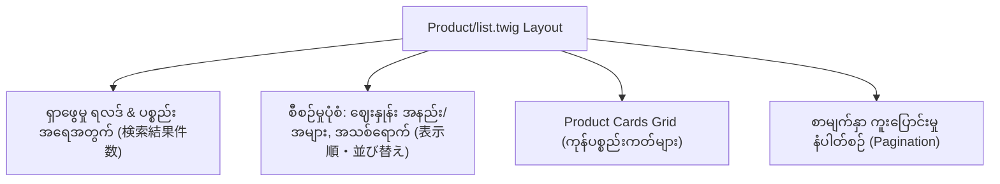

# Module 05 (Part 1): Core Pages Deep-Dive - Top & Product Pages (ပင်မနှင့် ကုန်ပစ္စည်း စာမျက်နှာများ)

---

## ၁။ Top Page (`index.twig`) ဖွဲ့စည်းပုံ

Top Page (Homepage) သည် ဝက်ဘ်ဆိုက်သို့ လာရောက်လည်ပတ်သူများ ပထမဆုံး မြင်တွေ့ရသော မျက်နှာစာ ဖြစ်ပါသည်။

EC-CUBE ၏ `index.twig` သည် အလွန်ရိုးရှင်းပြီး၊ အကြောင်းအရာ အားလုံးနီးပါးကို **Block Management (レイアウト管理)** မှတစ်ဆင့် စုစည်းထားပါသည်-

```twig
{# app/template/default/index.twig #}





    {# Layout Manager မှ သတ်မှတ်ထားသော Blocks များ အလိုအလျောက် Render လုပ်ပါမည် #}

```

### Top Page တွင် ထည့်သွင်းလေ့ရှိသော အဓိက Blocks များ-
1. **Main Visual Slider (`main_visual.twig`)**: အဓိက Brand Banner များနှင့် Campaign များကို Slider ဖြင့် ပြသခြင်း။
2. **Category Grid**: အဓိက Category များကို ပုံနှင့်တကွ ဖော်ပြခြင်း။
3. **New Arrivals (`new_item.twig`)**: အသစ်ရောက်ရှိလာသော ကုန်ပစ္စည်းများ စာရင်း။
4. **Ranking / Recommended Items**: လူကြိုက်များသော ပစ္စည်းများနှင့် အထူးအကြံပြု ပစ္စည်းများ။
5. **Topic / News (`news.twig`)**: ဆိုင်၏ နောက်ဆုံးရ ကြေညာချက်များ။

---

## ၂။ Product List Page (`Product/list.twig`)

Product List Page (ကုန်ပစ္စည်း စာရင်း) သည် Category အလိုက် သို့မဟုတ် ရှာဖွေမှုရလဒ်များကို Grid/List ပုံစံဖြင့် ပြသပေးသည့် စာမျက်နှာ ဖြစ်ပါသည်။



### Product Card ၏ Twig Code ဖွဲ့စည်းပုံ-

```twig
{# Product/list.twig အတွင်းရှိ Loop နမူနာ #}
<div class="ec-shelfRole">
    <ul class="ec-shelfGrid">
        
            <li class="ec-shelfGrid__item">
                <a href="{{ url('product_detail', {'id': Product.id}) }}">
                    {# ကုန်ပစ္စည်း ပုံ #}
                    <div class="ec-shelfGrid__item-image">
                        
                    </div>
                    
                    {# ကုန်ပစ္စည်း အမည် #}
                    <p class="ec-shelfGrid__item-title">{{ Product.name }}</p>
                    
                    {# ဈေးနှုန်း ဖော်ပြမှု (အခွန်ပါပြီး ဈေးနှုန်း) #}
                    <p class="ec-shelfGrid__item-price">
                        
                            
                                {{ Product.getPrice02IncTaxMin|price }}
                            
                                {{ Product.getPrice02IncTaxMin|price }} ～ {{ Product.getPrice02IncTaxMax|price }}
                            
                        
                            {{ Product.getPrice02IncTaxMin|price }}
                        
                        <span class="tax-label">(税込)</span>
                    </p>
                </a>
            </li>
        
    </ul>
</div>

{# Pagination ပြသခြင်း #}
<div class="ec-pagerRole">
    
</div>
```

---

## ၃။ Product Detail Page (`Product/detail.twig`) Deep-Dive

Product Detail Page သည် E-Commerce ဆိုက်တစ်ခုတွင် အရေးအကြီးဆုံး စာမျက်နှာ ဖြစ်ပြီး ဝယ်ယူမှု ဆုံးဖြတ်ချက် (Add to Cart) ချမှတ်သည့် နေရာ ဖြစ်ပါသည်။

### အဓိက အစိတ်အပိုင်းများနှင့် Twig Logic များ-

```twig
{# app/template/default/Product/detail.twig #}



<div class="ec-productRole">
    <div class="row">
        
        {# (က) ပစ္စည်းပုံများ Gallery / Slider #}
        <div class="col-md-6 ec-productRole__imgSection">
            <div class="product-gallery">
                {# Main Hero Image #}
                <div class="main-image">
                    
                </div>
                
                {# Sub Images Thumbnails #}
                
                    <ul class="thumbnail-list">
                        
                            <li>
                                
                            </li>
                        
                    </ul>
                
            </div>
        </div>

        {# (ခ) ပစ္စည်း အချက်အလက်နှင့် ဝယ်ယူရန် Form #}
        <div class="col-md-6 ec-productRole__profile">
            
            {# ကုန်ပစ္စည်း အမည် #}
            <h1 class="ec-productRole__title">{{ Product.name }}</h1>
            
            {# ကုန်ပစ္စည်း ကုဒ် (商品コード) #}
            <p class="ec-productRole__code">
                商品コード: <span class="product-code-default">{{ Product.code_min }} ～ {{ Product.code_max }}</span>
            </p>

            {# ဈေးနှုန်း ဖော်ပြခြင်း (税込 / 税抜) #}
            <div class="ec-productRole__price">
                {# ပုံမှန်ရောင်းဈေး (Selling Price) #}
                <div class="selling-price">
                    <span class="price-title">販売価格:</span>
                    <span class="price-value price02-default">
                        {{ Product.getPrice02IncTaxMin|price }}
                        
                            ～ {{ Product.getPrice02IncTaxMax|price }}
                        
                    </span>
                    <span class="price-tax">(税込)</span>
                </div>
                
                {# မူရင်း ပုံမှန်ဈေး (Normal/List Price - ရှိပါက) #}
                
                    <div class="normal-price text-muted">
                        <span class="price-title">通常価格:</span>
                        <del>{{ Product.getPrice01IncTaxMin|price }}</del>
                    </div>
                
            </div>

            {# (ဂ) Add to Cart Form (規格ရွေးချယ်မှု နှင့် ခြင်းတောင်းထဲထည့်ခြင်း) #}
            <form action="{{ url('product_add_cart', {id: Product.id}) }}" method="post" id="form1" name="form1">
                {{ form_widget(form._token) }}
                
                {# 規格 1 (ဥပမာ- အရောင် Color) ရှိပါက #}
                
                    <div class="ec-select variant-select">
                        <label>規格1 (Color):</label>
                        {{ form_widget(form.classcategory_id1) }}
                        {{ form_errors(form.classcategory_id1) }}
                    </div>
                

                {# 規格 2 (ဥပမာ- အရွယ်အစား Size) ရှိပါက #}
                
                    <div class="ec-select variant-select">
                        <label>規格2 (Size):</label>
                        {{ form_widget(form.classcategory_id2) }}
                        {{ form_errors(form.classcategory_id2) }}
                    </div>
                

                {# အရေအတွက် (Quantity) #}
                <div class="ec-numberInput quantity-select">
                    <label>数量:</label>
                    {{ form_widget(form.quantity) }}
                    {{ form_errors(form.quantity) }}
                </div>

                {# Add to Cart Button #}
                <div class="ec-productRole__btn">
                    <button type="submit" class="ec-blockBtn--action add-cart-btn">
                        🛒 カートに入れる (ခြင်းတောင်းထဲထည့်မည်)
                    </button>
                </div>

                {# Favorite / Wishlist Button (お気に入り追加) #}
                
                    <div class="ec-productRole__btn">
                        <a href="{{ url('product_add_favorite', {id: Product.id}) }}" class="ec-blockBtn--cancel favorite-btn">
                            ❤️ お気に入りに追加 (Favorite သို့ထည့်မည်)
                        </a>
                    </div>
                
            </form>

            {# (ဃ) ပစ္စည်း အသေးစိတ် ရှင်းလင်းချက် #}
            <div class="ec-productRole__description">
                <h3>商品説明</h3>
                <div class="description-content">
                    {{ Product.description_detail|raw|nl2br }}
                </div>
            </div>

        </div>
    </div>
</div>

```

---

## ၄။ 規格 (Product Variants) JavaScript Interaction

EC-CUBE တွင် 規格1 (Color) ကို Dropdown မှ ရွေးချယ်လိုက်ပါက 規格2 (Size) ၏ Dropdown စာရင်းနှင့် ဈေးနှုန်းကို `eccube.classCategories` JavaScript object ဖြင့် အလိုအလျောက် Dynamic ပြောင်းလဲပေးပါသည်။

```javascript
// EC-CUBE Default JavaScript (assets/js/eccube.js) မှ 規格 ပြောင်းလဲမှုကို ထိန်းချုပ်ပုံ
$(function() {
    $('#classcategory_id1').change(function() {
        var classcategory_id1 = $(this).val();
        eccube.setClassCategories(
            $('#form1'),
            classcategory_id1,
            '#classcategory_id2'
        );
    });
});
```

> [!IMPORTANT]
> Custom Template ရေးသားသည့်အခါ `#form1`, `#classcategory_id1`, `#classcategory_id2` စသည့် HTML ID များကို မပြောင်းလဲစေရန် သတိပြုပါ။ JavaScript စနစ်များသည် အဆိုပါ ID များကို အခြေခံ၍ Dynamic calculation ပြုလုပ်သောကြောင့် ဖြစ်ပါသည်။
