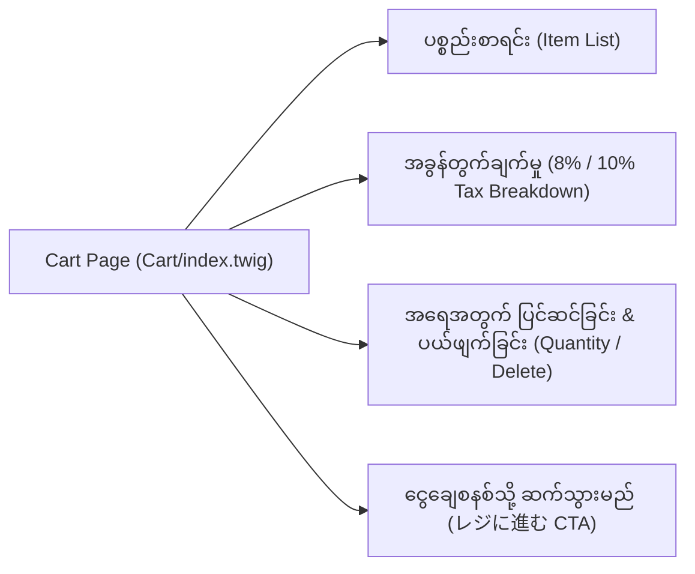
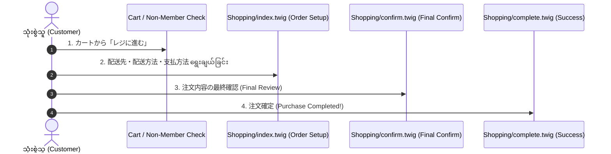

# Module 05 (Part 2): Core Pages Deep-Dive - Cart, Checkout & Mypage (ခြင်းတောင်း၊ ငွေချေစနစ်နှင့် အသင်းဝင် စာမျက်နှာများ)

---

## ၁။ Shopping Cart Page (`Cart/index.twig`)

Shopping Cart (ခြင်းတောင်း စာမျက်နှာ) သည် သုံးစွဲသူ ရွေးချယ်ထားသော ပစ္စည်းများ၊ အရေအတွက်၊ စုစုပေါင်း ကုန်ကျငွေနှင့် အခွန်တွက်ချက်မှုများကို ဖော်ပြပေးသော နေရာဖြစ်ပါသည်။



### Cart Item Table ၏ Twig Code ဖွဲ့စည်းပုံ-

```twig
{# Cart/index.twig အတွင်းရှိ Cart Items Loop နမူနာ #}

    <div class="ec-cartRole">
        <div class="ec-cartRole__items">
            
                
                
                
                <div class="cart-item-row">
                    {# ကုန်ပစ္စည်း ပုံ #}
                    <div class="cart-item-image">
                        
                    </div>

                    {# အချက်အလက်နှင့် 規格 #}
                    <div class="cart-item-info">
                        <h4><a href="{{ url('product_detail', {'id': Product.id}) }}">{{ Product.name }}</a></h4>
                        
                            <p class="variant">{{ ProductClass.ClassCategory1.CategoryType.name }}: {{ ProductClass.ClassCategory1.name }}</p>
                        
                        
                            <p class="variant">{{ ProductClass.ClassCategory2.CategoryType.name }}: {{ ProductClass.ClassCategory2.name }}</p>
                        
                        <p class="unit-price">{{ CartItem.price|price }} (税込)</p>
                    </div>

                    {# အရေအတွက် တိုး/လျှော့ ခလုတ်များ #}
                    <div class="cart-item-quantity">
                        <a href="{{ url('cart_down', {'productClassId': ProductClass.id}) }}" class="btn-qty">-</a>
                        <span class="qty-val">{{ CartItem.quantity }}</span>
                        <a href="{{ url('cart_up', {'productClassId': ProductClass.id}) }}" class="btn-qty">+</a>
                    </div>

                    {# စုစုပေါင်း ဈေးနှုန်း #}
                    <div class="cart-item-subtotal">
                        <strong>{{ CartItem.total_price|price }}</strong>
                    </div>

                    {# ဖျက်ပစ်မည့် ခလုတ် #}
                    <div class="cart-item-remove">
                        <a href="{{ url('cart_remove', {'productClassId': ProductClass.id}) }}" class="btn-remove">🗑️ 削除</a>
                    </div>
                </div>
            
        </div>

        {# စုစုပေါင်း ကုန်ကျငွေ ဖော်ပြခြင်း #}
        <div class="ec-cartRole__total">
            <div class="total-box">
                <p class="subtotal">合計金額: <strong>{{ Cart.totalPrice|price }}</strong> (税込)</p>
                <a href="{{ url('shopping') }}" class="ec-blockBtn--action checkout-btn">
                    レジに進む (ငွေချေစနစ်သို့ ဆက်သွားမည်)
                </a>
            </div>
        </div>
    </div>

    {# ခြင်းတောင်းထဲတွင် ပစ္စည်းမရှိပါက ပြသမည့် UI #}
    <div class="ec-emptyCart">
        <p>現在カート内に商品はございません。(ခြင်းတောင်းထဲတွင် ပစ္စည်းမရှိပါ)</p>
        <a href="{{ url('homepage') }}" class="ec-blockBtn--normal">Top သို့ ပြန်သွားမည်</a>
    </div>

```

---

## ၂။ 4-Step Checkout Flow (`Shopping/` Templates)

EC-CUBE ၏ ငွေချေစနစ် (Checkout Flow) ကို အဆင့် ၄ ဆင့်ဖြင့် တည်ဆောက်ထားပါသည်-



### (၁) Step 1: `Shopping/nonmember.twig` (Guest vs Member)
အကောင့်မရှိသော သုံးစွဲသူများအတွက် အကောင့်ဖွင့်စရာမလိုဘဲ အချက်အလက်ဖြည့်၍ ဝယ်ယူနိုင်သော စာမျက်နှာ ဖြစ်ပါသည်။

### (၂) Step 2: `Shopping/index.twig` (Order Setup)
- **ပို့ဆောင်မည့် လိပ်စာ (お届け先)**: အသင်းဝင်လိပ်စာ သို့မဟုတ် လိပ်စာအသစ် ရွေးချယ်ခြင်း။
- **ပို့ဆောင်ရေး နည်းလမ်း (配送方法)**: 宅配便 (Courier), メール便 (Mail), နံနက်/ညနေ အချိန် ရွေးချယ်ခြင်း (お届け時間指定)။
- **ငွေပေးချေနည်း (お支払方法)**: クレジットカード (Credit Card), 代金引換 (Cash on Delivery), 銀行振込 (Bank Transfer)။
- **အသုံးပြုမည့် Point များ (利用ポイント)**: Member Point လျှော့ဈေး အသုံးပြုခြင်း။

### (၃) Step 3: `Shopping/confirm.twig` (Final Confirmation)
- ပစ္စည်းတန်ဖိုး၊ ပို့ဆောင်ခ (送料), ဝန်ဆောင်ခ (手数料), အခွန် (消費税) နှင့် စုစုပေါင်း ပေးချေရမည့် ငွေပမာဏကို အပြီးသတ် စစ်ဆေးပြီး **`注文する` (Order Place)** ခလုတ် နှိပ်သည့် စာမျက်နှာ ဖြစ်ပါသည်။

### (၄) Step 4: `Shopping/complete.twig` (Thank You Page)
- အော်ဒါတင်ခြင်း အောင်မြင်ပြီးနောက် Order ID (注文番号) ကို ဖော်ပြပေးပြီး အီးမေးလ် ပေးပို့ပြီးကြောင်း အသိပေးသည့် စာမျက်နှာ ဖြစ်ပါသည်။

---

## ၃။ Mypage & Auth Pages (အသင်းဝင် စနစ် စာမျက်နှာများ)

### (က) အသင်းဝင် မှတ်ပုံတင်ခြင်း (`Entry/index.twig`)
ဂျပန်နိုင်ငံသုံး စနစ်များတွင် စာတိုက်သင်္ကေတ (郵便番号 - Zipcode) ၇ လုံး ရိုက်ထည့်သည်နှင့် မြို့နယ်/လိပ်စာ အလိုအလျောက် ပေါ်လာသော `AjaxZip3` စနစ်ကို Twig တွင် ချိတ်ဆက်ထားပါသည်-

```twig
{# Entry/index.twig အတွင်း စာတိုက်သင်္ကေတ အလိုအလျောက် ဖြည့်စနစ် #}
<div class="ec-zipInput">
    {{ form_widget(form.postal_code) }}
    <button type="button" class="btn-zip" onclick="AjaxZip3.zip2addr('entry[postal_code]','','entry[pref]','entry[addr01]');">
        住所自動入力 (လိပ်စာ အလိုအလျောက်ဖြည့်မည်)
    </button>
</div>
```

### (ခ) အသင်းဝင် Dashboard (`Mypage/index.twig`)
ဝယ်ယူခဲ့သော Order History (購入履歴) စာရင်းကို အခြေအနေ (Status: Processing, Shipped, Cancelled) နှင့်တကွ ကြည့်ရှုနိုင်ပါသည်။

```twig
{# Mypage/index.twig နမူနာ #}
<table class="ec-historyTable">
    <thead>
        <tr>
            <th>ご注文日時</th>
            <th>注文番号</th>
            <th>お支払い方法</th>
            <th>合計金額</th>
            <th>ご注文状況</th>
            <th>詳細</th>
        </tr>
    </thead>
    <tbody>
        
            <tr>
                <td>{{ Order.order_date|date('Y/m/d H:i') }}</td>
                <td>{{ Order.order_no }}</td>
                <td>{{ Order.payment_method_name }}</td>
                <td>{{ Order.total|price }}</td>
                <td><span class="badge status-{{ Order.OrderStatus.id }}">{{ Order.OrderStatus.name }}</span></td>
                <td><a href="{{ url('mypage_history', {'order_no': Order.order_no}) }}" class="btn-detail">詳細を見る</a></td>
            </tr>
        
    </tbody>
</table>
```

### (ဂ) Wishlist / စိတ်ကြိုက်စာရင်း (`Mypage/favorite.twig`)
Customer များ သိမ်းဆည်းထားသော အကြိုက်ဆုံး ပစ္စည်းများ စာရင်းဖြစ်ပြီး၊ ဤနေရာမှတစ်ဆင့် တိုက်ရိုက် ခြင်းတောင်းထဲသို့ ထည့်သွင်းနိုင်ပါသည် (`カートに入れる` Direct Add)။
