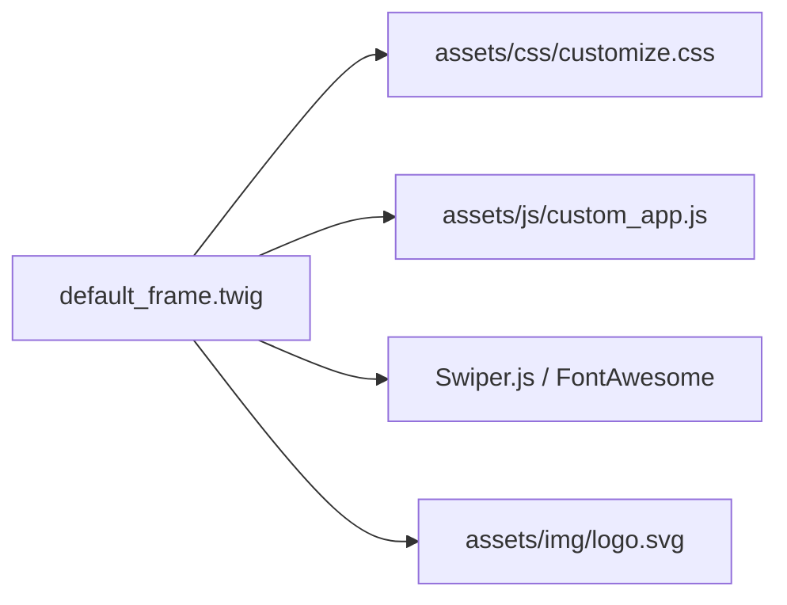

# Module 06: Styling & Assets Customization (CSS၊ JS နှင့် Asset များ စိတ်ကြိုက်ပြင်ဆင်ခြင်း)

---

## ၁။ Asset Customization Architecture (Asset တည်ဆောက်ပုံ)

EC-CUBE ၏ Static Assets (CSS, JS, Fonts, Images) များကို `html/template/default/assets/` အောက်တွင် စီမံခန့်ခွဲပါသည်။

```
html/template/default/assets/
├── css/
│   ├── style.css               # EC-CUBE Base Stylesheet
│   └── customize.css           # မိမိတို့ ရေးသားမည့် Custom Theme Stylesheet
├── js/
│   ├── eccube.js               # EC-CUBE Core Logic (Cart, Variants, Forms)
│   ├── function.js             # General Theme UI interactions
│   └── swiper-bundle.min.js    # Modern Slider Library
└── img/
    ├── common/                 # Brand Logo, Icons, Payment Badges
    └── top/                    # Banner visuals
```



---

## ၂။ Safe CSS Customization (`customize.css` အသုံးပြုနည်း)

မူရင်း `style.css` ကို တိုက်ရိုက် မပြင်ဘဲ `customize.css` ဖိုင်ကို သီးသန့်ဖန်တီး၍ `default_frame.twig` တွင် ချိတ်ဆက်ခြင်းသည် အကောင်းဆုံး နည်းလမ်း (Best Practice) ဖြစ်ပါသည်-

```twig
{# default_frame.twig ထဲတွင် customize.css ကို ချိတ်ဆက်ပုံ #}
<link rel="stylesheet" href="{{ asset('assets/css/style.css') }}">
<link rel="stylesheet" href="{{ asset('assets/css/customize.css') }}">
```

### `customize.css` နမူနာ (Modern E-Commerce Design System):

```css
/* html/template/default/assets/css/customize.css */

/* ၁။ Global Color Variables */
:root {
    --primary-color: #1a1a2e;       /* Elegant Dark Navy */
    --accent-color: #e94560;        /* Vibrant Coral Red */
    --bg-light: #f8f9fa;            /* Soft White Background */
    --text-main: #333333;           /* Clean Dark Text */
    --text-muted: #757575;          /* Subtitle Gray */
    --border-color: #e2e8f0;        /* Clean Border */
    --font-heading: 'Outfit', 'Noto Sans JP', sans-serif;
    --font-body: 'Inter', 'Noto Sans JP', sans-serif;
}

/* ၂။ Typography & Body */
body {
    font-family: var(--font-body);
    color: var(--text-main);
    background-color: var(--bg-light);
    -webkit-font-smoothing: antialiased;
}

h1, h2, h3, h4, h5, h6 {
    font-family: var(--font-heading);
    font-weight: 700;
}

/* ၃။ Modern Product Card Styling */
.ec-shelfGrid__item {
    background: #ffffff;
    border-radius: 12px;
    padding: 16px;
    border: 1px solid var(--border-color);
    transition: all 0.3s cubic-bezier(0.25, 0.8, 0.25, 1);
    box-shadow: 0 2px 8px rgba(0, 0, 0, 0.04);
}

.ec-shelfGrid__item:hover {
    transform: translateY(-6px);
    box-shadow: 0 12px 24px rgba(0, 0, 0, 0.08);
    border-color: rgba(233, 69, 96, 0.3);
}

.ec-shelfGrid__item-image img {
    border-radius: 8px;
    width: 100%;
    aspect-ratio: 1 / 1;
    object-fit: cover;
}

/* ၄။ High-Converting Add to Cart Button */
.ec-blockBtn--action, .add-cart-btn {
    background: linear-gradient(135deg, var(--accent-color) 0%, #ff6b81 100%) !important;
    color: #ffffff !important;
    border: none !important;
    border-radius: 30px !important;
    padding: 14px 28px !important;
    font-weight: 700 !important;
    font-size: 16px !important;
    box-shadow: 0 6px 18px rgba(233, 69, 96, 0.35) !important;
    transition: all 0.25s ease !important;
}

.ec-blockBtn--action:hover, .add-cart-btn:hover {
    transform: translateY(-2px);
    box-shadow: 0 10px 22px rgba(233, 69, 96, 0.45) !important;
}
```

---

## ၃။ Modern Slider Library (Swiper.js) ချိတ်ဆက်ခြင်း

Top Page Hero Visual သို့မဟုတ် Product Images များကို Smooth ဖြစ်သော Swiper.js Slider ဖြင့် ဖန်တီးနည်း-

### (က) Header & Scripts ချိတ်ဆက်ခြင်း
```twig
{# default_frame.twig #}
<link rel="stylesheet" href="https://cdn.jsdelivr.net/npm/swiper@11/swiper-bundle.min.css">
<script src="https://cdn.jsdelivr.net/npm/swiper@11/swiper-bundle.min.js"></script>
```

### (ခ) Twig Markup (`Block/main_visual.twig`)
```twig
<div class="swiper hero-swiper">
    <div class="swiper-wrapper">
        <div class="swiper-slide">
            <a href="{{ url('product_list') }}">
                
            </a>
        </div>
        <div class="swiper-slide">
            <a href="{{ url('product_list') }}">
                
            </a>
        </div>
    </div>
    <!-- Pagination & Arrows -->
    <div class="swiper-pagination"></div>
    <div class="swiper-button-next"></div>
    <div class="swiper-button-prev"></div>
</div>

<script>
document.addEventListener('DOMContentLoaded', function () {
    const swiper = new Swiper('.hero-swiper', {
        loop: true,
        autoplay: {
            delay: 4500,
            disableOnInteraction: false,
        },
        pagination: {
            el: '.swiper-pagination',
            clickable: true,
        },
        navigation: {
            nextEl: '.swiper-button-next',
            prevEl: '.swiper-button-prev',
        },
        effect: 'fade',
        fadeEffect: {
            crossFade: true
        },
    });
});
</script>
```

---

## ၄။ Mobile-First (スマホファースト) UI Best Practices

ဂျပန်နိုင်ငံတွင် E-Commerce ဝယ်ယူသူများ၏ ၇၅% ကျော်သည် စမတ်ဖုန်း (Mobile) မှ ဝယ်ယူကြသောကြောင့် Mobile UI သည် အလွန်အရေးကြီးပါသည်-

### (၁) Mobile Fixed Bottom Navigation Bar (スマホ下部固定メニュー)
Mobile မျက်နှာပြင် အောက်ခြေတွင် Home, Search, Cart, Mypage ခလုတ်များကို အမြဲပေါ်နေစေရန် ဖန်တီးနည်း-

```twig
{# default_frame.twig ၏ </body> အပေါ်တွင် ထည့်သွင်းပါ #}
<nav class="sp-bottom-bar is-sp-only">
    <a href="{{ url('homepage') }}" class="bottom-item">
        <span class="icon">🏠</span>
        <span class="label">ホーム</span>
    </a>
    <a href="{{ url('product_list') }}" class="bottom-item">
        <span class="icon">🔍</span>
        <span class="label">さがす</span>
    </a>
    <a href="{{ url('cart') }}" class="bottom-item cart-badge-item">
        <span class="icon">🛒</span>
        <span class="label">カート</span>
        
            <span class="cart-count">{{ Cart.total_quantity }}</span>
        
    </a>
    <a href="{{ url('mypage') }}" class="bottom-item">
        <span class="icon">👤</span>
        <span class="label">マイページ</span>
    </a>
</nav>

<style>
@media (max-width: 767.98px) {
    .sp-bottom-bar {
        position: fixed;
        bottom: 0;
        left: 0;
        width: 100%;
        height: 60px;
        background: #ffffff;
        border-top: 1px solid #e0e0e0;
        display: flex;
        justify-content: space-around;
        align-items: center;
        z-index: 9999;
        box-shadow: 0 -2px 10px rgba(0,0,0,0.05);
    }
    .sp-bottom-bar .bottom-item {
        display: flex;
        flex-direction: column;
        align-items: center;
        font-size: 11px;
        color: #555555;
        text-decoration: none;
        position: relative;
    }
    .sp-bottom-bar .icon {
        font-size: 20px;
    }
    .cart-count {
        position: absolute;
        top: -4px;
        right: 4px;
        background: #e94560;
        color: white;
        border-radius: 10px;
        padding: 2px 6px;
        font-size: 10px;
        font-weight: bold;
    }
    /* Mobile အောက်ခြေ ကွယ်မသွားစေရန် body padding ပေးခြင်း */
    body {
        padding-bottom: 65px;
    }
}
@media (min-width: 768px) {
    .sp-bottom-bar {
        display: none !important;
    }
}
</style>
```

> [!TIP]
> Google Fonts (ဥပမာ- `Outfit`, `Inter` နှင့် `Noto Sans JP`) များကို ချိတ်ဆက်အသုံးပြုခြင်းဖြင့် ဝက်ဘ်ဆိုက်၏ Visual Impression ကို သိသိသာသာ တိုးတက်ကောင်းမွန်စေပါသည်။
