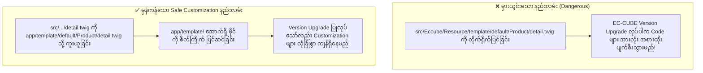
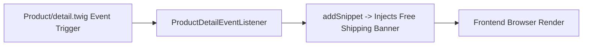

# Module 07: Safe Customization & Override Techniques (လုံခြုံသော Override နှင့် Hook စနစ်များ)

---

## ၁။ Safe Customization စည်းမျဉ်း (Core File မထိခိုက်စေသော နည်းလမ်း)

EC-CUBE Development တွင် အရေးအကြီးဆုံးသော စည်းမျဉ်းမှာ **"Core ဖိုင်များကို ဘယ်တော့မှ တိုက်ရိုက် Edit မလုပ်ရ"** (Never modify core files directly) ဖြစ်ပါသည်။



---

## ၂။ `app/template/` Override System အလုပ်လုပ်ပုံ

EC-CUBE သည် စာမျက်နှာတစ်ခုကို Render လုပ်သည့်အခါ `app/template/default/` အောက်တွင် ဖိုင်ရှိမရှိ အရင်စစ်ဆေးပြီး၊ မရှိမှသာ `src/Eccube/Resource/template/default/` ကို သုံးပါသည်။

### လက်တွေ့ Override ပြုလုပ်နည်း အဆင့်များ-

ဥပမာ- Product Detail Page ကို ပြင်လိုပါက-

1. မူရင်းဖိုင်ကို ရှာပါ:
   `src/Eccube/Resource/template/default/Product/detail.twig`
2. Override ဖိုင်တွဲအောက်သို့ လမ်းကြောင်းတူ ကူးယူပါ:
   `app/template/default/Product/detail.twig`
3. ကူးယူထားသော `app/template/default/Product/detail.twig` ဖိုင်ကို မိမိစိတ်ကြိုက် Edit ပြုလုပ်ပါ။
4. Cache Clear ပြုလုပ်ပြီး ရလဒ်ကို စစ်ဆေးပါ။

---

## ၃။ Template Event Hook များဖြင့် Snippet ထည့်သွင်းခြင်း (Plugin Approach)

အကယ်၍ Twig ဖိုင်တစ်ခုလုံးကို Override မလုပ်ဘဲ၊ တိကျသော နေရာတစ်ခုတွင်သာ HTML/Twig အပိုင်းအစ (Snippet) ထည့်သွင်းလိုပါက **Template Event Listener** ကို အသုံးပြုနိုင်ပါသည်-

```php
// app/Customize/EventListener/ProductDetailEventListener.php
namespace Customize\EventListener;

use Eccube\Event\TemplateEvent;
use Symfony\Component\EventDispatcher\EventSubscriberInterface;

class ProductDetailEventListener implements EventSubscriberInterface
{
    public static function getSubscribedEvents()
    {
        return [
            // Product Detail Page Render မလုပ်မီ Trigger ဖြစ်မည့် Event
            'Product/detail.twig' => 'onProductDetailRender',
        ];
    }

    public function onProductDetailRender(TemplateEvent $event)
    {
        // Custom HTML / Twig Snippet ကို ထည့်သွင်းခြင်း
        $snippet = '
            <div class="custom-shipping-badge">
                🚚 <strong>送料無料 (Free Shipping)</strong>: ¥5,000 以上のお買い上げで送料無料！
            </div>
        ';

        // Product Detail Page ၏ Price Section အောက်သို့ ထိုးထည့်ခြင်း
        $event->addSnippet($snippet);
    }
}
```



---

## ၄။ Cache System & Cache Clearing (Cache စီမံခန့်ခွဲမှု)

Twig Template များကို EC-CUBE က မြန်ဆန်စွာ အလုပ်လုပ်နိုင်ရန်အတွက် `var/cache/` အောက်တွင် Compiled PHP File များအဖြစ် သိမ်းဆည်းထားပါသည်။ ထို့ကြောင့် Template ဖိုင်များ ပြင်ဆင်ပြီးတိုင်း Cache ရှင်းထုတ်ရန် လိုအပ်ပါသည်။

### (က) Admin Panel မှ Cache Clear ပြုလုပ်နည်း
1. Admin Panel သို့ ဝင်ပါ။
2. `コンテンツ管理` (Content Management) -> `キャッシュ管理` (Cache Management) သို့ သွားပါ။
3. `キャッシュ削除` (Clear Cache) ခလုတ်ကို နှိပ်ပါ။

### (ခ) Terminal / Command Line မှ Cache Clear ပြုလုပ်နည်း
```bash
# Symfony Console ဖြင့် Cache ရှင်းထုတ်ခြင်း
bin/console cache:clear --no-debug

# var/cache ဖိုင်တွဲကို တိုက်ရိုက် ဖျက်ထုတ်ခြင်း (အရေးပေါ်အခြေအနေတွင်)
rm -rf var/cache/*
```

---

## ၅။ Safe Customization Best Practice Checklist

- [ ] Core Template (`src/Eccube/Resource/template/`) ကို တိုက်ရိုက် မထိဘဲ `app/template/` သို့ ကူးယူပြီးမှ ပြင်ဆင်ခြင်း။
- [ ] မူရင်း Form ID များ (ဥပမာ- `#form1`, `#classcategory_id1`) နှင့် Token Widget (`{{ form_widget(form._token) }}`) များကို မပျက်မကွက် ထည့်သွင်းထားခြင်း။
- [ ] CSS ပြင်ဆင်မှုများကို သီးသန့် `customize.css` ဖိုင်ဖြင့် ခွဲခြား ရေးသားထားခြင်း။
- [ ] Template ပြင်ဆင်ပြီးတိုင်း Cache Clear ပြုလုပ်၍ စမ်းသပ်ခြင်း။
- [ ] Git Version Control တွင် `app/template/` နှင့် `html/template/` ဖိုင်များကို Commit မှတ်တမ်းတင်ထားခြင်း။
