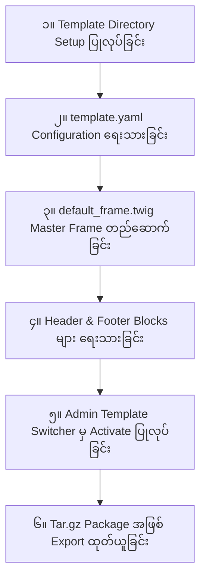

# Module 08: Hands-On: Building a Custom Template from Scratch (Custom Template အသစ်တစ်ခု အစမှအဆုံး တည်ဆောက်ခြင်း)

---

## ၁။ Project Overview (လက်တွေ့တည်ဆောက်မည့် Theme စီမံကိန်း)

ဤသင်ခန်းစာတွင် EC-CUBE 4.x အတွက် **"Modern Minimal Store Theme"** (Theme Code: `modern_minimal`) ဟုခေါ်သော Commercial-Ready Custom Template အသစ်တစ်ခုကို အစမှအဆုံး တည်ဆောက်သွားမည် ဖြစ်ပါသည်။



---

## အဆင့် (၁) - Directory & File Structure တည်ဆောက်ခြင်း

Terminal တွင် အောက်ပါ Command များကို အသုံးပြု၍ Template အသစ်အတွက် ဖိုင်တွဲများ တည်ဆောက်ပါ-

```bash
# ၁။ Twig Template Directory တည်ဆောက်ခြင်း
mkdir -p app/template/modern_minimal/Block
mkdir -p app/template/modern_minimal/Product
mkdir -p app/template/modern_minimal/Cart

# ၂။ Public Assets Directory တည်ဆောက်ခြင်း
mkdir -p html/template/modern_minimal/assets/css
mkdir -p html/template/modern_minimal/assets/js
mkdir -p html/template/modern_minimal/assets/img
```

---

## အဆင့် (၂) - `template.yaml` Configuration ရေးသားခြင်း

EC-CUBE အား Template အသစ်ကို အသိအမှတ်ပြုစေရန် `app/template/modern_minimal/template.yaml` ဖိုင်ကို ရေးသားပါ-

```yaml
# app/template/modern_minimal/template.yaml
code: modern_minimal
name: Modern Minimal Theme (မြန်မာ/ဂျပန် စတိုင်)
version: 1.0.0
author: MyHome Tech
description: A sleek, modern, and high-converting minimal theme for EC-CUBE 4.x.
```

---

## အဆင့် (၃) - `default_frame.twig` Master Frame ရေးသားခြင်း

```twig
{# app/template/modern_minimal/default_frame.twig #}
<!doctype html>
<html lang="ja">
<head>
    <meta charset="utf-8">
    <meta name="viewport" content="width=device-width, initial-scale=1">
    <title>{{ Page.name ? Page.name ~ ' | ' : '' }}{{ BaseInfo.shop_name }}</title>

    <!-- Google Fonts -->
    <link rel="preconnect" href="https://fonts.googleapis.com">
    <link rel="preconnect" href="https://fonts.gstatic.com" crossorigin>
    <link href="https://fonts.googleapis.com/css2?family=Outfit:wght@400;600;700&family=Noto+Sans+JP:wght@400;500;700&display=swap" rel="stylesheet">

    <!-- CSS Assets -->
    <link rel="stylesheet" href="{{ asset('assets/css/modern_style.css') }}">
    
</head>
<body class="modern-theme">
    
    {# Header Slot #}
    

    {# Main Body Layout #}
    <main class="main-container">
        
    </main>

    {# Footer Slot #}
    

    <!-- JavaScript Assets -->
    <script src="{{ asset('assets/js/eccube.js') }}"></script>
    <script src="{{ asset('assets/js/modern_app.js') }}"></script>
    
</body>
</html>
```

---

## အဆင့် (၄) - Header & Footer Blocks များ ရေးသားခြင်း

### (က) Header Block (`Block/header.twig`)
```twig
{# app/template/modern_minimal/Block/header.twig #}
<header class="site-header">
    <div class="header-inner">
        <div class="header-logo">
            <a href="{{ url('homepage') }}">
                <span class="logo-icon">✨</span>
                <span class="logo-text">{{ BaseInfo.shop_name }}</span>
            </a>
        </div>

        <nav class="main-nav">
            <a href="{{ url('homepage') }}">Home</a>
            <a href="{{ url('product_list') }}">Products</a>
            <a href="{{ url('help_about') }}">About</a>
            <a href="{{ url('contact') }}">Contact</a>
        </nav>

        <div class="header-actions">
            
                <a href="{{ url('mypage') }}" class="action-link">👤 My Page</a>
                <a href="{{ url('logout') }}" class="action-link">Logout</a>
            
                <a href="{{ url('mypage_login') }}" class="action-link">Login</a>
            

            <a href="{{ url('cart') }}" class="cart-pill-btn">
                🛒 Cart <span class="badge">{{ Cart.total_quantity|default(0) }}</span>
            </a>
        </div>
    </div>
</header>
```

### (ခ) Footer Block (`Block/footer.twig`)
```twig
{# app/template/modern_minimal/Block/footer.twig #}
<footer class="site-footer">
    <div class="footer-inner">
        <div class="footer-col">
            <h4>{{ BaseInfo.shop_name }}</h4>
            <p>{{ BaseInfo.shop_name }} မှ အရည်အသွေးမြင့် ကုန်ပစ္စည်းများကို စိတ်ချစွာ ဝယ်ယူနိုင်ပါသည်။</p>
        </div>
        <div class="footer-col">
            <h4>Shopping Guide</h4>
            <ul>
                <li><a href="{{ url('help_tradelaw') }}">特定商取引法に基づく表記</a></li>
                <li><a href="{{ url('help_privacy') }}">プライバシーポリシー</a></li>
                <li><a href="{{ url('help_guide') }}">ご利用ガイド</a></li>
            </ul>
        </div>
        <div class="footer-col">
            <h4>Contact Info</h4>
            <p>Email: {{ BaseInfo.email01 }}</p>
            <p>Phone: {{ BaseInfo.phone_number }}</p>
        </div>
    </div>
    <div class="footer-bottom">
        <p>&copy; {{ "now"|date("Y") }} {{ BaseInfo.shop_name }}. All rights reserved.</p>
    </div>
</footer>
```

---

## အဆင့် (၅) - Admin Panel မှ Template ပြောင်းလဲသတ်မှတ်ခြင်း (Template Switching)

1. Admin Panel သို့ ဝင်ပါ -> `設定` (Settings) -> `店舗設定` (Store Settings) -> `テンプレート設定` (Template Settings) သို့ သွားပါ။
2. Template List ထဲတွင် သင်ဖန်တီးလိုက်သော **"Modern Minimal Theme"** ကို တွေ့ရပါမည်။
3. `登録` သို့မဟုတ် `選択` ခလုတ်ကို နှိပ်၍ Active ပြုလုပ်ပါ။
4. Storefront (Frontend) သို့ သွားရောက်ကြည့်ရှုပြီး New Theme ၏ ဒီဇိုင်းကို စစ်ဆေးပါ။

---

## အဆင့် (၆) - Template Package အဖြစ် Export ထုတ်ယူခြင်း (Distribution)

မိမိ တည်ဆောက်ထားသော Template ကို Client ထံ ပေးပို့ရန် သို့မဟုတ် အခြား EC-CUBE ဆိုက်များတွင် Install ပြုလုပ်နိုင်ရန် `.tar.gz` အဖြစ် ထုတ်ယူနည်း-

```bash
# Template directory သို့ သွား၍ Package ဖိုင် ထုတ်ယူခြင်း
tar -czvf modern_minimal_theme.tar.gz \
    app/template/modern_minimal \
    html/template/modern_minimal
```

> [!TIP]
> Template Package ထဲတွင် ပိုမိုလှပသော UI Thumbnail ပေါ်စေရန် `app/template/modern_minimal/screenshot.png` (800x600px) ပုံကို ထည့်သွင်းထားနိုင်ပါသည်။
