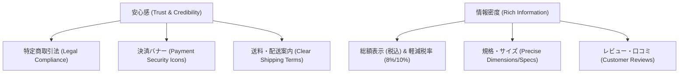

# Module 09: Japanese EC UI/UX Standards & Conversion Optimization (ဂျပန် EC ဒီဇိုင်း စံချိန်စံညွှန်းများနှင့် CRO)

---

## ၁။ Japanese EC Site UI/UX ၏ ထူးခြားချက်များ (Design Philosophy)

ဂျပန်နိုင်ငံရှိ E-Commerce စားသုံးသူများသည် အခြားနိုင်ငံများနှင့် မတူဘဲ **ယုံကြည်စိတ်ချရမှု (安心感・信頼感)** နှင့် **တိကျပြည့်စုံသော အချက်အလက် (情報密度)** ကို အလွန်အလေးထားကြပါသည်။



---

## ၂။ ဂျပန်ဥပဒေအရ မဖြစ်မနေ ထည့်သွင်းရမည့် အချက်များ (Legal Compliance)

### (၁) 特定商取引法に基づく表記 (Specified Commercial Transactions Act)
ဂျပန်နိုင်ငံတွင် အွန်လိုင်းမှ ကုန်ပစ္စည်းရောင်းချပါက အောက်ပါ အချက်အလက်များကို Footer တွင် Link ချိတ်ဆက်၍ ရှင်းလင်းစွာ ဖော်ပြရပါမည်-
- 販売業者 (ရောင်းချသူ ကုမ္ပဏီအမည်)
- 運営責任者 (တာဝန်ခံ အမည်)
- 所在地 / 連絡先 (လိပ်စာ၊ ဖုန်းနံပါတ်၊ အီးမေးလ်)
- 商品代金以外の必要料金 (ပို့ဆောင်ခ၊ အခွန်၊ ငွေလွှဲခ)
- 引き渡し時期 (ကုန်ပစ္စည်း ပို့ဆောင်ပေးမည့် ကာလ)
- 返品・交換に関する特約 (ပစ္စည်းပြန်လဲခြင်း/ငွေပြန်အမ်းခြင်း စည်းမျဉ်း)

### (၂) 総額表示義務 (Tax-Inclusive Total Price Display)
ဂျပန်နိုင်ငံ ဥပဒေအရ ကုန်ပစ္စည်းဈေးနှုန်းကို ပြသသည့်အခါ **အခွန်ပါဝင်ပြီး ဈေးနှုန်း (税込価格)** ကို အဓိက ထင်ရှားစွာ ဖော်ပြပေးရပါမည်။

```twig
{# ဈေးနှုန်း ဖော်ပြမှု အမှန် (Best Practice) #}
<span class="price-main">{{ Product.getPrice02IncTaxMin|price }}</span>
<span class="price-tax">(税込)</span>
<span class="price-sub text-muted">【本体価格 {{ Product.getPrice02Min|price }}】</span>
```

### (၃) 軽減税率 (Reduced Tax Rate: 8% vs 10%)
အစားအသောက် ပစ္စည်းများအတွက် 8% Tax နှင့် အခြား အထွေထွေပစ္စည်းများအတွက် 10% Tax ကို ခွဲခြားဖော်ပြပေးရပါမည်-

```twig

    <span class="badge-tax-reduced">軽減税率 8% 対象</span>

    <span class="badge-tax-standard">標準税率 10%</span>

```

---

## ၃။ Trust Badges & Conversion Boosting Elements (အရောင်းတက်စေမည့် Component များ)

### (က) Payment Icons Banner (အသုံးပြုနိုင်သော ငွေချေနည်းများ)

သုံးစွဲသူများ မိမိတို့ အသုံးပြုလိုသော ငွေပေးချေနည်း ရှိမရှိ ချက်ချင်းသိရှိနိုင်ရန် Footer သို့မဟုတ် Cart တွင် ထည့်သွင်းပြသပါ-

```twig
<div class="payment-methods-banner">
    <p class="banner-title">ご利用可能なお支払い方法</p>
    <div class="payment-icons">
        <span class="badge-card">💳 クレジットカード (VISA / Master / JCB / AMEX)</span>
        <span class="badge-pay">📱 PayPay / Amazon Pay</span>
        <span class="badge-cvs">🏪 コンビニ決済 (Seven-Eleven / Lawson / FamilyMart)</span>
        <span class="badge-bank">🏦 銀行振込 / 代金引換</span>
    </div>
</div>
```

### (ခ) Shipping & Delivery Guarantee Card (ပို့ဆောင်ခနှင့် အာမခံ)

```twig
<div class="trust-guarantee-card">
    <div class="trust-item">
        <div class="trust-icon">🚚</div>
        <div class="trust-text">
            <strong>¥3,980 以上で送料無料</strong>
            <span>(全国一律 / 離島を除く)</span>
        </div>
    </div>
    <div class="trust-item">
        <div class="trust-icon">⚡</div>
        <div class="trust-text">
            <strong>14時までの注文で即日発送</strong>
            <span>(土日祝も休まず出荷)</span>
        </div>
    </div>
    <div class="trust-item">
        <div class="trust-icon">🔄</div>
        <div class="trust-text">
            <strong>7日間 返品・交換保証</strong>
            <span>(初期不良・サイズ違い対応)</span>
        </div>
    </div>
</div>
```

---

## ၄။ Mobile Sticky Add to Cart Button (Mobile Conversion Optimization)

Product Detail Page တွင် Mobile User များ အောက်သို့ Scroll ဆွဲသွားသည့်အခါ Add to Cart ခလုတ် အောက်ခြေတွင် ကပ်ပါလာစေခြင်းဖြင့် Drop-off Rate ကို လျှော့ချနိုင်ပါသည်-

```twig
{# Product/detail.twig အတွင်း ထည့်သွင်းရန် #}
<div class="sticky-cart-bar is-sp-only">
    <div class="sticky-cart-inner">
        <div class="sticky-price">
            <span class="price">{{ Product.getPrice02IncTaxMin|price }}</span>
            <span class="tax">(税込)</span>
        </div>
        <button type="button" class="btn-sticky-cart" onclick="document.getElementById('form1').submit();">
            🛒 カートに入れる
        </button>
    </div>
</div>

<style>
@media (max-width: 767.98px) {
    .sticky-cart-bar {
        position: fixed;
        bottom: 0;
        left: 0;
        width: 100%;
        background: rgba(255, 255, 255, 0.95);
        backdrop-filter: blur(10px);
        border-top: 1px solid #eee;
        padding: 10px 16px;
        box-shadow: 0 -4px 15px rgba(0,0,0,0.08);
        z-index: 9999;
    }
    .sticky-cart-inner {
        display: flex;
        justify-content: space-between;
        align-items: center;
    }
    .sticky-price .price {
        font-size: 18px;
        font-weight: bold;
        color: #e94560;
    }
    .btn-sticky-cart {
        background: #e94560;
        color: #ffffff;
        border: none;
        border-radius: 25px;
        padding: 10px 24px;
        font-weight: bold;
        font-size: 15px;
    }
}
</style>
```
