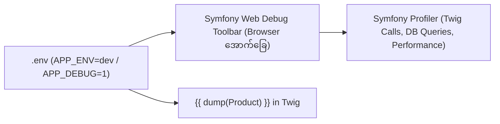

# Module 10: Troubleshooting, Debugging & Launch Checklist (အမှားရှာဖွေခြင်းနှင့် Launch စစ်ဆေးချက်များ)

---

## ၁။ Twig Debugging & Inspection Tools (Debug ပြုလုပ်နည်းများ)

Template ရေးသားရာတွင် Variable များ မည်သို့ပါဝင်လာသည်နှင့် Error များကို ရှာဖွေရန် အောက်ပါ နည်းလမ်းများကို အသုံးပြုနိုင်ပါသည်-



### (က) `{{ dump() }}` အသုံးပြုနည်း
```twig
{# ၁။ Object တစ်ခုလုံး၏ Property များကို စစ်ဆေးခြင်း #}
{{ dump(Product) }}

{# ၂။ သီးခြား Variable တစ်ခုကို ကြည့်ရှုခြင်း #}
{{ dump(Product.ProductClasses) }}

{# ၃။ လက်ရှိ စာမျက်နှာရှိ Variable အားလုံးကို စစ်ဆေးခြင်း #}
{{ dump(_context|keys) }}
```

> [!NOTE]
> `dump()` function အလုပ်လုပ်ရန်အတွက် `.env` ဖိုင်တွင် `APP_ENV=dev` နှင့် `APP_DEBUG=1` ဖွင့်ထားရန် လိုအပ်ပါသည်။ Production Environment တွင် `dump()` ကို မသုံးရပါ။

---

## ၂။ အဖြစ်များသော Template Errors များနှင့် ဖြေရှင်းနည်းများ (Common Errors & Fixes)

| Error Message / ပြဿနာ | ဖြစ်ပွားရသည့် အကြောင်းရင်း | ဖြေရှင်းနည်း (Solution) |
| :--- | :--- | :--- |
| **"Variable 'xyz' does not exist"** | Controller မှ Variable ပေးမပို့ထားခြင်း သို့မဟုတ် Null ဖြစ်နေခြင်း | `{{ xyz\|default('') }}` သို့မဟုတ် `` စစ်ဆေး၍ ရေးပါ |
| **"Unexpected token 'endblock'"** | Twig tag အဖွင့်/အပိတ် မညီခြင်း (ဥပမာ- `` ပိတ်ရန် မေ့ကျန်ခဲ့ခြင်း) | Tag အဖွင့်အပိတ်အတွဲများ (`if...endif`, `for...endfor`) ကို ပြန်လည်စစ်ဆေးပါ |
| **Template ပြင်သော်လည်း Browser တွင် မပြောင်းလဲခြင်း** | Symfony Twig Cache သို့မဟုတ် Browser Cache ကြောင့် ဖြစ်ခြင်း | Admin Panel မှ Cache Clear ပြုလုပ်ပါ (သို့မဟုတ် `bin/console cache:clear`) |
| **Asset 404 (Images/CSS မပေါ်ခြင်း)** | `asset()` function တွင် လမ်းကြောင်းမှားယွင်းနေခြင်း | `{{ asset('assets/css/style.css') }}` ပုံစံဖြင့် `assets/` မှ စတင်ရေးပါ |
| **規格 (Color/Size) ပြောင်းသော်လည်း ဈေးနှုန်းမပြောင်းခြင်း** | Form ID သို့မဟုတ် Select ID များ မူရင်းအတိုင်း မရှိခြင်း | Form တွင် `id="form1"`, `id="classcategory_id1"` မပြောင်းလဲဘဲ ထားရှိပါ |

---

## ၃။ Template Performance Optimization (အမြန်နှုန်း မြှင့်တင်ခြင်း)

ဝက်ဘ်ဆိုက် မြန်ဆန်စေရန် အောက်ပါ အချက်များကို လိုက်နာပါ-

1. **Native Image Lazy Loading**:
   ```twig
   
   ```
2. **Modern Image Format (WebP) အသုံးပြုခြင်း**:
   Jpg/Png ပုံများထက် ဖိုင်ဆိုဒ် ၃၀% သေးငယ်သော WebP ပုံစံကို အသုံးပြုပါ။
3. **Minified CSS/JS Bundle**:
   Production သို့ မတင်မီ CSS နှင့် JS ဖိုင်များကို Minify ပြုလုပ်ပါ။
4. **Twig Loop များ လျှော့ချခြင်း**:
   အလွန်ရှည်လျားသော Nested Loops (`` ထဲတွင် ``) များကို တတ်နိုင်သမျှ ရှောင်ကြဉ်ပါ။

---

## ၄။ Production Release & Launch Checklist (Website မလွှင့်တင်မီ စစ်ဆေးချက်)

Production Server သို့ မလွှင့်တင်မီ (Go-Live မတိုင်မီ) အောက်ပါ Checklist ကို မဖြစ်မနေ စစ်ဆေးပါ-

### (က) UI & Responsive Checklist
- [ ] PC, Tablet, Smartphone (iOS / Android) မျက်နှာပြင်များတွင် Layout ပုံစံမပျက်ဘဲ ကောင်းမွန်စွာ ပြသနိုင်ခြင်း။
- [ ] Mobile Navigation Drawer နှင့် Cart Icon များ အဆင်ပြေစွာ နှိပ်နိုင်ခြင်း (Touch target >= 48px)။
- [ ] Font Size များ သေးငယ်မနေဘဲ ဖတ်ရှုရလွယ်ကူခြင်း (Body text >= 14px-16px)။

### (ခ) E-Commerce Core Flow Checklist
- [ ] Top Page -> Category / Search -> Product List သို့ အဆင်ပြေစွာ ရှာဖွေနိုင်ခြင်း။
- [ ] Product Detail တွင် 規格 (Color/Size) ရွေးချယ်မှုနှင့် ဈေးနှုန်းပြောင်းလဲမှု အလုပ်လုပ်ခြင်း။
- [ ] `カートに入れる` (Add to Cart) နှိပ်ပါက Cart Page သို့ ပစ္စည်းမှန်ကန်စွာ ရောက်ရှိခြင်း။
- [ ] Checkout Flow (Address -> Shipping -> Payment -> Confirm -> Complete) အဆင့် ၄ ဆင့်လုံး အမှားမရှိ အော်ဒါတက်ခြင်း။
- [ ] အော်ဒါတင်ပြီးနောက် Customer နှင့် Admin ထံသို့ Auto-Confirmation Email ရောက်ရှိခြင်း။

### (ဂ) Legal & Security Checklist
- [ ] 特定商取引法に基づく表記 (Law page) တွင် လိပ်စာ၊ ဖုန်း၊ ပို့ဆောင်ခ အချက်အလက်များ တိကျစွာ ပါဝင်ခြင်း။
- [ ] ဈေးနှုန်းများတွင် **(税込)** အခွန်ပါဝင်ပြီး ဈေးနှုန်း ထင်ရှားစွာ ပါဝင်ခြင်း။
- [ ] `.env` ဖိုင်တွင် `APP_ENV=prod` နှင့် `APP_DEBUG=0` သို့ ပြောင်းလဲထားခြင်း။
- [ ] Debug Code များ (`{{ dump() }}`) အားလုံးကို ဖယ်ရှားပြီးဖြစ်ခြင်း။
